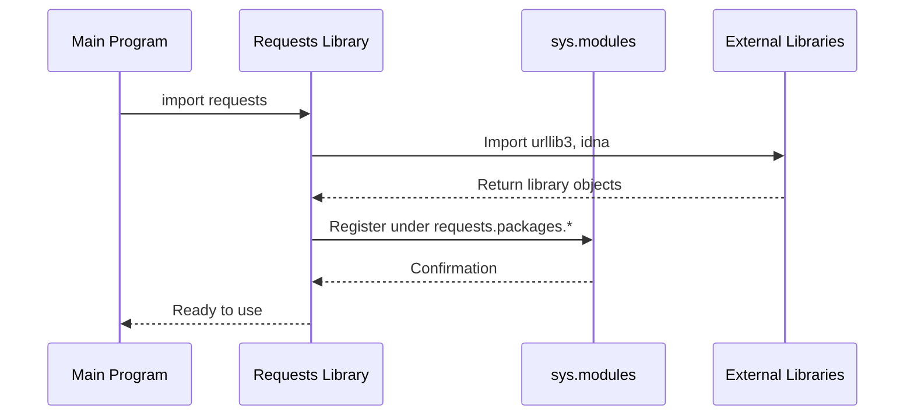

# Chapter 1: Dependency Package Integration

## Introduction

Imagine you're setting up a new entertainment system at home. You have a smart TV, gaming console, sound system, and streaming device - all from different manufacturers. Instead of dealing with multiple remotes and complex connections, you get a universal remote and smart hub that makes everything work together seamlessly. This is exactly what dependency package integration does in the `requests` library!

When you use the `requests` library to make HTTP requests, it relies on several other Python packages behind the scenes - like `urllib3` for connection pooling, `idna` for international domain names, and `chardet` for character encoding detection. Instead of making you import and manage these packages separately, `requests` provides a unified interface that makes them all available under one roof.

## The Problem We're Solving

Let's say you want to write a simple script that downloads a webpage and detects its character encoding. Without dependency integration, you might have to write something like this:

```python
import requests
import chardet  # Separate import
import urllib3  # Another separate import

# You'd need to manage multiple packages yourself
```

But what if different versions of these packages don't work well together? What if `chardet` isn't available on some systems? This is where dependency package integration comes to the rescue!

## Key Concepts

### 1. Unified Namespace

Think of a namespace as an address system. Instead of having separate addresses for each dependency, `requests` creates a single "neighborhood" where all dependencies live together:

```python
import requests

# All dependencies available under requests.packages
urllib3_module = requests.packages.urllib3
chardet_module = requests.packages.chardet
```

This means you can access everything through `requests.packages` without worrying about importing each dependency separately.

### 2. Backward Compatibility

Sometimes older code expects dependencies to be available in a specific way. The integration system ensures that old code continues to work even as the library evolves:

```python
# Both of these work the same way
import urllib3  # Direct import
import requests.packages.urllib3  # Through requests
```

### 3. Graceful Dependency Handling

Not all systems have all dependencies installed. The integration system handles missing packages gracefully, so your code doesn't crash unexpectedly.

## How It Works: A Step-by-Step Walkthrough

Let's trace through what happens when `requests` sets up its dependency integration system:



Here's what happens step by step:

1. **Import Phase**: When you import `requests`, it automatically imports its dependencies (`urllib3`, `idna`, etc.)
2. **Registration Phase**: It registers these dependencies in Python's module system under the `requests.packages` namespace
3. **Availability Phase**: Now you can access these dependencies through `requests.packages`

## Under the Hood: The Implementation

Let's look at how this magic happens in the code. The main work is done in the `packages.py` file:

### Step 1: Import Core Dependencies

```python
for package in ("urllib3", "idna"):
    locals()[package] = __import__(package)
```

This code loops through the essential packages and imports them dynamically. It's like telling Python "go get these packages and make them available here."

### Step 2: Register in Module System

```python
for mod in list(sys.modules):
    if mod == package or mod.startswith(f"{package}."):
        sys.modules[f"requests.packages.{mod}"] = sys.modules[mod]
```

This is where the magic happens! For each imported package, the code registers it in Python's `sys.modules` dictionary under the `requests.packages` namespace. Think of `sys.modules` as Python's phonebook - this code is adding new entries that point to the same addresses.

### Step 3: Handle Optional Dependencies

```python
if chardet is not None:
    # Register chardet modules if available
    target = chardet.__name__
    # ... registration code similar to above
```

Some dependencies like `chardet` are optional. This code checks if they're available and only registers them if they exist. This prevents crashes on systems where optional packages aren't installed.

## Practical Example

Here's how you can use this integration in your own code:

```python
import requests

# Access urllib3 through requests
connection_pool = requests.packages.urllib3.PoolManager()
```

**What happens here**: You're using urllib3's PoolManager class, but accessing it through the `requests.packages` namespace. This ensures you're using the exact version of urllib3 that `requests` was designed to work with.

```python
import requests

# Check if chardet is available
if hasattr(requests.packages, 'chardet'):
    detector = requests.packages.chardet.UniversalDetector()
```

**What happens here**: You're safely checking if the optional `chardet` package is available before trying to use it. This prevents errors on systems where `chardet` isn't installed.

## Benefits of This Approach

1. **Simplicity**: You only need to import `requests`, and everything else comes along
2. **Consistency**: You always get compatible versions of dependencies
3. **Reliability**: Graceful handling of missing optional dependencies
4. **Backward Compatibility**: Old code continues to work as the library evolves

## Conclusion

Dependency package integration in `requests` acts like a smart hub that brings together multiple third-party libraries under one unified interface. It handles the complexity of managing different packages, ensures compatibility, and provides a smooth experience for developers.

Just like how a universal remote simplifies your entertainment system, this integration simplifies HTTP programming in Python. You get all the power of multiple specialized libraries without the headache of managing them individually.

In our next chapter, we'll explore how `requests` manages SSL certificates to keep your connections secure: [SSL Certificate Authority Management](02_ssl_certificate_authority_management_.md).

