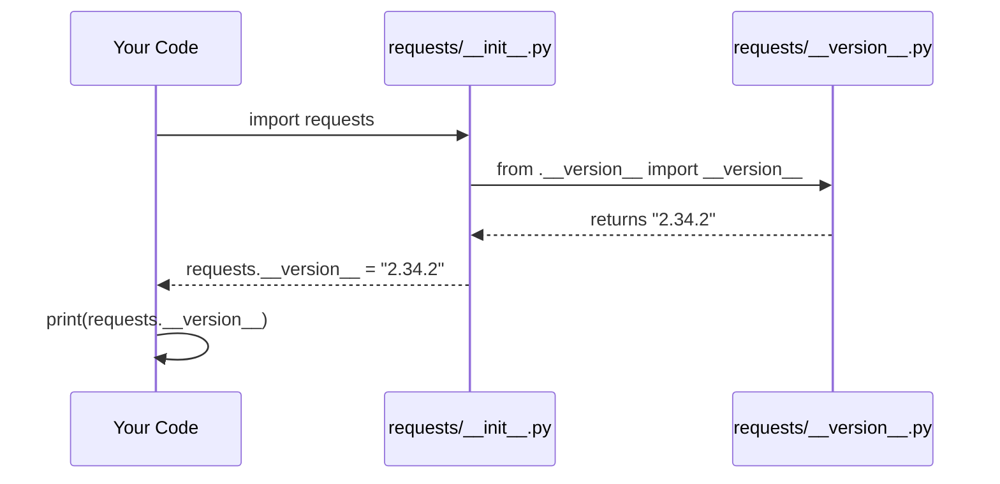

# Chapter 1: Package Metadata & Versioning

Welcome to the very first chapter of our journey into the `requests` library! We're going to start at the very beginning — the library's identity card.

## What Problem Does This Solve?

Imagine you walk into a store and pick up a product. You flip it over and read the label:

- **Product name:** Super Shampoo
- **Version:** 2.34.2
- **Made by:** Kenneth
- **License:** Free to use

Without that label, you'd have no idea what you bought, who made it, or whether it's the right version for your needs.

Software libraries have the same problem. When you type:

```bash
pip install requests
```

How does `pip` know what it just installed? How does your code know which version of `requests` it's running? How do tools report bugs or check compatibility?

The answer: **package metadata**. It's the label on the `requests` box.

---

## The Central Use Case

Here's a simple, real-world scenario:

> You're debugging a bug report and someone asks: *"Which version of requests are you using?"*

With package metadata, you can answer in one line:

```python
import requests
print(requests.__version__)
```

**Output:**
```
2.34.2
```

Simple! Let's understand how this works under the hood.

---

## Key Concepts

### 1. What is Package Metadata?

Package metadata is a set of **predefined variables** that describe the library. Think of them as facts written on the library's ID card.

Here are the most important ones in `requests`:

| Variable | Meaning | Example Value |
|---|---|---|
| `__title__` | The library's name | `"requests"` |
| `__version__` | The version number | `"2.34.2"` |
| `__author__` | Who created it | `"Kenneth Reitz"` |
| `__license__` | How you can use it | `"Apache-2.0"` |
| `__description__` | A short tagline | `"Python HTTP for Humans."` |

---

### 2. Where Does This Information Live?

All this metadata lives in a single file:

📄 **`src/requests/__version__.py`**

```python
__title__ = "requests"
__description__ = "Python HTTP for Humans."
__version__ = "2.34.2"
__author__ = "Kenneth Reitz"
__license__ = "Apache-2.0"
```

Each line follows the same pattern: a variable name wrapped in double underscores (`__like_this__`), assigned a string value.

> 🔑 **Why double underscores?** In Python, names surrounded by double underscores are called *dunder* (double under) variables. They signal that this is a special, well-known attribute — not just a random variable name someone made up.

---

### 3. Version Numbers Explained

The version `2.34.2` follows a pattern called **Semantic Versioning**:

```
MAJOR . MINOR . PATCH
  2   .  34   .  2
```

- **MAJOR** (`2`): Big changes, possibly breaking old code
- **MINOR** (`34`): New features added
- **PATCH** (`2`): Bug fixes, small improvements

Think of it like a book edition:
- A new *edition* (MAJOR) means the book was rewritten
- A new *chapter* (MINOR) means content was added
- A *correction* (PATCH) means typos were fixed

---

## How to Use This in Practice

### Checking the version

```python
import requests
print(requests.__version__)  # "2.34.2"
print(requests.__author__)   # "Kenneth Reitz"
```

**Output:**
```
2.34.2
Kenneth Reitz
```

### Checking version compatibility in your code

```python
import requests

if requests.__version__ < "2.0.0":
    print("Please upgrade requests!")
else:
    print("Good to go!")
```

**Output:**
```
Good to go!
```

This is useful when your code relies on features only available in newer versions.

---

## Under the Hood: What Happens Step by Step?

Let's trace what happens when you write `import requests` and then access `requests.__version__`.



**Step by step:**
1. You write `import requests`
2. Python loads the `requests` package, starting with `__init__.py`
3. Inside `__init__.py`, it imports from `__version__.py`
4. The version string `"2.34.2"` is pulled into the main `requests` namespace
5. You can now access it as `requests.__version__`

---

### Diving Into the Code

Here's what the `__version__.py` file looks like (simplified):

```python
# src/requests/__version__.py

__title__ = "requests"
__version__ = "2.34.2"
__author__ = "Kenneth Reitz"
__license__ = "Apache-2.0"
__cake__ = "✨ 🎂 ✨"  # A little fun Easter egg!
```

Every variable here is just a plain Python string assignment. Nothing magical — just organized, well-named variables in one dedicated file.

Now, the `requests` main package (`__init__.py`) imports these:

```python
# Inside requests/__init__.py (simplified)
from .__version__ import __version__, __author__
# Now requests.__version__ works!
```

The dot in `.__version__` means "from the same package folder" — it's called a *relative import*.

---

### How `setup.py` Uses This

When you run `pip install requests`, the packaging tool uses `setup.py`:

```python
# setup.py
from setuptools import setup
setup()  # Reads metadata from pyproject.toml or setup.cfg
```

The metadata (including the version from `__version__.py`) is referenced during the build process so `pip` knows exactly what version it's installing.

---

## A Fun Extra: The `__cake__` Variable

If you look closely at `__version__.py`, there's a hidden gem:

```python
__cake__ = "✨ 🎂 ✨"
```

This is Kenneth Reitz's little joke — a birthday cake emoji hidden in the source code. It serves no technical purpose, but it shows that even in serious software, there's room for personality! 🎂

---

## Summary

Here's what we learned in this chapter:

- Package metadata is like a **label on a product box** — it identifies the library
- All `requests` metadata lives in **`src/requests/__version__.py`**
- The most important piece is `__version__ = "2.34.2"`, which follows Semantic Versioning
- You can access metadata with `requests.__version__`, `requests.__author__`, etc.
- This information helps tools like `pip` manage and identify the library

---

## What's Next?

Now that we understand how `requests` identifies itself, let's look at how it handles *trust* when making secure web requests. In the next chapter, we'll explore how `requests` knows which websites to trust — using something called a Certificate Bundle.

➡️ Continue to [Chapter 2: CA Certificate Bundle (Trust Store)](02_ca_certificate_bundle__trust_store__.md)

---

Generated by [AI Codebase Knowledge Builder](https://github.com/The-Pocket/Tutorial-Codebase-Knowledge)