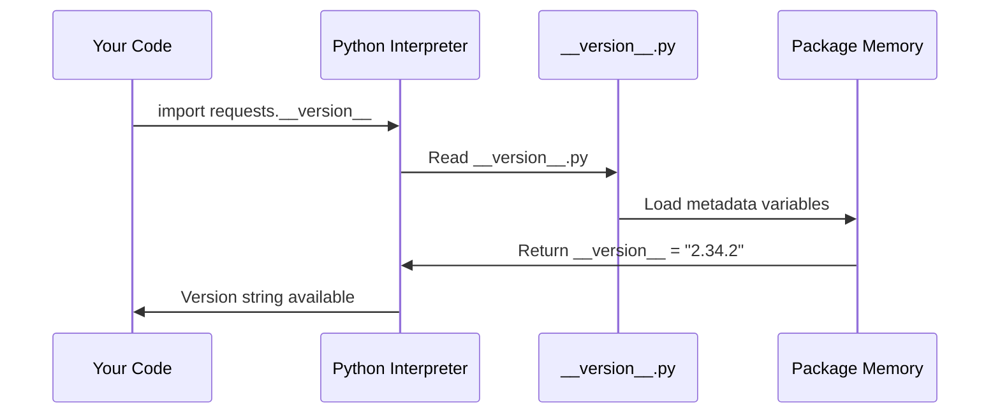

# Chapter 1: Package Metadata Management

Welcome to the world of Python packages! Have you ever wondered how your computer knows what version of a software library you're using, or who created it? Just like how products in a store have labels with important information, Python packages need their own "ID cards" to tell the world about themselves.

## The Problem: Identifying Your Package

Imagine you're in a library with thousands of books, but none of them have title pages or author information. How would you know which book is which? This is exactly the problem that package metadata solves for Python libraries.

When you install the `requests` library (a popular tool for making web requests), your system needs to know:
- What is this package called?
- What version is it?
- Who created it?
- What license does it use?

Without this information, package managers like `pip` wouldn't know how to handle updates, dependencies, or even display basic information about the package.

## What is Package Metadata?

Package metadata is like a detailed ID card for a Python library. Just as your driver's license contains your name, photo, and other identifying information, package metadata contains all the essential details about a software package.

Think of it as a digital business card that includes:
- **Name**: What the package is called
- **Version**: Which release you're using
- **Description**: What the package does
- **Author**: Who created it
- **License**: How you're allowed to use it

## How to Access Package Metadata

Let's see how the `requests` library stores and shares its metadata. The information is kept in a special file that other programs can read.

```python
from requests import __version__, __title__, __author__

print(f"Package: {__title__}")
print(f"Version: {__version__}")  
print(f"Author: {__author__}")
```

When you run this code, you'll see output like:
```
Package: requests
Version: 2.34.2
Author: Kenneth Reitz
```

This simple code shows you the basic identity of the requests package! The double underscores (like `__version__`) are Python's way of marking special attributes.

## Exploring More Metadata

The requests library includes even more detailed information about itself:

```python
from requests import __description__, __url__, __license__

print(f"What it does: {__description__}")
print(f"Documentation: {__url__}")
print(f"License: {__license__}")
```

This will output:
```
What it does: Python HTTP for Humans.
Documentation: https://requests.readthedocs.io
License: Apache-2.0
```

The description tells you what the library is for, the URL points to where you can learn more, and the license tells you how you're allowed to use the code.

## Behind the Scenes: How Metadata Works

Let's understand what happens when you import this metadata information:



Here's what happens step by step:

1. **You ask for metadata**: Your code imports metadata from requests
2. **Python finds the file**: The interpreter locates the special `__version__.py` file
3. **Variables are loaded**: Python reads all the metadata variables into memory
4. **Information is returned**: You get access to the version string and other details

## The Metadata Storage File

All this information lives in a dedicated file called `__version__.py`. Let's look at how it's organized:

```python
__title__ = "requests"
__description__ = "Python HTTP for Humans."
__version__ = "2.34.2"
```

Each piece of information is stored as a simple Python variable. The naming convention with double underscores tells Python (and other developers) that these are special metadata attributes.

```python
__author__ = "Kenneth Reitz"
__author_email__ = "me@kennethreitz.org"
__license__ = "Apache-2.0"
```

These variables contain contact information and legal details. When package managers like `pip` need to display information about requests, they read these exact values.

## Why This Matters for You

As a beginner, you might wonder why this matters. Here are some practical benefits:

**Version Checking**: You can check if you have the right version for compatibility:
```python
from requests import __version__

if __version__ >= "2.30.0":
    print("You have a recent version!")
```

**Debugging Help**: When reporting bugs, developers often ask for version information:
```python
import requests
print(f"I'm using requests {requests.__version__}")
```

**Understanding Dependencies**: Package metadata helps tools automatically manage what your project needs to run properly.

## Real-World Usage

Package managers and development tools use this metadata constantly:

- **pip** reads it to show package information
- **Virtual environments** use it to track what's installed  
- **Documentation tools** display author and version details
- **Security scanners** check versions against vulnerability databases

## Conclusion

Package metadata might seem simple, but it's the foundation that makes Python's entire ecosystem work smoothly. Just like how barcodes help stores track inventory, metadata helps the Python world keep track of millions of packages and their versions.

You've learned how the requests library identifies itself to the world, and how you can access that information in your own code. This system of package identification becomes even more important when we start dealing with security features, which brings us to our next topic.

In the next chapter, we'll explore how requests handles secure connections through [SSL Certificate Management](02_ssl_certificate_management_.md), building on this foundation of package identification to ensure your web requests are safe and secure.

