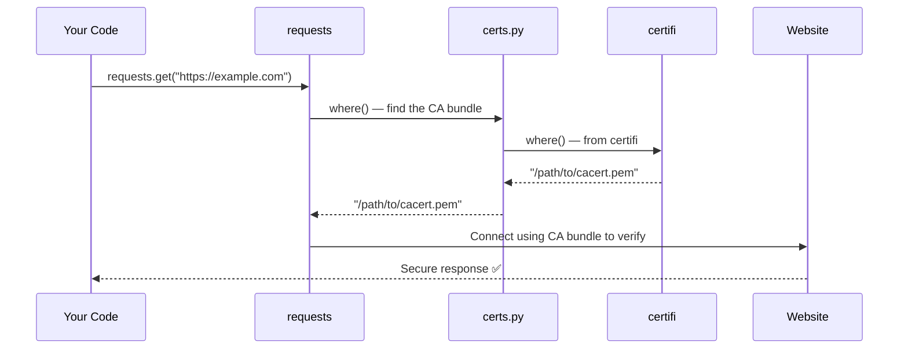

# Chapter 2: CA Certificate Bundle (Trust Store)

In [Chapter 1: Package Metadata & Versioning](01_package_metadata___versioning_.md), we learned how `requests` identifies itself with a version number and author information — its "label." Now let's explore how `requests` decides **who to trust** when making secure web connections.

---

## What Problem Does This Solve?

Imagine you receive a letter claiming to be from your bank. How do you know it's really from them and not a scammer? You might look for an official seal, a known address, or some other mark of authenticity.

The internet has the same problem. When your code connects to `https://api.example.com`, how does `requests` know that website is genuinely who it claims to be?

The answer involves **certificates** — digital identity documents — and a list of trusted organizations that vouch for them.

---

## The Central Use Case

Here's a simple, real-world scenario:

> You want to make a secure HTTPS request and you need `requests` to verify the server is trustworthy — without you doing anything special.

```python
import requests

response = requests.get("https://httpbin.org/get")
print(response.status_code)
```

**Output:**
```
200
```

This worked! But behind the scenes, `requests` quietly checked that `httpbin.org` is trustworthy. How? Let's find out.

---

## Key Concepts

### 1. What is HTTPS?

When a web address starts with `https://`, the `s` stands for **secure**. It means:

1. The connection is **encrypted** — nobody can eavesdrop
2. The server's identity is **verified** — you're talking to the real site

Think of it like a sealed, tamper-proof envelope that also has the sender's verified ID attached.

---

### 2. What is a Certificate?

A **certificate** is a digital document that says:

> "I, the website `httpbin.org`, am who I claim to be. Here's my proof."

It's like a passport — a government-issued document that proves your identity.

---

### 3. Who Issues Certificates? (Certificate Authorities)

Just like governments issue passports, **Certificate Authorities (CAs)** issue digital certificates. Examples of real CAs include:
- DigiCert
- Let's Encrypt
- Comodo

When your browser (or `requests`) connects to a website, it checks:

> "Was this certificate issued by a CA I trust?"

---

### 4. The Trust Store (CA Bundle)

A **trust store** (or CA bundle) is simply a **file containing a list of all the CAs you trust**.

It's like a **directory of verified, trusted organizations**. If a website's certificate was signed by someone in that directory, you trust the website.

```
trust_store.pem
├── DigiCert Root CA
├── Let's Encrypt Root CA
├── Comodo Root CA
└── ... (hundreds more)
```

---

### 5. Where Does `requests` Get Its Trust Store?

`requests` delegates this responsibility to a separate package called **`certifi`**.

> 🎯 **`certifi`** is a Python package that bundles Mozilla's carefully curated list of trusted CAs. It's updated independently, so your trust store stays current even if `requests` itself doesn't update.

---

## How It Works in Practice

### The `where()` Function

The heart of this feature is in a tiny file: `src/requests/certs.py`.

```python
# src/requests/certs.py
from certifi import where
```

That's almost the entire file! `requests` simply **borrows** the `where()` function from `certifi`.

The `where()` function returns the **file path** to the CA bundle on your computer:

```python
from requests.certs import where

print(where())
```

**Output (example — path will vary by system):**
```
/usr/local/lib/python3.11/site-packages/certifi/cacert.pem
```

This `.pem` file is the trust store — the list of trusted CAs.

---

### Seeing It in Action

When `requests` makes an HTTPS connection, it uses this path automatically:

```python
import requests

# requests uses the CA bundle automatically
response = requests.get("https://httpbin.org/get")
print("Connected securely:", response.status_code == 200)
```

**Output:**
```
Connected securely: True
```

You don't have to do anything — `requests` handles it quietly in the background.

---

### What Happens If Verification Fails?

If the server's certificate is NOT in the trust store (or is invalid), `requests` raises an error:

```python
import requests

try:
    # This site has an invalid certificate
    response = requests.get("https://expired.badssl.com/")
except requests.exceptions.SSLError as e:
    print("SSL verification failed!")
```

**Output:**
```
SSL verification failed!
```

`requests` protects you by refusing to connect to untrusted sites by default. 🛡️

---

### Checking the Bundle Manually

You can run the `certs.py` file directly from the command line:

```bash
python -m requests.certs
```

**Output (example):**
```
/usr/local/lib/python3.11/site-packages/certifi/cacert.pem
```

This tells you exactly where your CA bundle lives.

---

## Under the Hood: What Happens Step by Step?

Let's trace what happens when `requests` makes a secure connection:



**Step by step:**
1. You call `requests.get("https://...")`
2. `requests` needs to verify the server — it calls `where()` from `certs.py`
3. `certs.py` delegates to `certifi`'s `where()` function
4. `certifi` returns the path to its bundled `cacert.pem` file
5. `requests` uses that file to verify the server's certificate
6. If verification passes, the connection proceeds and you get a response

---

## Diving Into the Code

Here's the complete `certs.py` file — it's surprisingly small:

```python
# src/requests/certs.py

from certifi import where

if __name__ == "__main__":
    print(where())
```

That's it! Let's break it down:

**Line 1: Import `where` from `certifi`**
```python
from certifi import where
```
This borrows the `where()` function directly from the `certifi` package. `requests` doesn't maintain its own CA list — it trusts `certifi` to do that job.

**Lines 2–3: Run directly from command line**
```python
if __name__ == "__main__":
    print(where())
```
If you run this file directly (not imported), it prints the path to the CA bundle. A handy diagnostic tool!

---

### Why Delegate to `certifi`?

This design choice is elegant:

```
requests  →  certs.py  →  certifi  →  cacert.pem
  (your code)   (thin wrapper)   (CA experts)  (actual list)
```

| Who | Does What |
|-----|-----------|
| `requests` | Makes HTTP connections |
| `certs.py` | Points to the trust store |
| `certifi` | Maintains the updated CA list |
| `cacert.pem` | The actual file with trusted CAs |

By separating concerns this way, when Mozilla updates their trusted CA list, you just update `certifi` — no need to update `requests` itself!

---

### For Advanced Users: Overriding the Bundle

The comment in `certs.py` hints at something useful for system administrators:

> *"If you are packaging Requests... you can change the definition of `where()` to return a separately packaged CA bundle."*

For example, on Linux systems, you might want to use the system's own CA bundle instead of `certifi`'s. A packager could replace `where()` to point there:

```python
# Example: a custom certs.py for Linux packagers
def where():
    return "/etc/ssl/certs/ca-certificates.crt"
```

This flexibility means `requests` works well in corporate or restricted environments with their own trusted CA lists.

---

## Analogy Recap

Let's tie it all together with one simple analogy:

> 🏛️ Think of CAs as **notaries public** — official, trusted people who verify identities. The CA bundle (`cacert.pem`) is your **directory of all licensed notaries**. When a website shows you their certificate, `requests` flips through the directory to check if the notary who signed it is legitimate. `certifi` keeps that directory up to date.

---

## Summary

Here's what we learned in this chapter:

- HTTPS connections require **verification** — making sure a website is who it claims to be
- **Certificate Authorities (CAs)** are trusted organizations that vouch for websites
- A **CA bundle (trust store)** is a file listing all the CAs you trust
- `requests` uses `certs.py` — a tiny file that simply delegates to the **`certifi`** package
- The `where()` function returns the **path to the CA bundle file**
- This design keeps the trust store **up-to-date independently** of `requests` itself
- Packagers can **override** `where()` to point to a system-level CA bundle

---

## What's Next?

Now that we understand how `requests` handles trust for secure connections, we'll look at a clever trick `requests` uses to stay backwards compatible with older code — without breaking anything.

➡️ Continue to [Chapter 3: Backwards-Compatible Package Aliases](03_backwards_compatible_package_aliases_.md)

---

Generated by [AI Codebase Knowledge Builder](https://github.com/The-Pocket/Tutorial-Codebase-Knowledge)