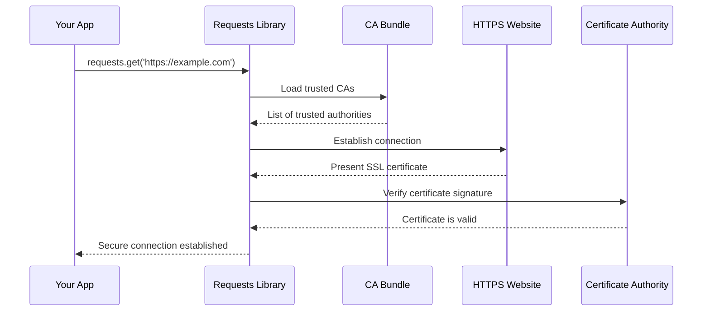

# Chapter 2: SSL Certificate Authority Management

Building on our understanding of how `requests` manages its dependencies from [Chapter 1: Dependency Package Integration](01_dependency_package_integration_.md), let's explore another crucial component that keeps your web requests secure: SSL Certificate Authority Management.

## Introduction

Imagine you're meeting someone for the first time at a coffee shop. How do you know they are who they claim to be? You might ask to see their driver's license or passport - a trusted document issued by an official authority that vouches for their identity. SSL Certificate Authority Management works in exactly the same way for websites!

When your Python program using `requests` connects to a website like `https://github.com`, it needs to verify that it's really talking to GitHub and not an imposter trying to steal your data. This is where SSL certificates come in - they're like digital driver's licenses for websites, and Certificate Authorities (CAs) are like the government agencies that issue these licenses.

## The Problem We're Solving

Let's say you want to write a simple script that downloads your user profile from GitHub:

```python
import requests

# This should be secure - but how do we know it really is?
response = requests.get('https://api.github.com/user')
```

**What could go wrong?** Without proper certificate verification, a malicious actor could intercept your connection and pretend to be GitHub, potentially stealing your authentication tokens or personal data. This is called a "man-in-the-middle" attack.

**The solution:** `requests` automatically uses a trusted list of Certificate Authorities to verify that websites are legitimate before establishing secure connections.

## Key Concepts

### 1. Certificate Authorities (CAs)

Think of Certificate Authorities as trusted organizations that act like notary publics for the internet. Just as a notary public verifies documents in the real world, CAs verify and digitally sign website certificates to prove their authenticity.

Popular CAs include:
- DigiCert
- Let's Encrypt  
- GlobalSign
- VeriSign

### 2. CA Bundle

A CA bundle is like a trusted contact list containing all the legitimate Certificate Authorities. It's a single file that contains hundreds of trusted CA certificates, allowing your program to verify websites signed by any of these authorities.

```python
# This is what requests does behind the scenes
import requests
print(requests.certs.where())
# Output: /path/to/cacert.pem
```

**What this shows:** The `where()` function tells us exactly where the trusted CA certificate bundle is stored on your system.

### 3. Certificate Verification Process

When you make an HTTPS request, here's what happens:

1. Website presents its certificate
2. `requests` checks if the certificate was signed by a trusted CA
3. If trusted: connection proceeds securely
4. If not trusted: connection is blocked and an error is raised

## How It Works: A Step-by-Step Walkthrough

Let's trace through what happens when you make a secure request:



Here's what happens step by step:

1. **Request Initiation**: Your app calls `requests.get()` with an HTTPS URL
2. **CA Bundle Loading**: `requests` loads the trusted Certificate Authority list
3. **Connection Attempt**: `requests` tries to connect to the website
4. **Certificate Presentation**: The website presents its SSL certificate
5. **Verification**: `requests` checks if the certificate was signed by a trusted CA
6. **Decision**: If valid, the secure connection is established; if not, an error is raised

## Under the Hood: The Implementation

The SSL Certificate Authority management in `requests` is elegantly simple. Let's look at how it works:

### Step 1: Finding the CA Bundle

```python
from certifi import where

def where():
    return certifi.where()
```

**What happens here:** The `where()` function simply calls `certifi.where()`, which returns the path to the trusted CA certificate bundle. The `certifi` package maintains an up-to-date collection of trusted Certificate Authorities.

### Step 2: Using the CA Bundle

```python
import requests

# Requests automatically uses the CA bundle
response = requests.get('https://httpbin.org/get')
```

**What happens here:** When you make this request, `requests` automatically uses the CA bundle from `certifi` to verify that `httpbin.org` is legitimate. You don't need to do anything special - it just works!

### Step 3: Custom CA Bundle (Advanced)

```python
import requests

# Use a custom CA bundle if needed
response = requests.get('https://example.com', verify='/path/to/custom/ca-bundle.pem')
```

**What happens here:** Sometimes you might need to use a custom CA bundle (for example, in corporate environments with internal certificates). The `verify` parameter allows you to specify a different certificate bundle.

## Practical Examples

### Example 1: Basic Secure Request

```python
import requests

# This automatically verifies the SSL certificate
response = requests.get('https://api.github.com')
print(f"Status: {response.status_code}")
print(f"Secure connection: {response.url.startswith('https')}")
```

**Expected Output:**
```
Status: 200
Secure connection: True
```

**What happens:** `requests` automatically verified GitHub's SSL certificate using the trusted CA bundle before making the request.

### Example 2: Checking Certificate Location

```python
import requests

# Find where the CA bundle is stored
ca_location = requests.certs.where()
print(f"CA Bundle location: {ca_location}")
```

**Expected Output:**
```
CA Bundle location: /usr/local/lib/python3.9/site-packages/certifi/cacert.pem
```

**What happens:** This shows you exactly where the trusted certificate bundle is stored on your system.

### Example 3: Handling Certificate Errors

```python
import requests

try:
    # This might fail if the certificate is invalid
    response = requests.get('https://self-signed.badssl.com')
except requests.exceptions.SSLError as e:
    print(f"SSL Certificate Error: {e}")
```

**Expected Output:**
```
SSL Certificate Error: HTTPSConnectionPool(host='self-signed.badssl.com', port=443): Max retries exceeded with url: / (Caused by SSLError(SSLError("bad handshake: Error([('SSL routines', 'tls_process_server_certificate', 'certificate verify failed')])")))
```

**What happens:** The website uses a self-signed certificate that isn't trusted by any CA in our bundle, so `requests` blocks the connection and raises an SSL error to protect you.

## The Role of Certifi

The `requests` library relies on the `certifi` package to provide the CA bundle. Think of `certifi` as a specialized service that:

1. **Maintains Trust**: Keeps an up-to-date list of trusted Certificate Authorities
2. **Regular Updates**: Updates the bundle when CAs are added, removed, or compromised
3. **Cross-Platform**: Works consistently across different operating systems

```python
# The entire certs.py module is just this simple
from certifi import where

if __name__ == "__main__":
    print(where())
```

**What this shows:** The beauty of this approach is its simplicity. Rather than maintaining its own CA bundle, `requests` delegates this complex responsibility to the specialized `certifi` package.

## Benefits of This Approach

1. **Security by Default**: All HTTPS requests are automatically verified
2. **Simplicity**: You don't need to manage certificates manually
3. **Up-to-Date Protection**: The CA bundle is regularly updated through `certifi`
4. **Flexibility**: You can still use custom CA bundles when needed
5. **Cross-Platform**: Works the same way on Windows, macOS, and Linux

## Common Use Cases

### Corporate Environments

```python
import requests

# In corporate networks, you might need custom certificates
response = requests.get('https://internal-api.company.com', 
                       verify='/etc/ssl/corporate-ca-bundle.pem')
```

### Development and Testing

```python
import requests

# Disable certificate verification (NOT recommended for production!)
response = requests.get('https://localhost:8000', verify=False)
```

**Warning:** Only disable certificate verification in development environments where you control the entire network. Never do this in production!

## Conclusion

SSL Certificate Authority Management in `requests` acts like an automatic security guard that checks the ID of every website you visit. By leveraging the `certifi` package, it provides robust, up-to-date protection against malicious websites while remaining completely transparent to developers.

Just like how you automatically trust a driver's license without understanding the complex government processes behind issuing it, `requests` handles all the complexity of certificate verification so you can focus on building great applications instead of worrying about security details.

The elegant simplicity of this system - just importing trusted certificates from `certifi` - demonstrates how powerful abstractions can make complex security requirements feel effortless.

In our next chapter, we'll explore how `requests` manages its own version information and metadata: [Chapter 3: Package Metadata and Version Management](03_package_metadata_and_version_management_.md).

