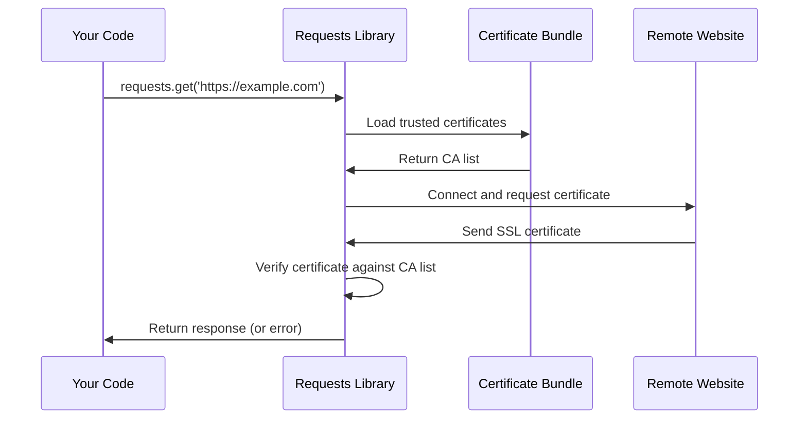

# Chapter 2: SSL Certificate Management

In [Chapter 1: Package Metadata Management](01_package_metadata_management_.md), we learned how Python packages identify themselves with metadata like version numbers and author information. Now, let's explore another crucial aspect of the `requests` library: keeping your web connections secure through SSL Certificate Management.

## The Problem: How Do You Know a Website Is Real?

Imagine you're meeting someone for the first time in a crowded coffee shop. How do you know they are who they claim to be? You might ask to see their driver's license or ID card. The same challenge exists when your program connects to websites over the internet.

When you visit `https://github.com` or `https://google.com`, how does your computer know it's really talking to the legitimate website and not a fake one set up by hackers? This is where SSL certificates come in - they're like digital ID cards for websites.

Let's say you want to download some data from a secure website using the `requests` library:

```python
import requests

response = requests.get('https://api.github.com/users/octocat')
print("Connected successfully!")
```

Behind the scenes, `requests` is doing something very important: it's checking the website's digital ID card (SSL certificate) to make sure GitHub is really GitHub, not an imposter.

## What Are SSL Certificates?

Think of SSL certificates like a security badge system at a large office building. Just as security guards check employee badges against a list of trusted companies, your computer checks website certificates against a list of trusted certificate authorities (CAs).

An SSL certificate contains:
- **Website identity**: Which domain it belongs to (like github.com)
- **Digital signature**: A special stamp from a trusted certificate authority
- **Expiration date**: When the certificate needs to be renewed
- **Public key**: Used for secure communication

## The Certificate Authority System

Certificate authorities are like trusted ID card companies. Just as your state's DMV is trusted to issue real driver's licenses, companies like DigiCert, Let's Encrypt, and Verisign are trusted to issue real website certificates.

Your computer keeps a list of these trusted authorities - this is called a "CA bundle" or "certificate bundle." It's like having a phone book of all the legitimate ID card companies.

## How Requests Handles SSL Certificates

The `requests` library makes SSL certificate checking automatic and easy. Let's see how it determines which certificates to trust:

```python
import requests

# This automatically uses trusted certificates
response = requests.get('https://httpbin.org/get')
print(f"Status: {response.status_code}")
```

When you run this code, `requests` will:
1. Connect to the website
2. Ask for its SSL certificate
3. Check if the certificate is signed by a trusted authority
4. Proceed only if the certificate is valid

If the certificate is invalid or suspicious, `requests` will raise an error to protect you.

## Finding the Certificate Bundle

The `requests` library needs to know where to find its list of trusted certificate authorities. Let's explore how it locates this information:

```python
import requests.certs

certificate_location = requests.certs.where()
print(f"Certificates stored at: {certificate_location}")
```

This will show you the file path where the trusted certificates are stored on your system, something like:
```
Certificates stored at: /usr/local/lib/python3.9/site-packages/certifi/cacert.pem
```

The `where()` function is like asking "Where did you put the phone book of trusted ID companies?" It returns the exact location of the certificate bundle file.

## Behind the Scenes: The Certificate Verification Process

Let's understand what happens when you make a secure request:



Here's what happens step by step:

1. **You make a request**: Your code calls `requests.get()` with an HTTPS URL
2. **Load trusted certificates**: Requests loads the bundle of trusted certificate authorities
3. **Connect to website**: Requests establishes a connection and asks for the site's certificate
4. **Verify certificate**: The certificate is checked against the trusted CA list
5. **Return result**: If valid, you get your data; if invalid, you get an error

## The Certificate Bundle File

All the trusted certificate authorities are stored in a single file. Let's look at how `requests` accesses this file:

```python
from certifi import where

print(f"Certificate bundle location: {where()}")
```

The `certifi` package provides the certificate bundle that `requests` uses. This file contains hundreds of trusted certificate authorities in a standardized format.

```python
# Read the first few lines of the certificate file
cert_file = where()
with open(cert_file, 'r') as f:
    lines = f.readlines()[:5]
    for line in lines:
        print(line.strip())
```

You'll see output like:
```
##
## Bundle of CA Root Certificates
##
## Certificate data from Mozilla
```

This file is regularly updated to add new trusted authorities and remove ones that are no longer trustworthy.

## Customizing Certificate Verification

Sometimes you might need to use a different set of certificates or disable verification for testing:

```python
import requests

# Use a custom certificate bundle
response = requests.get('https://example.com', 
                       verify='/path/to/custom/cacert.pem')
```

Or for testing purposes only (never in production!):

```python
import requests

# Disable certificate verification (DANGEROUS!)
response = requests.get('https://example.com', verify=False)
```

The `verify` parameter tells `requests` whether and how to check certificates. Setting it to `False` is like telling a security guard to let anyone into the building without checking their ID - very risky!

## The Internal Implementation

Let's look at how the certificate management works inside the `requests` library. The key file is `certs.py`:

```python
from certifi import where

def where():
    """Return the location of the certificate bundle."""
    return certifi.where()
```

This simple function acts as a bridge between `requests` and the `certifi` package. It's like having a receptionist who knows exactly where the phone book of trusted companies is stored.

## When Certificate Verification Fails

If a website has an invalid or suspicious certificate, `requests` will protect you by raising an error:

```python
import requests

try:
    response = requests.get('https://expired.badssl.com/')
except requests.exceptions.SSLError as e:
    print("Certificate verification failed!")
    print(f"Error: {e}")
```

This code will output something like:
```
Certificate verification failed!
Error: HTTPSConnectionPool(host='expired.badssl.com', port=443)
```

This error is actually a good thing - it means `requests` is protecting you from potentially dangerous connections.

## Why This Matters for You

SSL certificate management might seem complex, but it's working behind the scenes to keep you safe:

**Automatic Protection**: Every HTTPS request is automatically verified
```python
response = requests.get('https://api.example.com/data')
# Certificate was checked automatically!
```

**Prevents Attacks**: Invalid certificates are rejected before any data is exchanged

**Up-to-date Security**: The certificate bundle is regularly updated with new trusted authorities

## Real-World Benefits

This automatic certificate checking protects you from:

- **Man-in-the-middle attacks**: Where hackers intercept your connections
- **Fake websites**: That impersonate real services to steal data  
- **Compromised certificates**: That are no longer trustworthy

All of this protection happens automatically - you don't need to think about it for normal usage.

## Conclusion

SSL Certificate Management in the `requests` library acts like an automatic security system for your web connections. Just as a building's security system checks every visitor's ID against a trusted database, `requests` checks every website's certificate against a trusted list of certificate authorities.

You've learned how this invisible guardian works to keep your connections secure, from the simple `where()` function that locates certificates to the complex verification process that happens with every HTTPS request. The beauty of this system is that it works automatically - providing enterprise-level security with zero configuration.

In our next chapter, we'll explore how `requests` handles another behind-the-scenes challenge: managing compatibility between different versions of dependent libraries through the [Dependency Compatibility Layer](03_dependency_compatibility_layer_.md). This builds on our understanding of how `requests` manages both its identity and security features to ensure everything works smoothly together.

