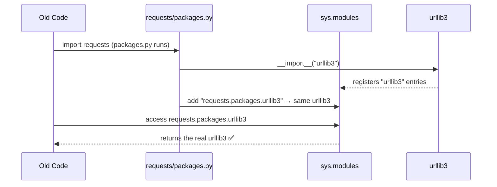

# Chapter 3: Backwards-Compatible Package Aliases

In [Chapter 2: CA Certificate Bundle (Trust Store)](02_ca_certificate_bundle__trust_store__.md), we learned how `requests` uses a trust store to verify that websites are who they claim to be. Now let's explore a clever trick `requests` uses to keep old code working — even when things have moved around under the hood.

---

## What Problem Does This Solve?

Imagine you've lived at the same address for years. Then you move to a new house. Your friends who have your old address written down would no longer be able to reach you — *unless* the post office sets up a **mail forwarding** service that quietly redirects letters from your old address to your new one.

`requests` faces exactly this kind of problem.

---

## The Central Use Case

In older versions of `requests`, the library used to *bundle* its dependencies (like `urllib3` and `idna`) directly inside the `requests` package. That meant people could write code like this:

```python
import requests

# Old way: accessing urllib3 through requests
print(requests.packages.urllib3)
```

**This used to work in old versions of `requests`.** But today, `urllib3` and `idna` are separate, independent packages — they no longer live *inside* `requests`.

So what happens to all the old code that uses `requests.packages.urllib3`?

Without a solution: it **breaks** 💥

With backwards-compatible aliases: it **still works** ✅

That's exactly what this chapter is about.

---

## Key Concepts

### 1. What Are Dependencies?

`requests` doesn't do everything itself. It relies on other packages to help:

| Package | Job |
|---------|-----|
| `urllib3` | Handles the low-level HTTP connections |
| `idna` | Handles international domain names |
| `chardet` / `charset_normalizer` | Detects text encoding |

These are called **dependencies** — other packages that `requests` depends on to do its job.

---

### 2. What is `sys.modules`?

Python keeps a directory of every module (file) it has loaded. This directory lives in:

```python
import sys
print(sys.modules)
```

Think of `sys.modules` like a **phone book** for Python modules. When Python imports something, it looks it up here first. If it's already there, Python reuses it instead of loading it again.

```
sys.modules = {
    "urllib3": <the urllib3 package>,
    "urllib3.exceptions": <urllib3's exceptions module>,
    ...
}
```

---

### 3. What is a Module Alias?

A **module alias** is when you add a *new name* to the phone book that points to the *same existing entry*.

```
sys.modules["requests.packages.urllib3"] = sys.modules["urllib3"]
```

Now, whether someone looks up `urllib3` or `requests.packages.urllib3`, they get the **exact same object** — no copy, no duplicate. Just two names pointing to one thing.

It's like having two phone book listings with different names but the same number. ☎️

---

### 4. Why Does Identity Matter?

Here's something subtle but important. In Python, `is` checks whether two things are the *exact same object*:

```python
import urllib3
import requests

# Because of aliasing, these are the SAME object
print(urllib3 is requests.packages.urllib3)
```

**Output:**
```
True
```

If `requests` just imported a *copy* of `urllib3`, these would be two different objects. That could cause subtle bugs — like setting a configuration on one copy and the other copy not knowing about it. The alias ensures there's only **one** `urllib3` in memory.

---

## How It Works: The `packages.py` File

The magic lives in a small file: `src/requests/packages.py`.

Let's walk through it piece by piece.

### Step 1: Import urllib3 and idna

```python
for package in ("urllib3", "idna"):
    locals()[package] = __import__(package)
```

This loop imports both `urllib3` and `idna` using Python's built-in `__import__()` function.

`locals()[package] = ...` adds the imported package as a local variable with that name — so `urllib3` and `idna` become accessible in this file.

---

### Step 2: Register the Aliases

```python
    for mod in list(sys.modules):
        if mod == package or mod.startswith(f"{package}."):
            sys.modules[f"requests.packages.{mod}"] = sys.modules[mod]
```

This is the clever part! For every module already loaded that belongs to `urllib3` (like `urllib3`, `urllib3.exceptions`, `urllib3.util`, etc.), it creates a matching entry under the `requests.packages.*` namespace.

Think of it like this:

```
Before:
  sys.modules["urllib3"]            → <urllib3 package>
  sys.modules["urllib3.exceptions"] → <urllib3.exceptions>

After:
  sys.modules["urllib3"]                       → <urllib3 package>
  sys.modules["urllib3.exceptions"]            → <urllib3.exceptions>
  sys.modules["requests.packages.urllib3"]     → same <urllib3 package>!
  sys.modules["requests.packages.urllib3.exceptions"] → same <urllib3.exceptions>!
```

Old code asking for `requests.packages.urllib3` gets the real, live `urllib3` — not a copy!

---

### Step 3: Handle `chardet` (or its replacement)

```python
if chardet is not None:
    target = chardet.__name__
    for mod in list(sys.modules):
        if mod == target or mod.startswith(f"{target}."):
            imported_mod = sys.modules[mod]
            sys.modules[f"requests.packages.{mod}"] = imported_mod
            mod = mod.replace(target, "chardet")
            sys.modules[f"requests.packages.{mod}"] = imported_mod
```

`chardet` has a modern replacement called `charset_normalizer`. Either one might be installed. This code handles **both cases** — it maps whichever is present to `requests.packages.chardet` for backwards compatibility.

---

## Under the Hood: What Happens Step by Step?

Let's trace what happens when old code accesses `requests.packages.urllib3`:



**Step by step:**
1. Old code does `import requests`
2. `requests` loads `packages.py`
3. `packages.py` imports `urllib3` (which loads all its sub-modules into `sys.modules`)
4. `packages.py` loops through `sys.modules` and adds `requests.packages.*` aliases
5. When old code accesses `requests.packages.urllib3`, Python looks in `sys.modules` and finds the alias — returning the real `urllib3`

---

## Trying It Out

You can verify the aliases work yourself:

```python
import requests

# Old-style access still works!
u3_via_requests = requests.packages.urllib3
print(u3_via_requests)
```

**Output:**
```
<module 'urllib3' from '...'>
```

And checking that it's the *same* object:

```python
import urllib3
import requests

print(urllib3 is requests.packages.urllib3)
```

**Output:**
```
True
```

No duplicates — just two names for the same thing! 🎉

---

## A Helpful Analogy: The Post Office Forwarding Service

Let's put it all together:

| Real World | `requests` World |
|-----------|-----------------|
| Your old address | `requests.packages.urllib3` |
| Your new address | `urllib3` (standalone package) |
| Post office forwarding | `sys.modules` alias |
| Your actual house | The single `urllib3` module in memory |

When a letter (code) arrives at your old address, the post office (Python's `sys.modules`) quietly forwards it to your new address. You receive it either way — same person, same house, no confusion!

---

## Why Not Just Break Old Code?

You might wonder: *"Why bother? Just tell people to update their code!"*

In theory, yes! But in practice:

- Many projects have **thousands of lines** of code using old patterns
- Some code runs on systems that **can't be easily updated**
- `requests` is used by **millions of projects** worldwide

Backwards compatibility is a form of respect for your users. It says: *"We changed things internally, but we won't leave you behind."*

The comment in the source code even acknowledges the awkwardness:

```python
# This code exists for backwards compatibility reasons.
# I don't like it either. Just look the other way. :)
```

Even the `requests` developers find this a bit ugly — but they know it's necessary! 😄

---

## Summary

Here's what we learned in this chapter:

- `requests` used to bundle dependencies like `urllib3` inside itself — old code accessed them as `requests.packages.urllib3`
- Today, these are separate packages, but old code must still work
- Python's `sys.modules` is a **phone book** of all loaded modules
- `packages.py` adds **alias entries** to `sys.modules`, mapping old paths to the real packages
- This ensures that `requests.packages.urllib3 is urllib3` — **same object, no copies**
- This approach respects old code without shipping duplicate dependencies

---

## Conclusion

Backwards-compatible package aliases are a small but thoughtful piece of engineering. They show that great libraries care not just about moving *forward*, but about bringing their users along for the ride — without breaking what already works.

You've now completed all three foundational chapters of this tutorial! You've learned how `requests` identifies itself with [Package Metadata & Versioning](01_package_metadata___versioning_.md), how it builds trust with the [CA Certificate Bundle (Trust Store)](02_ca_certificate_bundle__trust_store__.md), and how it maintains peace with the past through Backwards-Compatible Package Aliases.

You're well on your way to understanding `requests` from the inside out! 🚀

---

Generated by [AI Codebase Knowledge Builder](https://github.com/The-Pocket/Tutorial-Codebase-Knowledge)