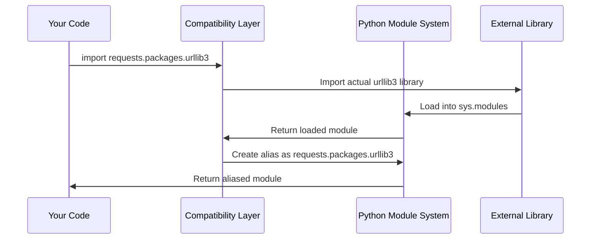

# Chapter 3: Dependency Compatibility Layer

In [Chapter 2: SSL Certificate Management](02_ssl_certificate_management_.md), we learned how the `requests` library automatically handles SSL certificates to keep your connections secure. Now, let's explore another behind-the-scenes feature that makes `requests` so user-friendly: the Dependency Compatibility Layer.

## The Problem: When Libraries Need Different Versions

Imagine you're building with LEGO blocks, but your friend gives you blocks from a different brand that are almost the same size but not quite compatible. You'd need some kind of adapter to make them work together, right?

This same challenge exists in Python libraries. The `requests` library depends on several other libraries like `urllib3` (for HTTP connections), `idna` (for international domain names), and `chardet` (for character encoding detection). But what happens when different versions of these libraries change their interfaces or when users have different versions installed?

Let's say you want to make a simple web request:

```python
import requests

response = requests.get('https://example.com')
print(response.text)
```

This simple line of code actually uses multiple external libraries working together behind the scenes. The Dependency Compatibility Layer ensures they all speak the same language, regardless of which versions you have installed.

## What Is a Dependency Compatibility Layer?

Think of this layer as a universal translator at the United Nations. Just like how translators allow delegates speaking different languages to understand each other, the compatibility layer allows different versions of external libraries to work seamlessly with `requests`.

The compatibility layer acts as a middleman that:
- **Creates aliases**: Makes external packages accessible through the `requests` namespace
- **Maintains consistency**: Ensures the same interface works across different versions
- **Provides fallbacks**: Handles cases where certain libraries aren't available

It's like having a universal remote control that works with any TV brand, regardless of the manufacturer.

## How Users Benefit From This Layer

As a user of `requests`, you might not even realize this compatibility layer exists - and that's the point! Let's see it in action:

```python
# This works seamlessly
import requests
response = requests.get('https://httpbin.org/json')
data = response.json()
print(f"Origin IP: {data['origin']}")
```

Behind this simple code, the compatibility layer is ensuring that:
- The correct version of `urllib3` handles the HTTP connection
- The right `chardet` version detects text encoding
- The proper `idna` version handles international domain names

## Accessing Dependencies Through Requests

The compatibility layer allows you to access underlying libraries through the `requests` namespace:

```python
import requests.packages.urllib3

# Disable SSL warnings for testing
requests.packages.urllib3.disable_warnings()
```

This code works because the compatibility layer makes `urllib3` available as `requests.packages.urllib3`, even though it's actually a separate library.

```python
# You can also access other dependencies
import requests.packages.idna
import requests.packages.chardet

print("Dependencies are available through requests!")
```

The beauty is that you don't need to know the exact versions - the compatibility layer handles the mapping automatically.

## Behind the Scenes: How the Magic Works

Let's understand what happens when the compatibility layer sets up these aliases:



Here's what happens step by step:

1. **You request a dependency**: Your code tries to import something like `requests.packages.urllib3`
2. **Layer finds the real library**: The compatibility layer locates the actual `urllib3` library
3. **Module gets loaded**: Python loads the external library into memory
4. **Alias is created**: The layer creates a new name pointing to the same library
5. **You get access**: You can now use the library through the `requests` namespace

## The Package Aliasing System

The core of this compatibility layer lives in a file called `packages.py`. Let's break down how it works:

```python
import sys

# Create aliases for external packages
for package in ("urllib3", "idna"):
    locals()[package] = __import__(package)
```

This code loops through important dependency names and imports them. The `locals()[package]` creates a variable with the package name pointing to the imported library.

```python
# Create the requests.packages.* aliases
for mod in list(sys.modules):
    if mod == package or mod.startswith(f"{package}."):
        sys.modules[f"requests.packages.{mod}"] = sys.modules[mod]
```

This second loop creates aliases in Python's module system. It's like creating shortcuts - `requests.packages.urllib3` becomes another name for the same `urllib3` library.

## Handling Optional Dependencies

Some dependencies might not be available on every system. The compatibility layer handles this gracefully:

```python
from .compat import chardet

if chardet is not None:
    # Create aliases only if chardet is available
    target = chardet.__name__
    for mod in list(sys.modules):
        if mod == target or mod.startswith(f"{target}."):
            imported_mod = sys.modules[mod]
            sys.modules[f"requests.packages.{mod}"] = imported_mod
```

This code checks if `chardet` is available before creating aliases. If it's missing, the system continues working without it - providing graceful degradation.

## The Module Identity Preservation

One clever aspect of this system is preserving module identity:

```python
# This ensures requests.packages.urllib3.* is identical to urllib3.*
for mod in list(sys.modules):
    if mod == package or mod.startswith(f"{package}."):
        sys.modules[f"requests.packages.{mod}"] = sys.modules[mod]
```

This means that `requests.packages.urllib3.exceptions.SSLError` is exactly the same object as `urllib3.exceptions.SSLError`. They're not copies - they're the exact same thing with different names.

## Why This Matters for Backward Compatibility

This layer solves a critical problem: what if older code expects to find dependencies in specific places?

```python
# Old code might expect this to work
from requests.packages.urllib3.exceptions import InsecureRequestWarning

# Thanks to the compatibility layer, it does!
```

Without this layer, upgrading `requests` might break existing code that relies on these import paths. The compatibility layer ensures that old code keeps working.

## Real-World Example: SSL Warnings

Here's a practical example of why this matters:

```python
import requests
from requests.packages.urllib3.exceptions import InsecureRequestWarning

# Disable SSL warnings for a specific request
requests.packages.urllib3.disable_warnings(InsecureRequestWarning)
response = requests.get('https://self-signed.badssl.com/', verify=False)
```

This code works because:
1. The compatibility layer makes `urllib3` available through `requests.packages`
2. You can access `urllib3`'s warning system through this alias
3. The SSL certificate management from [Chapter 2](02_ssl_certificate_management_.md) still works, but warnings are suppressed

## The Compatibility Import System

The layer also handles different ways packages might be installed:

```python
# Handle different chardet installations
if chardet is not None:
    target = chardet.__name__  # Might be 'chardet' or 'charset_normalizer'
    mod = mod.replace(target, "chardet")  # Normalize the name
    sys.modules[f"requests.packages.{mod}"] = imported_mod
```

This ensures that whether you have `chardet` or its replacement `charset_normalizer` installed, the code works the same way.

## Benefits for Library Developers

This compatibility layer provides several advantages:

**Consistent Interface**: Your code works regardless of dependency versions
```python
# Always works the same way
import requests.packages.urllib3
```

**Simplified Imports**: No need to handle different package locations
```python
# Don't need to worry about where urllib3 is installed
requests.packages.urllib3.disable_warnings()
```

**Graceful Degradation**: Missing optional dependencies don't break everything

## The Comment That Says It All

In the actual code, you'll find this revealing comment:

```python
# This code exists for backwards compatibility reasons.
# I don't like it either. Just look the other way. :)
```

This honest comment from the developers shows that while this system works well, it's a complex solution to a real-world problem. It's not elegant, but it ensures that millions of lines of existing code continue to work.

## Why Abstraction Layers Matter

The Dependency Compatibility Layer demonstrates an important programming principle: sometimes you need ugly code behind the scenes to provide a beautiful experience for users.

Just like how a swan looks graceful gliding on water but is paddling furiously underneath, `requests` appears simple to use while handling complex dependency management behind the scenes.

## Conclusion

The Dependency Compatibility Layer might be invisible to most users, but it's crucial for making `requests` the reliable, user-friendly library we know and love. By creating aliases and managing different dependency versions automatically, this layer ensures that your code works consistently across different environments and Python installations.

You've learned how this universal adapter translates between different library versions and provides a stable interface, building on the package identification concepts from [Chapter 1: Package Metadata Management](01_package_metadata_management_.md) and the security features from [Chapter 2: SSL Certificate Management](02_ssl_certificate_management_.md). Together, these three foundational layers make `requests` both powerful and easy to use.

This compatibility layer represents the kind of thoughtful engineering that makes great libraries great - handling complexity so you don't have to, while maintaining backward compatibility and providing a consistent experience across different systems and configurations.

