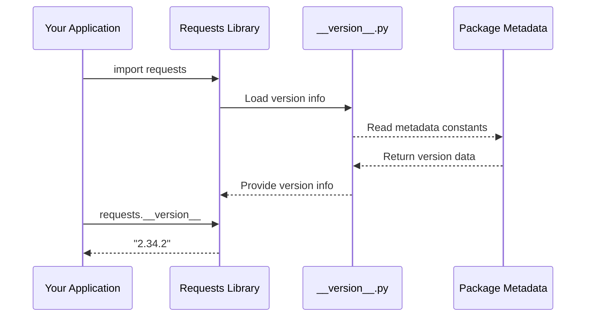

# Chapter 3: Package Metadata and Version Management

Building on our understanding from [Chapter 2: SSL Certificate Authority Management](02_ssl_certificate_authority_management_.md), where we learned how `requests` manages security certificates, let's now explore another fundamental aspect: how `requests` keeps track of its own identity and version information.

## Introduction

Imagine you're organizing a large software project at work, and you need to know which version of each tool your team is using. Just like how you might check the "About" section in your favorite app to see its version number, or how you look at a book's title page to find the author and publication details, every Python package needs a way to identify itself clearly.

Package Metadata and Version Management in `requests` is like having a digital ID card that contains all the essential information about the library - its name, version, who created it, and other important details. This information helps developers, package managers, and other tools understand exactly what they're working with.

## The Problem We're Solving

Let's say you're building a web application and encounter a bug. You want to report it to the `requests` maintainers, but they ask: "What version of requests are you using?" Without proper metadata management, answering this simple question would be surprisingly difficult!

```python
import requests

# How do I find out which version I'm using?
# What's the official website for documentation?
# Who should I contact for support?
```

This is where Package Metadata and Version Management comes to the rescue, providing a standardized way to access all this information.

## Key Concepts

### 1. Package Metadata

Think of metadata as the "nutrition label" of a software package. Just like how food labels tell you ingredients, calories, and manufacturer information, package metadata tells you:

- **Name**: What the package is called (`requests`)
- **Version**: Which specific release you're using (`2.34.2`)
- **Author**: Who created it (`Kenneth Reitz`)
- **Description**: What it does (`Python HTTP for Humans`)
- **License**: How you're allowed to use it (`Apache-2.0`)

### 2. Version Numbers

Version numbers are like addresses for software releases. They follow a pattern that helps everyone understand which release is newer:

```
2.34.2
│ │  │
│ │  └─ Patch version (bug fixes)
│ └──── Minor version (new features)
└───── Major version (big changes)
```

### 3. Build Numbers

Build numbers are like serial numbers for software releases. They provide a unique identifier that's useful for developers:

```python
__version__ = "2.34.2"    # Human-readable
__build__ = 0x023402      # Machine-readable hexadecimal
```

## How It Works: A Step-by-Step Walkthrough

Let's trace through what happens when you want to access version information:



Here's what happens step by step:

1. **Import Phase**: When you import `requests`, it automatically loads the version module
2. **Loading Phase**: The version module reads all metadata constants from `__version__.py`
3. **Registration Phase**: Version information becomes available as attributes on the main package
4. **Access Phase**: You can now query version information using simple attribute access

## Under the Hood: The Implementation

The magic happens in the `__version__.py` file, which acts as the central registry for all package information:

### Step 1: Define Core Metadata

```python
__title__ = "requests"
__description__ = "Python HTTP for Humans."
__url__ = "https://requests.readthedocs.io"
__version__ = "2.34.2"
```

**What happens here**: These constants define the essential identity information for the package. Think of them as filling out a registration form for the library.

### Step 2: Author and Legal Information

```python
__author__ = "Kenneth Reitz"
__author_email__ = "me@kennethreitz.org"
__license__ = "Apache-2.0"
__copyright__ = "Copyright Kenneth Reitz"
```

**What happens here**: This section identifies who created the library and under what legal terms you can use it. It's like the credits section of a movie.

### Step 3: Technical Version Details

```python
__build__ = 0x023402
```

**What happens here**: The build number provides a hexadecimal representation of the version. For version `2.34.2`, this becomes `0x023402` (2 = 02, 34 = 34, 2 = 02 in hex).

### Step 4: Making Information Accessible

```python
# In the main __init__.py file
from .__version__ import __version__
```

**What happens here**: The main requests module imports the version information, making it available to users as `requests.__version__`.

## Practical Examples

### Example 1: Checking Your Version

```python
import requests

print(f"Using requests version: {requests.__version__}")
```

**Expected Output:**
```
Using requests version: 2.34.2
```

**What happens**: You're accessing the version string that was defined in the `__version__.py` file. This is useful for debugging and ensuring compatibility.

### Example 2: Getting Detailed Package Information

```python
import requests

# Access various metadata attributes
print(f"Package: {requests.__title__}")
print(f"Description: {requests.__description__}")
print(f"Author: {requests.__author__}")
print(f"License: {requests.__license__}")
```

**Expected Output:**
```
Package: requests
Description: Python HTTP for Humans.
Author: Kenneth Reitz
License: Apache-2.0
```

**What happens**: Each piece of metadata defined in `__version__.py` becomes accessible as an attribute on the main package.

### Example 3: Version Checking in Code

```python
import requests
from packaging import version

# Check if you have a recent version
current_version = version.parse(requests.__version__)
required_version = version.parse("2.25.0")

if current_version >= required_version:
    print("Great! You have a compatible version.")
else:
    print("Please upgrade your requests library.")
```

**What happens**: This shows how you might programmatically check version compatibility in your applications.

## The ASCII Art Touch

You might notice something fun at the top of `__version__.py`:

```python
# .-. .-. .-. . . .-. .-. .-. .-.
# |(  |-  |.| | | |-  `-.  |  `-.
# ' ' `-' `-`.`-' `-' `-'  '  `-'
```

**What this is**: This ASCII art spells out "requests" in a stylized font! It's a playful touch that shows the personality of the project. The `__cake__ = "\u2728 \U0001f370 \u2728"` variable (which creates ✨🍰✨) is another example of this friendly character.

## Integration with Python's Package System

The metadata defined in `__version__.py` integrates seamlessly with Python's packaging ecosystem:

### Setup Configuration

```python
# In setup.py
from setuptools import setup

setup()  # Reads metadata from pyproject.toml
```

**What happens here**: Modern Python packages use configuration files that reference the same metadata, ensuring consistency across the entire packaging system.

### Package Managers

Package managers like `pip` can read this metadata to:
- Display package information
- Check version compatibility
- Resolve dependency conflicts
- Show author and license information

## Benefits of This Approach

1. **Centralized Information**: All package metadata lives in one place
2. **Easy Access**: Simple attribute access to get any information
3. **Standardization**: Follows Python packaging conventions
4. **Tool Integration**: Works with pip, setuptools, and other tools
5. **Debugging Support**: Helps identify exact versions when troubleshooting

## Real-World Use Cases

### Bug Reports

When users report issues, they can easily include version information:

```python
import requests
print(f"Issue occurred with requests {requests.__version__}")
```

### Compatibility Checking

Libraries that depend on `requests` can verify compatibility:

```python
import requests
if requests.__version__ < "2.0.0":
    raise ImportError("This app requires requests 2.0 or higher")
```

### Development Tools

IDEs and development tools can display package information to help developers understand their dependencies.

## Conclusion

Package Metadata and Version Management in `requests` is like having a comprehensive ID card for the library. It provides a simple, standardized way to access essential information about the package - from version numbers for compatibility checking to author information for support questions.

The elegant simplicity of storing all metadata in a single `__version__.py` file makes it easy to maintain and access, while the integration with Python's packaging system ensures that this information is available to tools throughout the ecosystem.

Just like how a well-organized filing system makes it easy to find important documents, this metadata system makes it effortless to identify and work with different versions of the `requests` library. Whether you're debugging an issue, checking compatibility, or simply curious about what you're using, all the information is right at your fingertips.

This completes our journey through the foundational concepts of the `requests` library. We've explored how it integrates dependencies, manages security certificates, and maintains its own identity - all working together to provide the smooth, reliable HTTP experience that makes `requests` so popular among Python developers.

