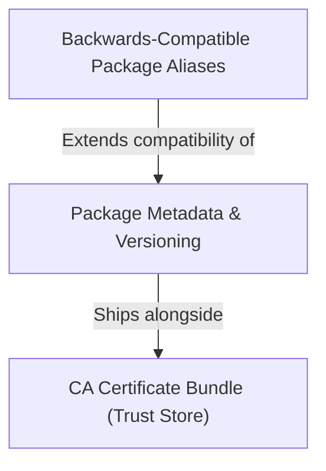

# Tutorial: requests

The `requests` library is a popular **Python HTTP client** that makes it easy for humans to send web requests.
It handles things like *HTTPS security*, *authentication*, and *session management* in a simple, readable way.
The project includes metadata to identify its *version and authorship*, a *trust store* for verifying secure connections,
and *backwards-compatible aliases* so older code continues to work without modification.

**Source Repository:** [https://github.com/psf/requests](https://github.com/psf/requests)

## Chapters

1. [Package Metadata & Versioning
](01_package_metadata___versioning_.md)
2. [CA Certificate Bundle (Trust Store)
](02_ca_certificate_bundle__trust_store__.md)
3. [Backwards-Compatible Package Aliases
](03_backwards_compatible_package_aliases_.md)

---

Generated by [AI Codebase Knowledge Builder](https://github.com/The-Pocket/Tutorial-Codebase-Knowledge)