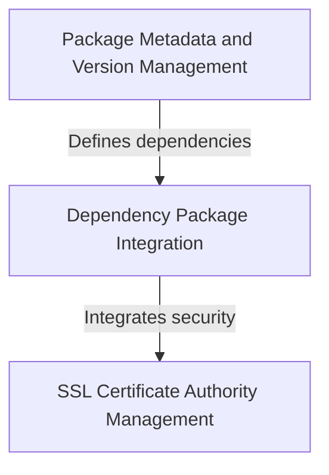

# Tutorial: requests

**Requests** is a popular Python library that makes it *easy and human-friendly* to send HTTP requests to websites and APIs. 
Think of it as a **simplified tool** for your Python programs to communicate with web services - whether you're fetching data from a REST API, 
downloading files, or submitting forms. The library handles all the complex details of web communication while providing a 
*clean and intuitive interface* that developers love to use.

**Source Repository:** [https://github.com/psf/requests](https://github.com/psf/requests)

## Chapters

1. [Dependency Package Integration
](01_dependency_package_integration_.md)
2. [SSL Certificate Authority Management
](02_ssl_certificate_authority_management_.md)
3. [Package Metadata and Version Management
](03_package_metadata_and_version_management_.md)
