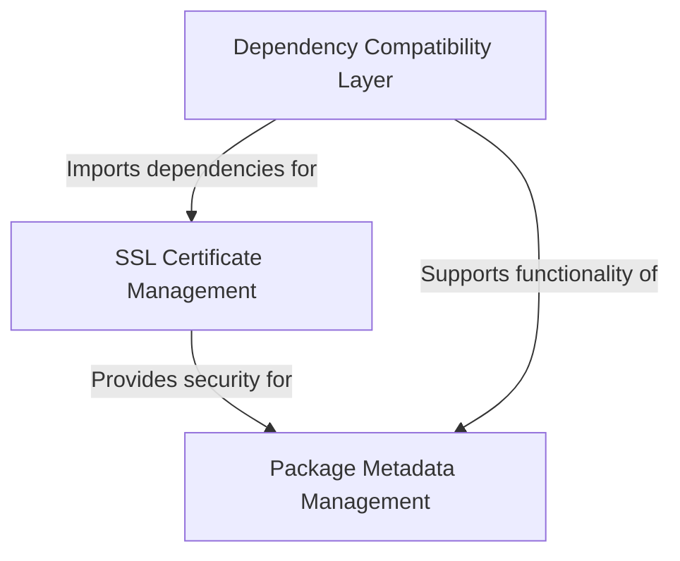

# Tutorial: requests

The **requests** library is a popular *Python HTTP client* that makes it easy for developers to send web requests and interact with APIs. 
It provides a **user-friendly interface** for making HTTP calls while handling complex underlying tasks like *SSL certificate verification* 
and *dependency management* automatically, so developers can focus on building their applications rather than dealing with low-level networking details.

**Source Repository:** [https://github.com/psf/requests](https://github.com/psf/requests)

## Chapters

1. [Package Metadata Management
](01_package_metadata_management_.md)
2. [SSL Certificate Management
](02_ssl_certificate_management_.md)
3. [Dependency Compatibility Layer
](03_dependency_compatibility_layer_.md)
