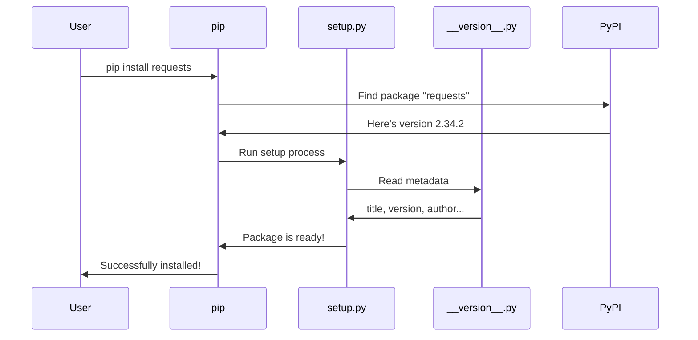
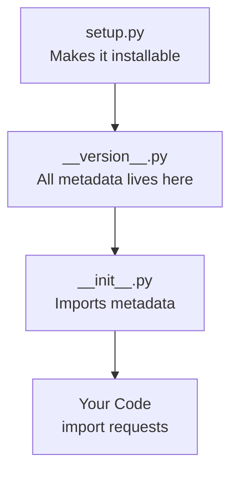

# Chapter 1: Package Versioning & Metadata

Welcome to the very first chapter of our journey into the `requests` library! We're going to start with something that might seem small but is incredibly important — the **identity card** of the `requests` package.

---

## Why Does This Matter? 🤔

Imagine you walk into a store and pick up a bottle of shampoo. On the label, you can read:
- The product name
- Who made it
- What version/formula it is
- What it's for

Without that label, you'd have no idea what you're holding!

Software packages work the same way. When you run:

```bash
pip install requests
```

How does `pip` know *what* to install? How does it know if you already have the latest version? How does PyPI (the Python Package Index) know who made `requests` and what license it uses?

The answer: **Package Metadata**.

---

## The Central Use Case

Let's say you're building an app and you want to check which version of `requests` is installed, or display the author's name in your documentation. You need a reliable, single place to look up this information.

The `requests` library solves this with a dedicated file called `__version__.py`. Let's explore it!

---

## Key Concept 1: The `__version__.py` File

Think of `__version__.py` as a **single source of truth** for all identity information about the package. Instead of scattering this info across multiple files, everything lives in one tidy place.

Here's what it looks like:

```python
# src/requests/__version__.py

__title__ = "requests"
__description__ = "Python HTTP for Humans."
__url__ = "https://requests.readthedocs.io"
__version__ = "2.34.2"
```

Each line stores one piece of identity information. The double underscores (called "dunders") are a Python convention that signals: *"This is special metadata."*

```python
__author__ = "Kenneth Reitz"
__author_email__ = "me@kennethreitz.org"
__license__ = "Apache-2.0"
__copyright__ = "Copyright Kenneth Reitz"
```

This part tells us who made `requests` and under what legal terms you can use it.

> 💡 **Analogy:** If `requests` were a book, `__version__.py` would be the **copyright page** at the front — title, author, edition, publisher, all in one spot.

---

## Key Concept 2: What Each Field Means

| Variable | Example Value | What It Means |
|---|---|---|
| `__title__` | `"requests"` | The package name |
| `__description__` | `"Python HTTP for Humans."` | A short summary |
| `__version__` | `"2.34.2"` | Current version number |
| `__author__` | `"Kenneth Reitz"` | Who made it |
| `__license__` | `"Apache-2.0"` | Legal usage terms |
| `__url__` | `"https://..."` | Project's website |

### Understanding Version Numbers

The version `2.34.2` follows a pattern called **Semantic Versioning**:

```
  2  .  34  .  2
  │      │     │
Major  Minor  Patch
```

- **Major** (`2`): Big changes, may break old code
- **Minor** (`34`): New features, backward-compatible
- **Patch** (`2`): Bug fixes only

---

## Key Concept 3: The `setup.py` File

Now you have all this metadata — but how does Python actually use it to make `requests` *installable*?

That's the job of `setup.py`:

```python
# setup.py
import sys
from setuptools import setup

# Make sure Python is new enough
if sys.version_info < (3, 10):
    sys.stderr.write("Requests requires Python 3.10 or later.\n")
    sys.exit(1)

setup()  # Reads config and makes the package installable
```

The `setup()` call from `setuptools` reads your package configuration and bundles everything up so tools like `pip` can install it correctly.

> 💡 **Analogy:** If `__version__.py` is the product label, `setup.py` is the **factory machine** that uses that label to package and ship the product.

---

## Using the Metadata in Your Code

Now let's solve our original use case — checking the version and author from your own Python code!

```python
import requests

# Check the version
print(requests.__version__)
# Output: 2.34.2
```

That's it! The `requests` package exposes `__version__` directly so you can always check what version is running.

```python
from requests.__version__ import __author__, __license__

print(__author__)   # Output: Kenneth Reitz
print(__license__)  # Output: Apache-2.0
```

This is useful when you want to display library info, write automated compatibility checks, or generate documentation.

---

## What Happens Under the Hood? 🔧

Let's trace what happens step-by-step when `pip install requests` uses this metadata:



Here's the flow in plain English:

1. **You** ask `pip` to install `requests`
2. **`pip`** contacts PyPI to find the package
3. **PyPI** returns the latest version info
4. **`setup.py`** is invoked to handle installation
5. **`__version__.py`** provides the metadata
6. The package is installed on your machine!

---

## Diving Deeper: How the Files Connect

The `__version__.py` file doesn't do magic on its own. The main `requests` package imports from it to expose metadata at the top level:

```python
# Simplified from src/requests/__init__.py
from .__version__ import (
    __version__,
    __author__,
    __title__,
    # ... and more
)
```

This is why you can write `requests.__version__` directly — the value is imported from `__version__.py` and made available at the package's top level.

> 💡 Think of it like a store putting the product summary on the **front window**, even though the full details are in the back office.

Here's a simple diagram of this connection:



---

## A Fun Easter Egg 🎂

Did you notice this line in `__version__.py`?

```python
__cake__ = "\u2728 \U0001f370 \u2728"
```

Let's see what that is:

```python
from requests.__version__ import __cake__
print(__cake__)
# Output: ✨ 🎂 ✨
```

It's a sparkly cake emoji! A little personality from Kenneth Reitz, the author. It's a reminder that open source software is made by real humans who have fun! 🎉

---

## Summary

In this chapter, you learned:

- ✅ **Why** package metadata matters — it's the identity card of a library
- ✅ **What** `__version__.py` contains — version, author, license, and more
- ✅ **How** semantic versioning (`2.34.2`) works — Major.Minor.Patch
- ✅ **How** `setup.py` uses this metadata to make the package installable
- ✅ **How** to access version info in your own Python code

This metadata system is the foundation that makes `requests` a well-managed, trustworthy open source package. Every time `pip` installs or upgrades it, this is the information it relies on.

---

In the next chapter, we'll look at another foundational piece of `requests` — how it handles secure HTTPS connections by managing trusted certificates. Head over to [CA Certificate Management](02_ca_certificate_management_.md) to learn more!

---

Generated by [AI Codebase Knowledge Builder](https://github.com/The-Pocket/Tutorial-Codebase-Knowledge)