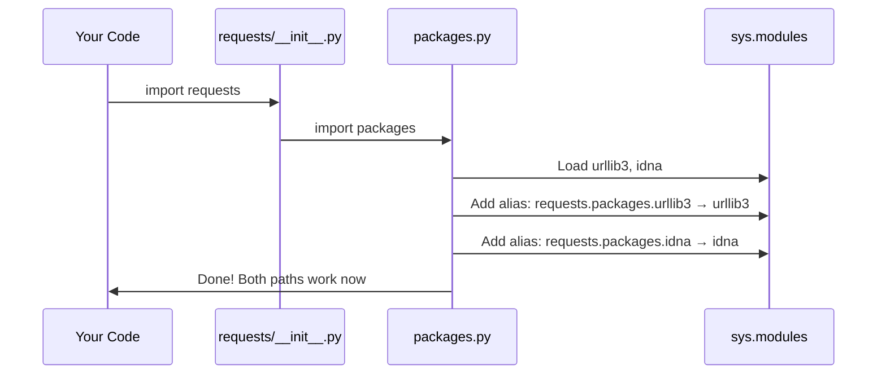
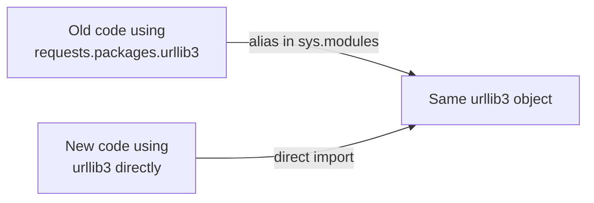

# Chapter 3: Dependency Namespace Bridging

Welcome back! In [Chapter 2: CA Certificate Management](02_ca_certificate_management_.md), we saw how `requests` delegates the job of managing trusted certificates to an external library called `certifi`. This is a great example of `requests` leaning on other libraries to do specialized work.

In this chapter, we'll explore a clever trick that `requests` uses to make sure code that was written *years ago* still works today — even when the internal structure of the library has changed. This trick is called **Dependency Namespace Bridging**.

---

## Why Does This Matter? 🤔

Let's start with a real problem.

Imagine you wrote some Python code back in 2015 that looked like this:

```python
import requests

# Access urllib3 through requests
http = requests.packages.urllib3
```

This used to work! `requests` exposed its internal dependencies under `requests.packages`. But over time, the `requests` library evolved. The internal structure changed. If `requests.packages` just... disappeared one day, your old code would suddenly *crash*.

> 💡 **Analogy:** Think of a building that has both a **front door** and a **side entrance** leading to the same room. Even if they renovate the front, the side entrance still gets you to the same place.

That's exactly what `packages.py` does — it keeps the **side entrance** open so old code doesn't break.

---

## The Central Use Case

Suppose you have old code (or you're using an old library) that does this:

```python
import requests

# Old-style access to urllib3 through requests.packages
pool = requests.packages.urllib3.PoolManager()
print(pool)
# Output: <urllib3.poolmanager.PoolManager object at 0x...>
```

Thanks to `packages.py`, this still works perfectly. The `requests.packages.urllib3` path and the direct `urllib3` path both lead to the **exact same object** in memory.

Let's understand how!

---

## Key Concept 1: What Are These Dependencies?

`requests` is not written from scratch. It builds on top of other great libraries:

| Library | What It Does |
|---|---|
| `urllib3` | Handles the actual HTTP connection pooling |
| `idna` | Handles international domain names (e.g., non-ASCII URLs) |
| `chardet` / `charset_normalizer` | Detects the character encoding of a response |

These libraries are **dependencies** of `requests`. They're installed automatically when you `pip install requests`.

> 💡 **Analogy:** `requests` is like a **contractor** who hires specialists. `urllib3` is the plumber, `idna` is the translator, and `chardet` is the handwriting expert. `requests` coordinates them all.

---

## Key Concept 2: What is `sys.modules`?

Before we can understand the trick in `packages.py`, we need to understand one Python built-in: `sys.modules`.

```python
import sys

# sys.modules is a dictionary of all currently loaded modules
print(type(sys.modules))
# Output: <class 'dict'>

print("urllib3" in sys.modules)
# Output: True (after requests is imported)
```

`sys.modules` is Python's **registry of loaded modules**. When Python imports a module, it stores it here with a key equal to the module's name.

> 💡 **Analogy:** Think of `sys.modules` as the **index of a library**. Each book (module) has a label (its name). If you want Python to find a module by a new name, you just add a new entry in the index pointing to the same book!

---

## Key Concept 3: Creating an Alias (The Core Trick!)

Here's the core idea. Let's say `urllib3` is already loaded. We can make it accessible under a *different name* like this:

```python
import sys
import urllib3

# Add a new entry pointing to the SAME module object
sys.modules["requests.packages.urllib3"] = urllib3
```

After this line, Python will find `urllib3` whether you import it as `urllib3` or as `requests.packages.urllib3`. They're the **same object**!

This is the heart of Dependency Namespace Bridging — creating aliases in `sys.modules`.

---

## Walking Through `packages.py`

Now let's look at the actual file, piece by piece.

**Step 1: Loop over the main packages**

```python
import sys

for package in ("urllib3", "idna"):
    locals()[package] = __import__(package)
```

This imports both `urllib3` and `idna` and stores them as local variables. `__import__("urllib3")` is the same as writing `import urllib3`.

**Step 2: Register all sub-modules**

```python
    for mod in list(sys.modules):
        if mod == package or mod.startswith(f"{package}."):
            sys.modules[f"requests.packages.{mod}"] = sys.modules[mod]
```

This loops through *all* loaded modules and finds any that belong to `urllib3` (like `urllib3.exceptions`, `urllib3.poolmanager`, etc.). For each one, it adds an alias like `requests.packages.urllib3.exceptions`.

> 💡 **Analogy:** Imagine renaming every chapter in a book AND every section within each chapter. This loop does that systematically for the whole module tree.

**Step 3: Handle `chardet` (character detection)**

```python
from .compat import chardet

if chardet is not None:
    target = chardet.__name__  # might be "chardet" or "charset_normalizer"
    for mod in list(sys.modules):
        if mod == target or mod.startswith(f"{target}."):
            imported_mod = sys.modules[mod]
            sys.modules[f"requests.packages.{mod}"] = imported_mod
```

`chardet` is special — it might not be installed, and it might actually be `charset_normalizer` under the hood. This code handles both cases gracefully.

---

## What Happens Step-by-Step? 🔧

Here's a walkthrough of what happens when you do `import requests`:



In plain English:

1. **You** write `import requests`
2. **`requests`** loads `packages.py` as part of its setup
3. **`packages.py`** imports `urllib3` and `idna`
4. **`packages.py`** registers aliases in `sys.modules`
5. **Now** both `urllib3` and `requests.packages.urllib3` point to the same thing!

---

## Seeing It In Action

Let's verify that the aliasing actually works:

```python
import requests
import urllib3

# Are they the same object?
same = requests.packages.urllib3 is urllib3
print(same)
# Output: True
```

They are literally the **same object** in memory — not a copy, not a wrapper. The same object, accessed through two different names.

```python
# Sub-modules work too!
direct = urllib3.exceptions.HTTPError
bridged = requests.packages.urllib3.exceptions.HTTPError

print(direct is bridged)
# Output: True
```

Even nested sub-modules are identical objects. The bridging goes all the way down.

---

## Why Not Just Use `import urllib3` Directly?

Good question! If you're writing *new* code today, you absolutely should use:

```python
import urllib3  # ✅ Modern, direct, preferred
```

The `requests.packages` namespace exists **only for backward compatibility**. It's a bridge for old code that hasn't been updated yet.



Both paths lead to the same place — the old path just exists so we don't break anything!

---

## The Comment in the Code 😄

There's a wonderfully honest comment right at the top of `packages.py`:

```python
# This code exists for backwards compatibility reasons.
# I don't like it either. Just look the other way. :)
```

This is the author acknowledging that this trick is a bit of a hack — it works, but it's not the prettiest code. Open source software is built by real humans who sometimes have to do messy things to keep old code running! 

---

## A Simple Mental Model

Here's the simplest way to think about all of this:

```
sys.modules = {
    "urllib3":                          <urllib3 module>,
    "urllib3.exceptions":               <urllib3.exceptions module>,
    
    # Aliases added by packages.py:
    "requests.packages.urllib3":          <same urllib3 module>,
    "requests.packages.urllib3.exceptions": <same urllib3.exceptions module>,
}
```

`packages.py` is just adding extra keys to this dictionary, all pointing to the same existing values. No copying, no wrapping — just new labels on the same shelves.

---

## Summary

In this chapter, you learned:

- ✅ **Why** namespace bridging exists — to keep old code working after internal changes
- ✅ **What** `sys.modules` is — Python's registry of all loaded modules
- ✅ **How** the alias trick works — adding new keys to `sys.modules` pointing to existing modules
- ✅ **What** `packages.py` does — registers `requests.packages.urllib3` (and others) as aliases
- ✅ **That** both the old path and the new path point to the **exact same object**
- ✅ **When** to use it — only in old code; new code should import libraries directly

The key insight is elegant: you can give a module multiple names in Python by simply adding entries to `sys.modules`. `packages.py` uses this to build a bridge between the old `requests.packages.*` namespace and the modern, direct imports of `urllib3` and `idna`.

---

Congratulations! You've now completed the first three chapters of this tutorial series. You've learned about [Package Versioning & Metadata](01_package_versioning___metadata_.md), [CA Certificate Management](02_ca_certificate_management_.md), and now Dependency Namespace Bridging. Together, these three concepts form the **foundation layer** of how `requests` is packaged, secured, and made compatible — all before a single HTTP request is ever sent!

---

Generated by [AI Codebase Knowledge Builder](https://github.com/The-Pocket/Tutorial-Codebase-Knowledge)