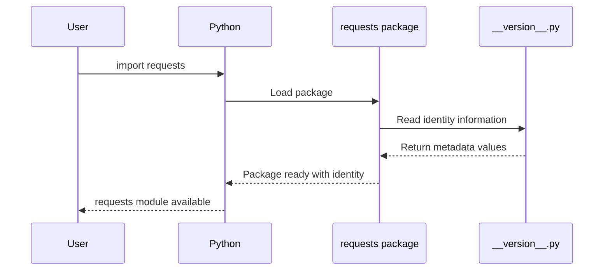

# Chapter 1: Package Identity & Metadata

Welcome to your journey into understanding the `requests` library! Think of this chapter as learning to read a library's "ID card" - just like how you have personal information that identifies who you are, Python packages need their own identity and information.

## What Problem Does Package Identity Solve?

Imagine you're in a huge library with thousands of books, but none of them have title pages, author names, or publication dates. How would you know which book is which? How would you know if you have the latest edition? This would be chaos!

The same problem exists in the Python world. When you install a package like `requests`, Python needs to know:
- What is this package called?
- Who created it?
- What version is it?
- What does it do?

Package identity and metadata solve this problem by providing a clear "passport" for every Python package.

## A Real-World Example

Let's say you're building a web application and want to make sure you're using the right version of the `requests` library. Here's how you can check the package's identity:

```python
import requests
print(requests.__version__)
```

This might output something like:
```
2.34.2
```

This simple line tells you exactly which version of `requests` you're using - crucial information for debugging and ensuring compatibility!

## Key Concepts of Package Identity

### 1. Package Name and Description

Every package needs a clear name and purpose. Think of it like a business card:

```python
print(requests.__title__)        # "requests"
print(requests.__description__)  # "Python HTTP for Humans."
```

The title tells you the package name, and the description gives you a friendly summary of what it does. Notice how `requests` describes itself as "Python HTTP for Humans" - this immediately tells you it's designed to be user-friendly!

### 2. Version Information

Version numbers are like edition numbers for books:

```python
print(requests.__version__)  # "2.34.2"
```

This version number follows a pattern called "semantic versioning" - the numbers tell you about major changes, minor updates, and bug fixes.

### 3. Author and License Information

Just like books have authors and copyright information:

```python
print(requests.__author__)      # "Kenneth Reitz"
print(requests.__license__)     # "Apache-2.0"
```

This tells you who created the package and how you're legally allowed to use it.

## How This Works Under the Hood

Let's peek behind the curtain to see how this identity system actually works. When you import `requests`, here's what happens step by step:



### The Metadata File

All of this identity information lives in a special file called `__version__.py`. Let's look at how it's structured:

```python
__title__ = "requests"
__description__ = "Python HTTP for Humans."
__version__ = "2.34.2"
```

This file is like a database of identity information. Each variable starting with double underscores (`__`) is a special metadata field that Python and packaging tools can read.

### More Metadata Fields

The `requests` library includes additional identity information:

```python
__author__ = "Kenneth Reitz"
__author_email__ = "me@kennethreitz.org"
__url__ = "https://requests.readthedocs.io"
```

These fields provide contact information and links to documentation - like having a complete contact card for the package.

### Special Metadata

Some metadata fields are unique to specific packages:

```python
__cake__ = "🌟 🍰 🌟"
```

This playful addition shows that package metadata can include anything the developers want - it's their space to add personality to their code!

## Why This Matters for You

Understanding package identity helps you:

1. **Debug issues**: When reporting bugs, you can specify exactly which version you're using
2. **Manage dependencies**: You can ensure your project uses compatible package versions
3. **Track updates**: You can check if newer versions are available
4. **Understand licensing**: You can verify you're legally allowed to use the package

## Accessing Metadata in Your Code

Here's a practical example of checking package information before using it:

```python
import requests

# Check if we have a recent version
version = requests.__version__
print(f"Using requests version: {version}")

# Get package description
print(f"Description: {requests.__description__}")
```

This might output:
```
Using requests version: 2.34.2
Description: Python HTTP for Humans.
```

## Summary

In this chapter, you've learned that package identity and metadata work like an ID card system for Python packages. The `requests` library stores its identity information in a `__version__.py` file, which contains everything from the package name and version to author information and licensing details.

This metadata system helps you identify exactly which package you're working with, track versions for compatibility, and understand the legal and practical aspects of using the package in your projects.

Next, we'll explore how this identity system connects to keeping your packages secure and managing their dependencies in [Security & Dependency Management](02_security___dependency_management_.md).

