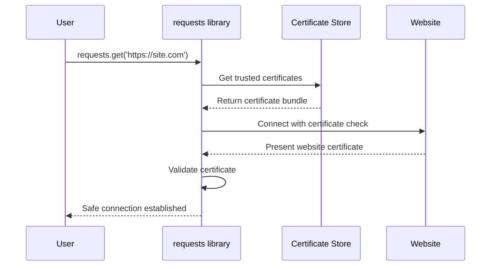
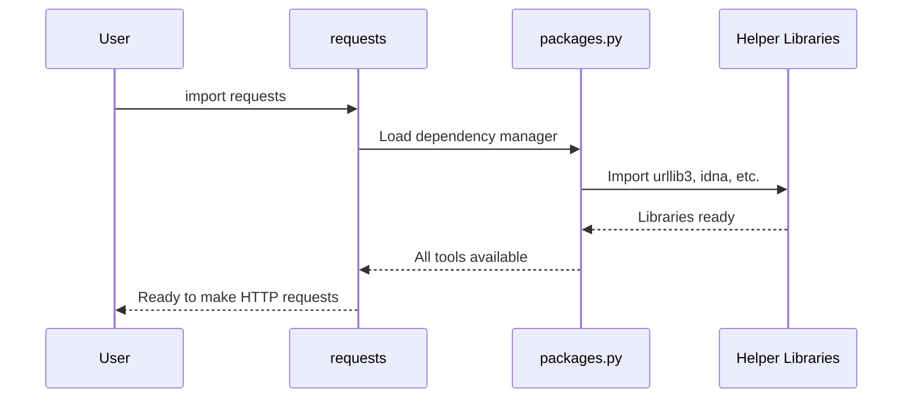

# Chapter 2: Security & Dependency Management

In [Chapter 1: Package Identity & Metadata](01_package_identity___metadata_.md), we learned how Python packages identify themselves with metadata. Now let's explore how the `requests` library keeps you safe online and manages the tools it needs to work properly.

## What Problem Does Security & Dependency Management Solve?

Imagine you're planning to visit a new city. You'd want two things:
1. A way to verify that the hotels and restaurants you visit are legitimate (not scams)
2. A reliable travel toolkit with maps, translation apps, and emergency contacts

The same applies when your Python code visits websites on the internet. The `requests` library needs to:
1. **Verify website identity**: Make sure the websites you connect to are really who they claim to be
2. **Manage its toolkit**: Ensure all the helper libraries it depends on are available and working

Let's say you want to safely download data from a secure website:

```python
import requests
response = requests.get('https://api.github.com/users/octocat')
print(response.json()['name'])
```

Behind the scenes, `requests` is doing two critical jobs to make this simple code work safely and reliably.

## Key Concepts of Security & Dependency Management

### 1. SSL Certificate Validation - Your Internet ID Checker

When you visit a website with `https://`, you're asking for a secure connection. But how do you know the website is really who it claims to be? This is where SSL certificates come in - they're like digital ID cards for websites.

```python
import requests
# This automatically validates the website's SSL certificate
response = requests.get('https://github.com')
print("Connection successful and secure!")
```

If you try to connect to a website with an invalid or suspicious certificate, `requests` will protect you by refusing the connection:

```python
import requests
try:
    # This would fail if the certificate is invalid
    response = requests.get('https://expired.badssl.com')
except requests.exceptions.SSLError:
    print("Blocked unsafe connection - certificate problem!")
```

### 2. Dependency Management - Your Software Toolkit

The `requests` library is like a master craftsperson who needs specific tools to do their job. These tools are other Python libraries called "dependencies." The main ones are:

- **urllib3**: Handles the low-level internet connections
- **certifi**: Provides trusted website certificates
- **idna**: Helps with international domain names
- **chardet**: Detects text encoding

```python
import requests
# When you do this, requests automatically has access to all its tools
response = requests.get('https://example.com')
```

## How Security Works: SSL Certificate Validation

Let's see how `requests` keeps you safe when connecting to websites:



### The Certificate Store

The `requests` library uses a file called `certs.py` to manage trusted certificates:

```python
# This is how requests finds trusted certificates
from certifi import where

print(where())  # Shows path to certificate file
```

This code tells `requests` where to find the list of trusted certificate authorities - organizations that verify website identities.

### What Happens During Certificate Validation

When you make a secure request, here's what happens:

1. **Request**: You ask to connect to a website
2. **Certificate Check**: The website presents its ID certificate
3. **Validation**: `requests` checks if the certificate is signed by a trusted authority
4. **Decision**: Connection proceeds if valid, blocks if suspicious

```python
import requests

# This will work - GitHub has a valid certificate
response = requests.get('https://api.github.com')
print(f"Status: {response.status_code}")  # Status: 200

# This protects you from potentially dangerous sites
try:
    response = requests.get('https://self-signed.badssl.com')
except requests.exceptions.SSLError as e:
    print("Protected from unsafe connection!")
```

## How Dependency Management Works

The `requests` library needs helper libraries to function. Let's see how it manages them:



### The Package Manager

The `packages.py` file acts like a toolkit organizer:

```python
# This imports essential helper libraries
for package in ("urllib3", "idna"):
    locals()[package] = __import__(package)
```

This code automatically imports the helper libraries that `requests` needs and makes them available in a organized way.

### Making Dependencies Accessible

The package manager also creates convenient shortcuts:

```python
import requests

# Instead of importing urllib3 separately, you can access it through requests
print(requests.packages.urllib3)  # Access to urllib3 through requests
```

This means all the tools `requests` needs are neatly organized under `requests.packages`, like having a well-organized toolbox.

## Real-World Security Example

Here's how these security features protect you in practice:

```python
import requests

def safe_api_call(url):
    try:
        # Automatic certificate validation happens here
        response = requests.get(url)
        return response.json()
    except requests.exceptions.SSLError:
        print("⚠️  Unsafe website - connection blocked!")
        return None
    except requests.exceptions.ConnectionError:
        print("❌ Couldn't connect to website")
        return None

# This will work safely
data = safe_api_call('https://api.github.com/users/octocat')
if data:
    print(f"✅ Safely got data for: {data['name']}")
```

This might output:
```
✅ Safely got data for: The Octocat
```

## Why This Matters for You

Security and dependency management provide crucial benefits:

1. **Automatic Protection**: You don't need to become a security expert - `requests` handles certificate validation automatically
2. **Simplified Imports**: All necessary helper libraries are managed for you
3. **Consistent Behavior**: The same security standards apply across all your requests
4. **Error Prevention**: Invalid certificates are caught before they can cause problems

## Checking Your Security Setup

You can verify that security features are working:

```python
import requests
import ssl

# Check SSL context
print(f"SSL version: {ssl.OPENSSL_VERSION}")

# Make a secure request
response = requests.get('https://httpbin.org/get')
print(f"Secure connection: {response.url.startswith('https')}")
```

This confirms that SSL security is properly configured and working.

## Summary

In this chapter, you've learned how `requests` acts as both a security guard and a toolkit manager. The `certs.py` module ensures that your connections to websites are secure by validating SSL certificates - like checking ID cards at a secure building. The `packages.py` module organizes all the helper libraries that `requests` needs to function, ensuring they're available and accessible.

These features work automatically in the background, so you can focus on building your applications while `requests` handles the complex security and dependency management tasks.

Next, we'll explore how these components fit into the broader development workflow in [Project Configuration & Development Workflow](03_project_configuration___development_workflow_.md).

