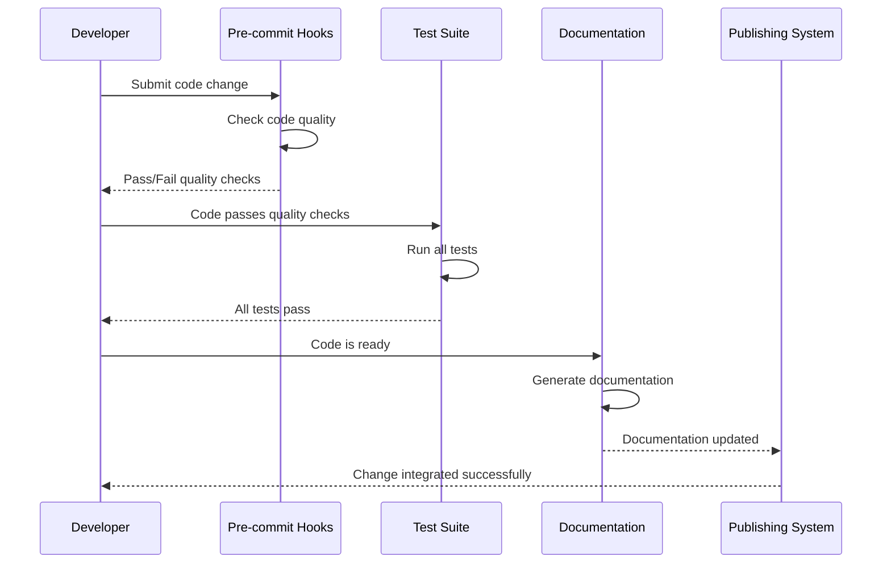

# Chapter 3: Project Configuration & Development Workflow

In [Chapter 2: Security & Dependency Management](02_security___dependency_management_.md), we learned how the `requests` library keeps you safe online and manages its helper libraries. Now let's explore the behind-the-scenes tools and processes that ensure the `requests` library itself is built properly, tested thoroughly, and delivered reliably to millions of developers worldwide.

## What Problem Does Project Configuration & Development Workflow Solve?

Imagine you're running a bakery that produces thousands of loaves of bread every day. You'd need:
1. Quality control checkpoints to ensure every loaf meets your standards
2. Automated ovens and timers so bread bakes consistently
3. A reliable delivery system to get bread to stores
4. Documentation so new bakers can follow your recipes

The `requests` library faces the same challenge, but with code instead of bread. With millions of users depending on it, the project needs systems to ensure:
- Every piece of code meets quality standards before being added
- Tests run automatically to catch bugs early
- New versions are published correctly
- Documentation stays up-to-date

Let's say a developer wants to contribute a new feature to `requests`. Here's what happens automatically:

```python
# Developer writes code and submits it
def new_feature():
    return "This is a new feature!"
```

Behind the scenes, an entire workflow springs into action to validate, test, and potentially integrate this code safely.

## Key Concepts of Development Workflow

### 1. Code Quality Checks - Your Automatic Code Reviewer

Think of code quality checks like a spell-checker for your writing, but much more sophisticated. They automatically review code for common problems before it becomes part of the library.

The `requests` project uses a file called `.pre-commit-config.yaml` that acts like a checklist:

```yaml
repos:
- repo: https://github.com/pre-commit/pre-commit-hooks
  rev: v6.0.0
  hooks:
  - id: check-merge-conflict
  - id: check-yaml
  - id: trailing-whitespace
```

This configuration tells the system: "Before accepting any code changes, automatically check for merge conflicts, validate YAML files, and remove extra whitespace."

### 2. Automated Testing - Your Quality Assurance Team

Every time someone changes the code, automated tests run to make sure nothing breaks. It's like having a robot that tests every feature of your car after any repair.

```python
# This is what happens when tests run
def test_basic_request():
    response = requests.get('https://httpbin.org/get')
    assert response.status_code == 200
```

This test ensures that basic HTTP requests still work correctly after any code changes.

### 3. Documentation Generation - Your Automatic Manual Writer

The project automatically builds and publishes documentation so users always have current information. The `.readthedocs.yaml` file controls this process:

```yaml
version: 2
sphinx:
  configuration: docs/conf.py
python:
  install:
    - path: .
```

This tells the documentation system: "Build docs using Python 3.12, install the requests library, and use Sphinx to generate beautiful web pages."

## How Development Workflow Works: The Complete Pipeline

Let's see what happens when a developer submits a code change:



### The Pre-commit Hook System

The `.pre-commit-config.yaml` file sets up automatic code quality checks:

```yaml
hooks:
  - id: check-case-conflict
  - id: check-merge-conflict  
  - id: trailing-whitespace
```

Each "hook" is like a quality gate:
- `check-case-conflict`: Prevents file name conflicts between operating systems
- `check-merge-conflict`: Catches incomplete code merges
- `trailing-whitespace`: Removes messy extra spaces

When a developer tries to commit code, these checks run automatically and block bad code from entering the project.

### The Testing Infrastructure

The `Makefile` defines commands for running different types of tests:

```makefile
test:
	python -m pytest tests

coverage:
	python -m pytest --cov-report term --cov=src/requests tests
```

This creates simple commands:
- `make test`: Runs all tests to ensure nothing is broken
- `make coverage`: Checks how much of the code is covered by tests

### The Documentation Pipeline  

The `.readthedocs.yaml` configuration automates documentation building:

```yaml
build:
  os: ubuntu-22.04
  tools:
    python: "3.12"
```

This ensures documentation is built in a consistent environment, so it looks and works the same for everyone.

## Real-World Development Workflow Example

Here's what happens when you contribute to the `requests` project:

```python
# 1. You write a new feature
def improved_timeout_handling():
    # Your awesome new code here
    pass
```

```bash
# 2. Pre-commit hooks automatically run
git commit -m "Add improved timeout handling"
# → Checks code style, removes trailing spaces, etc.
```

```python
# 3. Tests run automatically  
def test_improved_timeout():
    # Test your new feature works
    assert improved_timeout_handling() is not None
```

```yaml
# 4. Documentation builds automatically
# Your feature gets documented and published online
```

### The Publishing Process

The `Makefile` also includes commands for publishing new versions:

```makefile
publish: .publishenv
	.publishenv/bin/python -m build
	.publishenv/bin/python -m twine upload dist/*
```

This automated process:
1. Creates a clean environment for building
2. Packages the code into distributable files
3. Uploads the package to PyPI (where `pip install` gets it from)

## Why This Matters for You

Understanding development workflow helps you:

1. **Contribute Confidently**: You know your contributions will be automatically checked for quality
2. **Trust the Library**: You can rely on `requests` because it has rigorous quality processes
3. **Learn Best Practices**: You can apply similar workflows to your own projects
4. **Report Issues Effectively**: You understand how testing and releases work

## Setting Up Your Own Development Workflow

You can use similar tools in your own projects:

```yaml
# .pre-commit-config.yaml for your project
repos:
- repo: https://github.com/pre-commit/pre-commit-hooks
  rev: v6.0.0
  hooks:
  - id: trailing-whitespace
  - id: end-of-file-fixer
```

```makefile
# Makefile for your project
test:
	python -m pytest tests

install:
	pip install -r requirements.txt
```

These simple configurations can give your projects the same professional quality controls that `requests` uses.

## Advanced Configuration Features

The `setup.py` file includes version checking to ensure compatibility:

```python
import sys

if sys.version_info < (3, 10):
    sys.stderr.write("Requests requires Python 3.10 or later.\n")
    sys.exit(1)
```

This prevents users from installing `requests` on incompatible Python versions, avoiding confusing error messages later.

## The Complete Development Lifecycle

Here's how all these pieces work together in the `requests` project:

1. **Code Quality**: Pre-commit hooks catch problems before they enter the codebase
2. **Testing**: Automated tests verify everything works correctly
3. **Documentation**: Docs are automatically built and published
4. **Publishing**: New versions are reliably packaged and distributed
5. **Compatibility**: Version checks ensure users get working software

This creates a reliable pipeline from developer's computer to your `pip install requests` command.

## Summary

In this chapter, you've learned how the `requests` project uses development workflow tools to maintain its high quality and reliability. The `.pre-commit-config.yaml` file ensures code quality through automated checks, the `Makefile` provides consistent commands for testing and publishing, and the `.readthedocs.yaml` configuration keeps documentation current.

These tools work together like a well-orchestrated factory assembly line, ensuring that every piece of code that becomes part of `requests` meets strict quality standards. This infrastructure is what allows the library to serve millions of developers reliably while continuing to evolve and improve.

Understanding these development workflows gives you insight into how professional open-source projects maintain their quality and reliability, and provides a model you can follow in your own development projects.

