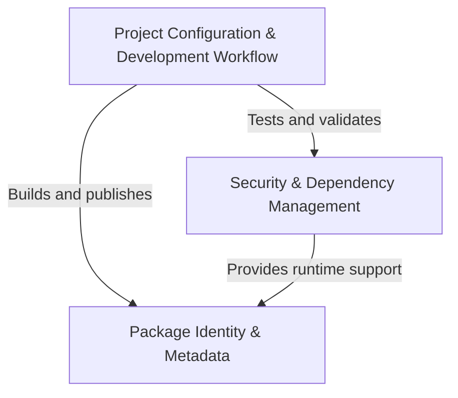

# Tutorial: requests

**Requests** is a popular *Python library* that makes **HTTP requests** simple and human-friendly. 
Instead of dealing with complex low-level networking code, developers can easily fetch web pages, 
send data to APIs, and interact with web services using intuitive Python code. The library handles 
all the complicated parts like *SSL certificates*, *authentication*, and *connection management* 
behind the scenes, making web programming accessible to beginners while remaining powerful for 
advanced users.

**Source Repository:** [https://github.com/psf/requests](https://github.com/psf/requests)

## Chapters

1. [Package Identity & Metadata
](01_package_identity___metadata_.md)
2. [Security & Dependency Management
](02_security___dependency_management_.md)
3. [Project Configuration & Development Workflow
](03_project_configuration___development_workflow_.md)
