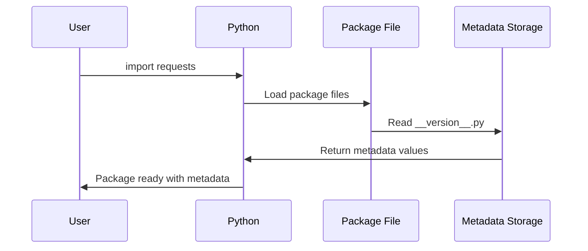

# Chapter 1: Package Metadata and Version Management

Welcome to the world of Python packages! Imagine you're shopping for groceries and pick up a box of cereal. On that box, you'll find important information like the brand name, what's inside, who made it, and when it expires. Software packages work in a very similar way - they need an "information label" that tells you and your computer everything important about that piece of software.

## What Problem Does This Solve?

Let's say you're building a web application and you want to use the `requests` library to fetch data from websites. But how does your computer know:
- What version of `requests` you're using?
- Who created it?
- What it's designed to do?
- Whether it's compatible with your other software?

Without this information, it would be like having a mystery box of software - you wouldn't know what you're working with! Package metadata solves this problem by providing a clear "ID card" for every piece of software.

## The Package Information Card

Think of package metadata as a digital business card. Just like a business card tells you someone's name, job title, and contact information, package metadata tells you everything essential about a software package.

Here's what the `requests` library's "business card" looks like:

```python
__title__ = "requests"
__description__ = "Python HTTP for Humans."
__version__ = "2.34.2"
__author__ = "Kenneth Reitz"
```

This simple code creates four pieces of information that anyone can check. Let's break down what each piece means:

- `__title__`: The name of the package (like "requests")
- `__description__`: A short explanation of what it does
- `__version__`: Which version you're using (like version 2.34.2)
- `__author__`: Who created this software

## How to Use Package Metadata

Let's see how you can actually use this information in your own code. Imagine you want to check what version of `requests` you're using:

```python
import requests
print(f"Using requests version: {requests.__version__}")
```

When you run this code, you'll see something like:
```
Using requests version: 2.34.2
```

This is incredibly useful! If you're getting help with a bug, the first thing someone will ask is "what version are you using?" Now you know how to find out.

You can also check other information:

```python
import requests
print(f"Package: {requests.__title__}")
print(f"Description: {requests.__description__}")
```

This will output:
```
Package: requests
Description: Python HTTP for Humans.
```

## Understanding Version Numbers

Version numbers might look confusing at first, but they follow a simple pattern. The version `2.34.2` breaks down like this:

```
2    .    34   .    2
^         ^         ^
Major    Minor     Patch
```

- **Major (2)**: Big changes that might break existing code
- **Minor (34)**: New features that don't break existing code  
- **Patch (2)**: Small bug fixes

## How It Works Under the Hood

Let's peek behind the curtain and see how this metadata system actually works. When you install a package like `requests`, here's what happens step by step:



The magic happens in a special file called `__version__.py`. This file is like the package's birth certificate - it contains all the official information:

```python
__title__ = "requests"
__description__ = "Python HTTP for Humans."
__url__ = "https://requests.readthedocs.io"
__version__ = "2.34.2"
__author__ = "Kenneth Reitz"
```

When you import the `requests` package, Python automatically reads this file and makes all these variables available to you.

## The Complete Metadata Picture

The `requests` package actually stores even more information than we've seen so far. Here's the full picture:

```python
# Basic identification
__title__ = "requests"
__description__ = "Python HTTP for Humans."
__version__ = "2.34.2"
```

```python
# Author and legal information  
__author__ = "Kenneth Reitz"
__author_email__ = "me@kennethreitz.org"
__license__ = "Apache-2.0"
__copyright__ = "Copyright Kenneth Reitz"
```

Each piece serves a specific purpose:
- `__url__`: Where to find documentation
- `__license__`: Legal terms for using the software
- `__author_email__`: How to contact the creator

## Why This Matters for You

Understanding package metadata helps you in several important ways:

1. **Debugging**: When something breaks, you can quickly check if you have the right version
2. **Compatibility**: Different versions might work differently with your code
3. **Trust**: You can verify who created the software you're using
4. **Learning**: You can find documentation and support resources

Think of it like checking the expiration date on milk - it helps you make informed decisions about what you're using in your project.

## Conclusion

Package metadata is like a universal ID system for software. It helps you identify, track, and manage the building blocks of your applications. Just like you'd check a food label before eating something new, checking package metadata helps you understand what software you're working with.

Now that you understand how packages identify themselves, you're ready to learn about how they handle security and trust. In the next chapter, we'll explore [SSL Certificate Management](02_ssl_certificate_management_.md), which ensures that when your code talks to websites, it's talking to the right ones safely.

