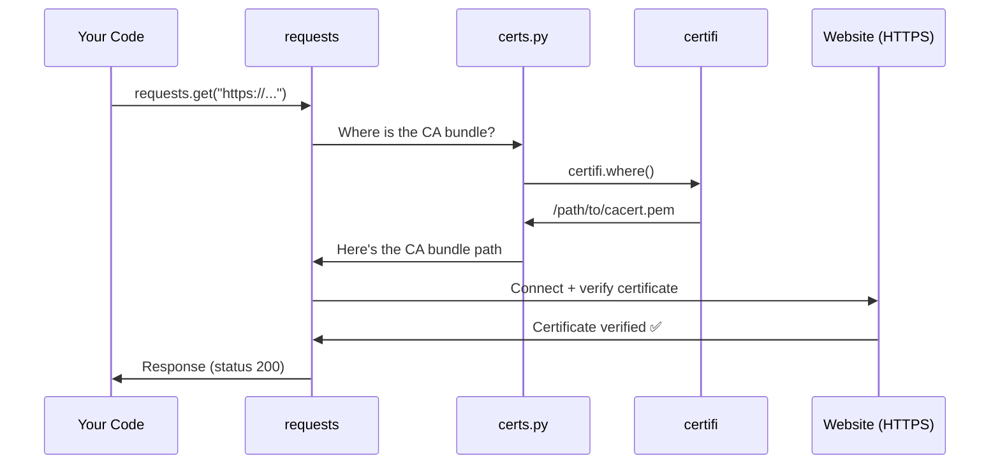
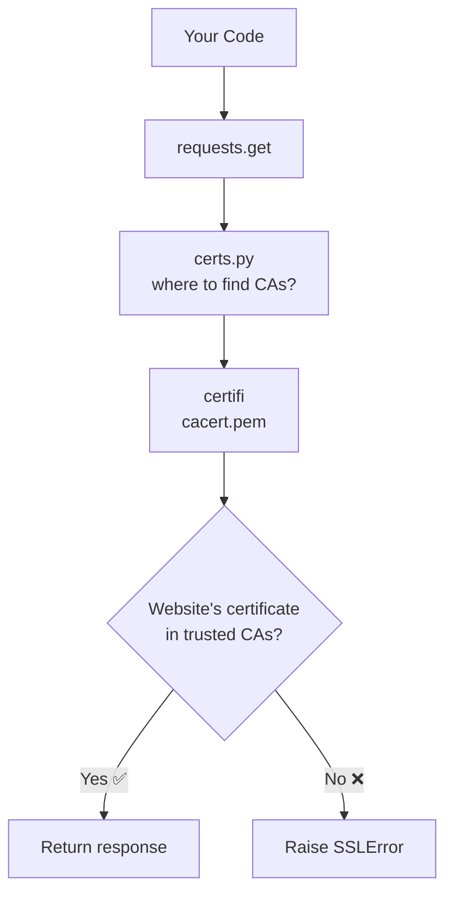

# Chapter 2: CA Certificate Management

Welcome back! In [Chapter 1: Package Versioning & Metadata](01_package_versioning___metadata_.md), we learned how `requests` identifies itself — its name, version, author, and more. Now let's explore something equally important: **how `requests` makes sure the websites it talks to are actually trustworthy**.

---

## Why Does This Matter? 🔒

Imagine you receive a phone call from someone claiming to be your bank. How do you know they're *really* your bank and not a scammer?

In the real world, you might ask for a verification code, or call back on an official number. On the internet, websites prove their identity using **digital certificates** — like a verified ID badge issued by a trusted authority.

When `requests` connects to an HTTPS website (the secure kind), it needs to answer one critical question:

> *"Can I trust this website's certificate?"*

Let's see this in action with a concrete example.

---

## The Central Use Case

Suppose you write this simple code:

```python
import requests

response = requests.get("https://api.github.com")
print(response.status_code)
# Output: 200
```

Behind the scenes, `requests` is not just fetching data — it's also **verifying that GitHub is who it claims to be**. If verification fails, you'd get a scary `SSLError` instead of a `200`.

How does `requests` know *who to trust*? That's where CA certificates come in!

---

## Key Concept 1: What is a CA Certificate?

**CA** stands for **Certificate Authority** — a trusted organization (like DigiCert, Let's Encrypt, or Comodo) that issues digital ID cards (certificates) to websites.

> 💡 **Analogy:** Think of a CA like a **government passport office**. Websites apply for a certificate (like a passport), and the CA verifies their identity before issuing it. When you connect to a website, `requests` checks: "Was this passport issued by a government I trust?"

A **CA bundle** is simply a file containing a collection of many trusted CAs — like a book of all the passport offices your computer trusts.

```
CA Bundle (a file on your computer)
├── DigiCert Root Certificate
├── Let's Encrypt Root Certificate
├── Comodo Root Certificate
└── ... (hundreds more trusted CAs)
```

---

## Key Concept 2: The `certifi` Package

Managing a list of hundreds of trusted CAs sounds complicated. And it is! Certificate authorities change over time — some get added, some get removed if they're compromised.

`requests` solves this by **delegating to `certifi`** — a dedicated Python package whose *only job* is to maintain an up-to-date CA bundle.

> 💡 **Analogy:** Instead of maintaining your own guest list for a party, you hire a **professional security service** (`certifi`) that keeps the list updated automatically.

You can install `certifi` (it comes with `requests`) and use it directly:

```python
import certifi

# Find out where the CA bundle file is stored
print(certifi.where())
# Output: /path/to/certifi/cacert.pem
```

The output is a file path to a `.pem` file — that's the CA bundle! A `.pem` file is just a text file containing a list of trusted certificates.

---

## Key Concept 3: The `certs.py` Module

Now let's look at the actual code in `requests` that handles this. It lives in a tiny but important file:

```python
# src/requests/certs.py

from certifi import where

if __name__ == "__main__":
    print(where())
```

That's the *entire file*! Let's break it down:

**Line 1:** `from certifi import where`

This imports the `where` function from `certifi`. The `where()` function simply returns the file path to the CA bundle.

**Lines 3-4:** `if __name__ == "__main__": print(where())`

This means: "If you run this file directly (not as an import), print the CA bundle path." It's a handy diagnostic tool!

---

## Using It in Practice

Here's how `requests` uses this under the hood when making a secure request:

```python
from requests.certs import where

# Get the path to the trusted CA bundle
ca_bundle_path = where()
print(ca_bundle_path)
# Output: /usr/local/lib/python3.x/site-packages/certifi/cacert.pem
```

And you can even tell `requests` to use this path explicitly:

```python
import requests
from requests.certs import where

# Explicitly specify the CA bundle (requests does this automatically!)
response = requests.get("https://api.github.com", verify=where())
print(response.status_code)
# Output: 200
```

Normally, `requests` handles this automatically — you don't need to pass `verify=where()` yourself. But it's useful to know you *can* customize it!

---

## Running `certs.py` Directly

Try running the `certs.py` file directly from your terminal:

```bash
python -m requests.certs
```

```
/usr/local/lib/python3.x/site-packages/certifi/cacert.pem
```

This tells you exactly where your CA bundle lives — handy for debugging SSL issues!

---

## What Happens Under the Hood? 🔧

Let's trace what happens step-by-step when `requests` makes a secure HTTPS call:



Here's the flow in plain English:

1. **You** call `requests.get()` on an HTTPS URL
2. **`requests`** asks `certs.py`: "Where's the CA bundle?"
3. **`certs.py`** asks `certifi`: "Where do you keep the bundle?"
4. **`certifi`** returns the file path
5. **`requests`** uses that bundle to verify the website's certificate
6. If verified ✅, you get your response. If not ❌, you get an `SSLError`.

---

## Diving Deeper: The Delegation Pattern

The beauty of `certs.py` is its **simplicity through delegation**. Here's the full file again, annotated:

```python
# The ENTIRE certs.py — just one import!
from certifi import where
```

By simply re-exporting `where` from `certifi`, `requests` creates a **clean separation of concerns**:

| Responsibility | Who Handles It |
|---|---|
| Making HTTP requests | `requests` |
| Maintaining the CA bundle | `certifi` |
| Pointing to the CA bundle | `certs.py` (bridges the two) |

> 💡 **Analogy:** `certs.py` is like a **receptionist** who doesn't know security details themselves, but knows exactly which expert to call.

This design means if `certifi` updates its CA bundle (which it does regularly), `requests` automatically benefits — no changes needed!

---

## What If Verification Fails?

Let's see what happens when something goes wrong:

```python
import requests

# Try connecting to a site with an untrusted certificate
try:
    requests.get("https://expired.badssl.com/")
except requests.exceptions.SSLError as e:
    print("SSL verification failed!")
    print(e)
```

```
SSL verification failed!
HTTPSConnectionPool: ... certificate verify failed ...
```

`requests` protects you by **refusing to connect** to websites it can't verify. This protects you from man-in-the-middle attacks where a bad actor might try to impersonate a legitimate website.

> ⚠️ **Warning:** Never disable SSL verification with `verify=False` in production code. It defeats the entire purpose of HTTPS!

---

## The Big Picture

Here's how everything fits together:



---

## Summary

In this chapter, you learned:

- ✅ **Why** CA certificates matter — they verify that websites are who they claim to be
- ✅ **What** a CA bundle is — a file full of trusted certificate authorities
- ✅ **How** `requests` uses `certifi` to manage this bundle automatically
- ✅ **What** `certs.py` does — it's a thin bridge that delegates to `certifi`
- ✅ **What happens** when verification fails — a helpful `SSLError`
- ✅ **How** to find your CA bundle path using `python -m requests.certs`

The key takeaway: `requests` doesn't reinvent the wheel. By delegating certificate management to `certifi`, it stays up-to-date with trusted CAs without any extra work on your part. Simple, elegant, and secure!

---

In the next chapter, we'll explore another clever bridging pattern in `requests` — how it connects different parts of its dependency ecosystem. Head over to [Dependency Namespace Bridging](03_dependency_namespace_bridging_.md) to continue your journey!

