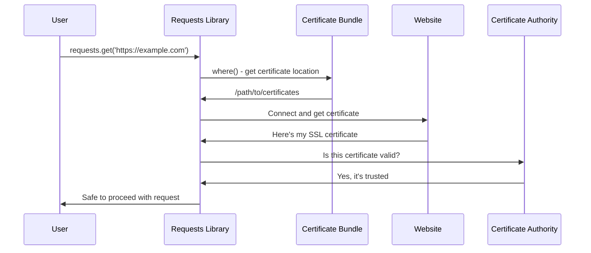

# Chapter 2: SSL Certificate Management

Now that you understand how packages identify themselves through [Package Metadata and Version Management](01_package_metadata_and_version_management_.md), let's explore how they keep your communications secure. Just as you need to verify someone's identity before sharing personal information, your computer needs to verify websites' identities before sharing data with them.

## What Problem Does This Solve?

Imagine you're at a crowded party and someone approaches you claiming to be your bank representative, asking for your account details. You'd want to see their official ID badge before sharing anything sensitive, right? The same principle applies when your Python code talks to websites.

When your code uses the `requests` library to communicate with a website like `https://api.github.com`, it needs to verify that it's actually talking to GitHub and not an imposter trying to steal your data. This verification happens through something called SSL certificates.

Here's a common scenario: You're building an app that fetches weather data from a secure API:

```python
import requests
response = requests.get('https://api.weather.com/data')
```

Behind the scenes, `requests` is asking: "How do I know this is really weather.com and not a fake site?" SSL Certificate Management provides the answer.

## Understanding Digital Certificates

Think of SSL certificates like digital passports for websites. Just as your passport proves your identity when traveling between countries, SSL certificates prove a website's identity when data travels between your computer and their servers.

These certificates contain information like:
- Who owns the website
- When the certificate expires
- A digital signature that's very hard to fake

But here's the key question: How does your computer know which certificates to trust?

## The Certificate Authority System

Imagine there's a trusted organization that everyone agrees is reliable - like a government agency that issues official IDs. In the digital world, these are called Certificate Authorities (CAs). They're organizations that verify website identities and issue certificates.

Your computer keeps a list of these trusted organizations, kind of like a phone book of reliable ID checkers. This list is called a "certificate bundle" or "CA bundle."

Here's where the `requests` library's certificate management comes in:

```python
import requests
response = requests.get('https://secure-website.com')
```

When you run this code, `requests` automatically:
1. Gets the website's certificate
2. Checks it against the trusted certificate bundle
3. Only proceeds if the certificate is valid

## How Requests Manages Certificates

The `requests` library uses a package called `certifi` to manage certificates. Think of `certifi` as a constantly updated phone book of trusted certificate authorities.

Let's see how this works:

```python
from requests import certs
print(certs.where())
```

This will output something like:
```
/path/to/your/python/site-packages/certifi/cacert.pem
```

This path points to a file containing hundreds of trusted certificates. It's like having an official directory of all legitimate ID-checking agencies.

## Finding the Certificate Bundle

The beauty of the certificate management system is its simplicity. Here's the complete code that makes it work:

```python
from certifi import where

certificate_location = where()
print(f"Certificates are stored at: {certificate_location}")
```

The `where()` function is like asking "Where do I find the official list of trusted certificate checkers?" It returns the exact location of the certificate bundle file.

## How It All Works Together

Let's trace what happens when you make a secure request. Here's the step-by-step process:



## Looking Under the Hood

Now let's examine the actual code that makes this magic happen. The certificate management in `requests` is surprisingly simple:

```python
#!/usr/bin/env python
from certifi import where

def get_certificate_location():
    return where()
```

That's it! The entire certificate management system relies on the `certifi` package's `where()` function. This function knows exactly where to find the most up-to-date certificate bundle.

When you install `requests`, it automatically includes `certifi` as a dependency. This means you always have access to a current list of trusted certificates without having to manage them yourself.

## Testing the Certificate System

You can verify that certificate management is working by making a request to a secure site:

```python
import requests

try:
    response = requests.get('https://httpbin.org/get')
    print("Certificate verification successful!")
    print(f"Status code: {response.status_code}")
except requests.exceptions.SSLError:
    print("Certificate verification failed!")
```

If the certificate verification works, you'll see:
```
Certificate verification successful!
Status code: 200
```

## What Happens When Certificates Fail

Sometimes certificate verification fails, and it's important to understand why. Here are common scenarios:

```python
import requests

# This might fail if the certificate is invalid
try:
    response = requests.get('https://expired-certificate-site.com')
except requests.exceptions.SSLError as e:
    print(f"SSL Error: {e}")
```

Common reasons for certificate failures:
- The certificate has expired (like an expired ID)
- The certificate doesn't match the website name
- The certificate authority isn't trusted
- Someone is trying to intercept your connection

## Customizing Certificate Behavior

While the default certificate management works great for most cases, you can customize it if needed:

```python
import requests

# Use default certificates (recommended)
response = requests.get('https://api.example.com')

# Or specify a custom certificate bundle (advanced)
response = requests.get('https://api.example.com', 
                       verify='/path/to/custom/certificates.pem')
```

For beginners, it's almost always best to stick with the default behavior. The `requests` library and `certifi` package work together to keep your connections secure automatically.

## The Certificate File

If you're curious about what's actually in the certificate bundle, you can take a peek:

```python
from requests import certs

cert_file = certs.where()
with open(cert_file, 'r') as f:
    first_lines = f.readlines()[:10]
    for line in first_lines:
        print(line.strip())
```

You'll see something that starts like:
```
##
## Bundle of CA Root Certificates
##
## Certificate data from Mozilla
-----BEGIN CERTIFICATE-----
MIIFYjCCBEqgAwIBAgIQd70NbNs2+RrqIQ/L8EtMrw==
```

This file contains hundreds of certificates from trusted authorities around the world, all formatted in a standard way that computers can read.

## Why This Abstraction Matters

The SSL Certificate Management abstraction in `requests` solves several important problems:

1. **Automatic Security**: You don't need to manually manage certificates
2. **Up-to-date Protection**: The `certifi` package regularly updates its certificate list
3. **Cross-platform Compatibility**: Works the same way on Windows, Mac, and Linux
4. **Simple Interface**: Just one function call to get the certificate location

Without this abstraction, you'd need to:
- Manually download certificate bundles
- Keep them updated as certificates expire
- Handle different certificate formats
- Manage platform-specific certificate stores

## Conclusion

SSL Certificate Management is like having a trusted security guard that automatically checks IDs for you. The `requests` library handles all the complex certificate verification behind the scenes, so you can focus on building your application instead of worrying about security details.

The beauty of this system lies in its simplicity: one small function (`where()`) that tells your code exactly where to find the most current list of trusted certificates. This ensures that every HTTPS request you make is verified against legitimate certificate authorities.

Now that you understand how `requests` keeps your connections secure, you're ready to learn about how it manages compatibility with other software components. In the next chapter, we'll explore [Dependency Compatibility Layer](03_dependency_compatibility_layer_.md), which ensures that all the different pieces of software work together harmoniously.

