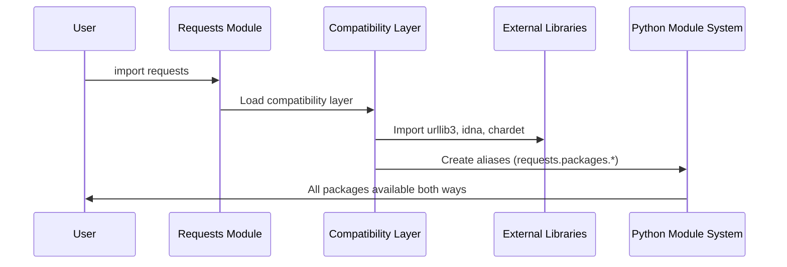

# Chapter 3: Dependency Compatibility Layer

Now that you understand how `requests` keeps your connections secure through [SSL Certificate Management](02_ssl_certificate_management_.md), let's explore how it manages to work smoothly with other software libraries. Imagine you're building with LEGO blocks from different sets - sometimes the pieces don't fit together perfectly, but with the right adapters, you can make them work as one unified creation.

## What Problem Does This Solve?

Let's say you're working on a project that uses the `requests` library, and you discover some older code that looks like this:

```python
import requests.packages.urllib3 as urllib3
response = urllib3.PoolManager().request('GET', 'http://example.com')
```

At first glance, this might look confusing. It appears to import `urllib3` from inside the `requests` package, but `urllib3` is actually a completely separate library! How is this possible?

This is where the Dependency Compatibility Layer comes in. It's like having a universal translator that makes different software libraries appear to be part of the same family, even when they're actually separate entities.

## The Universal Adapter Analogy

Think about traveling to different countries with various types of electrical outlets. You have devices with different plug types, but you want them all to work in any socket. What do you do? You bring universal adapters!

The Dependency Compatibility Layer works similarly. It creates "adapters" so that external libraries like `urllib3`, `idna`, and `chardet` can be accessed as if they're part of the `requests` package. This means older code that expects to find these libraries under `requests.packages` will continue to work perfectly.

```python
# These are actually the same library, just accessed differently:
import urllib3                    # Direct import
import requests.packages.urllib3  # Through the compatibility layer
```

## Understanding the Magic Behind the Scenes

Let's see how this compatibility magic works step by step. When you import `requests`, here's what happens behind the scenes:



The compatibility layer acts like a helpful librarian who creates multiple catalog entries for the same book, so you can find it whether you look under "Science Fiction" or "Space Adventures."

## How the Compatibility Layer Works

Let's break down the process into simple steps. The compatibility layer performs three main tasks:

### Step 1: Import Required Libraries

First, it imports the external libraries that `requests` depends on:

```python
# Import external packages directly
import urllib3
import idna
import chardet
```

These are completely separate libraries that `requests` uses for different purposes:
- `urllib3`: Handles low-level HTTP connections
- `idna`: Manages international domain names
- `chardet`: Detects text character encodings

### Step 2: Create Compatibility Aliases

Next, it creates aliases so these libraries can also be accessed through `requests.packages`:

```python
# Make urllib3 available as requests.packages.urllib3
locals()['urllib3'] = __import__('urllib3')
```

This is like creating a shortcut on your computer - the same file can now be accessed through multiple paths.

### Step 3: Handle Submodules

Finally, it ensures that submodules (parts within each library) also work through the compatibility layer:

```python
# If urllib3.util exists, make requests.packages.urllib3.util work too
import sys
for mod in list(sys.modules):
    if mod.startswith("urllib3."):
        sys.modules[f"requests.packages.{mod}"] = sys.modules[mod]
```

## Seeing the Compatibility Layer in Action

Let's test this compatibility layer to see how it works:

```python
import requests
import requests.packages.urllib3

# These should be the exact same object:
print(id(urllib3))
print(id(requests.packages.urllib3))
```

When you run this code, you'll see two identical numbers, proving that both paths point to the exact same library object in memory. It's like having two different addresses that lead to the same house.

You can also verify that all the functionality is identical:

```python
import requests
print(requests.packages.urllib3.__version__)
```

This will output the version of urllib3, accessed through the compatibility layer.

## Looking Under the Hood

Now let's examine the actual code that creates this compatibility magic. The implementation is surprisingly elegant:

```python
import sys

# Create aliases for main packages
for package in ("urllib3", "idna"):
    locals()[package] = __import__(package)
```

This loop does something clever: it dynamically imports each package and creates a local variable with the same name. The `locals()[package]` part is like saying "create a variable named 'urllib3' and point it to the imported urllib3 module."

Then, for each imported package, it handles all the submodules:

```python
for mod in list(sys.modules):
    if mod == package or mod.startswith(f"{package}."):
        sys.modules[f"requests.packages.{mod}"] = sys.modules[mod]
```

This code looks through all currently loaded modules and creates compatibility aliases for anything that belongs to our target packages.

## Special Handling for Character Detection

The compatibility layer has special logic for the `chardet` library, which handles character encoding detection:

```python
from .compat import chardet

if chardet is not None:
    target = chardet.__name__
    for mod in list(sys.modules):
        if mod == target or mod.startswith(f"{target}."):
            imported_mod = sys.modules[mod]
            sys.modules[f"requests.packages.{mod}"] = imported_mod
```

This extra complexity exists because `chardet` might not always be available, or might be replaced with alternative implementations. The compatibility layer gracefully handles these variations.

## Why This Abstraction Matters

The Dependency Compatibility Layer solves several important problems:

### Backward Compatibility
Older code that expects to import from `requests.packages` continues to work:

```python
# Old code still works
from requests.packages.urllib3 import PoolManager
```

### Clean Namespace Management
Users can choose how they want to access dependencies:

```python
# Direct access
import urllib3

# Through requests
import requests.packages.urllib3
```

### Simplified Installation
Users only need to install `requests`, and all dependencies become available through the compatibility layer automatically.

## Testing the Compatibility Layer

You can verify that the compatibility layer works by testing both access methods:

```python
import requests
import urllib3

# Both of these should work identically
direct_urllib3 = urllib3.PoolManager()
compat_urllib3 = requests.packages.urllib3.PoolManager()

print("Direct import works:", type(direct_urllib3))
print("Compatibility import works:", type(compat_urllib3))
```

Both should output the same type, showing that you're working with identical functionality regardless of how you access the library.

## Real-World Benefits

This compatibility layer provides significant benefits in real-world scenarios:

1. **Legacy Code Support**: Projects built with older versions of `requests` continue to work
2. **Gradual Migration**: Teams can gradually update their import statements without breaking existing functionality
3. **Simplified Dependencies**: Users don't need to separately manage `urllib3`, `idna`, and `chardet` installations

## The Developer's Perspective

From the comment in the source code, even the `requests` developers acknowledge this is a compromise:

```python
# This code exists for backwards compatibility reasons.
# I don't like it either. Just look the other way. :)
```

This honest comment reveals an important software development principle: sometimes we implement solutions not because they're elegant, but because they solve real problems for users. The compatibility layer might add complexity internally, but it provides tremendous value by maintaining backward compatibility.

## Conclusion

The Dependency Compatibility Layer is like a universal translator that makes different software libraries speak the same language. It ensures that external libraries like `urllib3`, `idna`, and `chardet` can be accessed both directly and through the `requests.packages` namespace, providing flexibility and maintaining backward compatibility.

This abstraction demonstrates how thoughtful software design can hide complexity while providing multiple ways to accomplish the same goal. Whether you access libraries directly or through the compatibility layer, you're working with the exact same functionality - just through different pathways.

Understanding this layer helps you appreciate how the `requests` library maintains its user-friendly interface while managing complex relationships with multiple dependencies. It's a perfect example of how good abstractions can make software both powerful and easy to use.

The compatibility layer represents the final piece of the foundational infrastructure that makes `requests` work seamlessly. You now understand how it identifies itself, secures connections, and manages dependencies - giving you a solid foundation for building robust applications with confidence.

