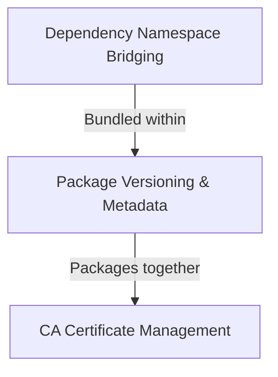

# Tutorial: requests

The `requests` library is a popular Python package that makes it easy to send **HTTP requests** (like fetching web pages or calling APIs) in a human-friendly way.
It handles complex tasks like *secure HTTPS connections* (by verifying trusted certificates), managing *third-party dependencies* like `urllib3` and `idna`, and keeping track of its own *version and metadata* so tools like pip can install and manage it correctly.
Think of it as a polite, well-organized assistant that handles all the messy details of talking to the web for you.

**Source Repository:** [https://github.com/psf/requests](https://github.com/psf/requests)

## Chapters

1. [Package Versioning & Metadata
](01_package_versioning___metadata_.md)
2. [CA Certificate Management
](02_ca_certificate_management_.md)
3. [Dependency Namespace Bridging
](03_dependency_namespace_bridging_.md)
