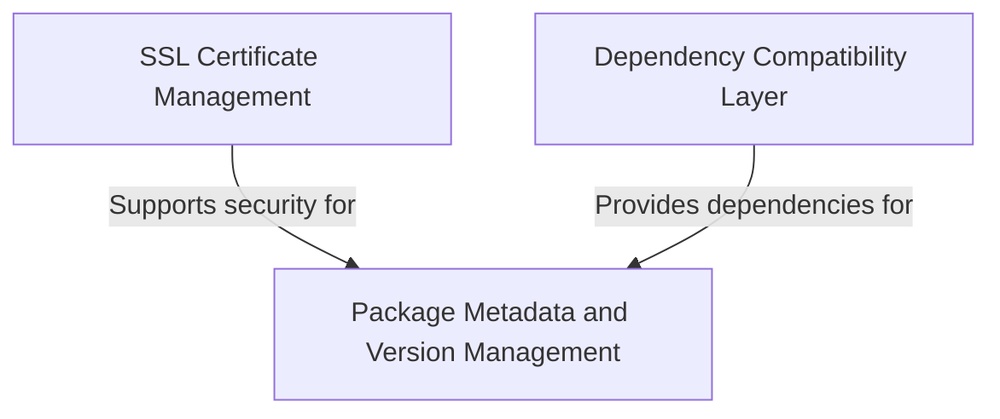

# Tutorial: requests

**Requests** is a *user-friendly* Python library that makes it incredibly easy to send HTTP requests to websites and web APIs. 
Think of it as a **simplified way to communicate with web servers** - instead of dealing with complex networking code, 
you can just ask for a webpage or send data to a service with simple, readable commands. The library handles all the 
*technical details* like **SSL certificates for security** and **compatibility with different systems** behind the scenes.

**Source Repository:** [https://github.com/psf/requests](https://github.com/psf/requests)

## Chapters

1. [Package Metadata and Version Management
](01_package_metadata_and_version_management_.md)
2. [SSL Certificate Management
](02_ssl_certificate_management_.md)
3. [Dependency Compatibility Layer
](03_dependency_compatibility_layer_.md)
