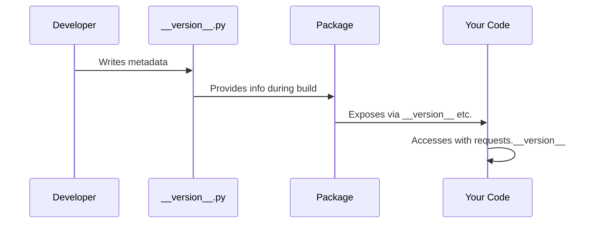

# Chapter 1: Package Metadata and Versioning

Welcome to the world of Python packages! Imagine you just downloaded a new app on your phone. The first thing you might want to know is: "What version is this? Who made it? What does it do?" The same questions apply when you're working with Python libraries like `requests`.

## The Problem: Knowing What You're Working With

Let's say you're building a web application and you run into a bug. You post a question on Stack Overflow, and the first response you get is: "What version of requests are you using?" Without package metadata, answering this simple question would be nearly impossible!

Package metadata solves this fundamental problem by providing an "ID card" for every Python package. Just like your driver's license tells people who you are and when it expires, package metadata tells you everything important about the software you're using.

## What is Package Metadata?

Think of package metadata as a business card for a Python library. It contains essential information like:

- **Name**: What is this package called?
- **Version**: Which release are you using?
- **Author**: Who created this?
- **Description**: What does this package do?
- **License**: How can you use this code legally?

Let's see how `requests` stores this information:

```python
import requests
print(f"Package: {requests.__title__}")
print(f"Version: {requests.__version__}")
```

This will output something like:
```
Package: requests
Version: 2.34.2
```

The double underscores (`__`) around these names indicate they are special attributes that Python uses for metadata.

## Exploring the Requests ID Card

Let's look at more details from the requests package:

```python
import requests
print(f"Description: {requests.__description__}")
print(f"Author: {requests.__author__}")
print(f"Website: {requests.__url__}")
```

This reveals:
```
Description: Python HTTP for Humans.
Version: Kenneth Reitz
Website: https://requests.readthedocs.io
```

Pretty neat! It's like reading the "About" section of any software application.

## Understanding Version Numbers

Version numbers aren't random! The requests version `2.34.2` follows a pattern called "semantic versioning":

- **2** (Major version): Big changes that might break your code
- **34** (Minor version): New features that don't break existing code  
- **2** (Patch version): Bug fixes and small improvements

This helps you understand what to expect when updating the package.

## How This Information Gets There

You might wonder: "Where does all this information come from?" Let's peek under the hood! 



When you install requests, Python reads a special file and makes all this information available to your code.

## The Magic Behind the Scenes

The requests library stores its metadata in a file called `__version__.py`. Here's what it looks like (simplified):

```python
__title__ = "requests"
__description__ = "Python HTTP for Humans."
__version__ = "2.34.2"
__author__ = "Kenneth Reitz"
__license__ = "Apache-2.0"
```

Each line defines a piece of metadata that describes the package. The requests library then imports these values so you can access them.

When you do `import requests`, Python:
1. Loads the main requests package
2. Reads the metadata from `__version__.py`
3. Makes it available as `requests.__version__`, `requests.__author__`, etc.

## Why This Matters for You

This metadata system helps you in several important ways:

**Debugging**: When something goes wrong, you can quickly check which version you're using:
```python
print(f"Using requests version: {requests.__version__}")
```

**Compatibility**: You can write code that behaves differently based on the version:
```python
if requests.__version__.startswith('2.'):
    print("Using requests version 2.x")
```

**Documentation**: When asking for help, you can provide exact version information to get better support.

## A Hidden Easter Egg

The requests library includes a fun surprise in its metadata. Try this:

```python
import requests
print(requests.__cake__)
```

You'll see: ✨ 🍰 ✨

This playful touch shows that even serious software can have personality!

## Conclusion

Package metadata and versioning provide essential identity information for Python libraries. Just like you need to know which version of an app you're running on your phone, knowing your package versions helps you debug problems, ensure compatibility, and get better help from the community.

Understanding this foundation prepares you for more advanced topics in the requests library. In our next chapter, we'll explore how requests handles secure connections through [SSL Certificate Management](02_ssl_certificate_management_.md).

Remember: when in doubt, check your versions! It's often the first step to solving any problem you encounter.

