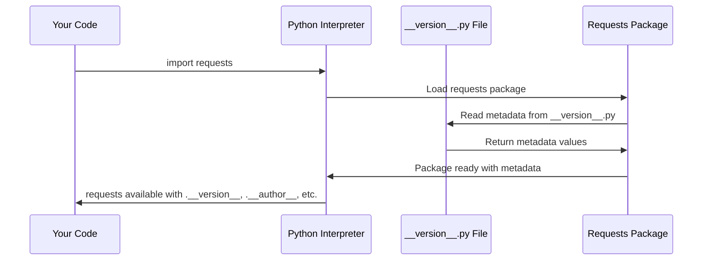

# Chapter 1: Package Metadata and Versioning

## What is Package Metadata and Why Do We Need It?

Imagine you're buying a phone from a store. Before making your purchase, you'd want to know important details like the brand name, model number, manufacturer, and where to get support if something goes wrong. Software packages work exactly the same way!

When you install the `requests` library to make HTTP requests in Python, your computer needs to know essential information about this package: What version is it? Who created it? Where can you find documentation? This information is called **package metadata**, and it's like the ID card or product label for the `requests` library.

Let's say you're building a web application and you encounter a bug. You need to report this issue to the developers, but first you need to know exactly which version of `requests` you're using. This is where package metadata becomes crucial!

## What Information Does Package Metadata Include?

Package metadata contains several key pieces of information, just like a product label:

- **Name**: The official name of the package (like "iPhone" or "Samsung Galaxy")
- **Version**: The specific version number (like "2.34.2")
- **Description**: What the package does in simple terms
- **Author**: Who created and maintains the package
- **License**: The legal terms for using the package
- **URL**: Where to find documentation and help

## How to Access Package Metadata

Let's see how to check the version of `requests` you're currently using:

```python
import requests
print(requests.__version__)
```

This will output something like: `2.34.2`

Here's how you can access other metadata information:

```python
import requests
print("Package name:", requests.__title__)
print("Description:", requests.__description__)
print("Author:", requests.__author__)
```

This would output:
```
Package name: requests
Description: Python HTTP for Humans.
Author: Kenneth Reitz
```

Each of these properties gives you specific information about the package, helping you understand what you're working with.

## A Real-World Example: Checking Compatibility

Let's say you're following a tutorial that requires `requests` version 2.25.0 or higher. Here's how you'd check if your version is compatible:

```python
import requests
current_version = requests.__version__
print(f"You have requests version: {current_version}")
```

If you see version `2.34.2`, you know you're good to go since it's higher than the required `2.25.0`!

## How Does This Work Under the Hood?

When you import the `requests` library, Python goes through a simple process to make this metadata available:



Let's look at where this metadata is actually stored:

## The Metadata Storage: __version__.py File

The `requests` library stores all its metadata in a special file called `__version__.py`. Here's what it looks like:

```python
__title__ = "requests"
__description__ = "Python HTTP for Humans."
__version__ = "2.34.2"
__author__ = "Kenneth Reitz"
__license__ = "Apache-2.0"
```

Each line defines a different piece of metadata using double underscores (called "dunder" attributes in Python). Think of these as special labels that Python recognizes.

When you access `requests.__version__`, Python is actually looking up the `__version__` variable from this file.

Here's how the package makes this metadata available to you:

```python
# In the main requests/__init__.py file
from .__version__ import __version__, __title__, __author__

# Now these are available when you import requests
```

This import statement brings all the metadata from the `__version__.py` file into the main package, making it accessible when you use `requests.__version__`.

## Version Number Format Explained

The version number `2.34.2` follows a common pattern called semantic versioning:

- **2**: Major version (big changes that might break compatibility)
- **34**: Minor version (new features that don't break existing code)  
- **2**: Patch version (bug fixes and small improvements)

This numbering system helps developers understand what kind of changes happened between versions.

## Why This Matters for You

Understanding package metadata helps you:

1. **Debug issues**: When reporting bugs, you can specify exactly which version you're using
2. **Check compatibility**: Ensure you have the right version for tutorials or other code
3. **Stay updated**: Know when you might need to upgrade to get new features
4. **Understand licensing**: Know the legal terms for using the package

## Wrapping Up

Package metadata is like the ID card for the `requests` library. It provides essential information about the version, author, and other details that help you work with the library effectively. This metadata is stored in a simple Python file and made available through special attributes you can access anytime.

Now that you understand how `requests` identifies itself, let's explore how it handles security in the next chapter: [Security Certificate Management](02_security_certificate_management_.md).

