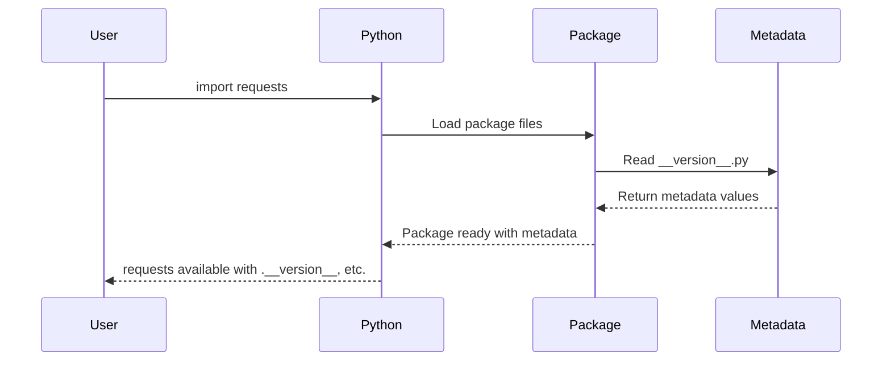

# Chapter 1: Package Metadata and Versioning

## What Problem Does This Solve?

Imagine you're building a house and need to keep track of all your tools. You have a hammer, but which hammer is it? Is it the lightweight one from 2020 or the heavy-duty model from 2024? Who made it? What's it designed for? Without proper labels, you'd be confused and might use the wrong tool for the job.

The same problem exists with Python packages! When you install the `requests` library, your computer needs to know exactly what it's getting. Package metadata and versioning solve this by providing a clear "identity card" for the library - just like a label on your hammer that tells you everything you need to know.

Let's say you're working on a project and need to check which version of requests you're using. Maybe a teammate mentions a bug that was fixed in version 2.30.0, and you want to make sure you have the updated version. This is where package metadata becomes essential!

## Understanding Package Metadata

Think of package metadata like the information printed on a book's title page. It tells you:

- **What** the book is (title)
- **Who** wrote it (author) 
- **When** it was published (version/date)
- **What** it's about (description)
- **Who** can use it (license)

For the `requests` package, all this information is stored in a special file that acts as the package's "birth certificate."

## How to Access Package Metadata

Let's start with the most common use case - checking what version of requests you have installed:

```python
import requests
print(requests.__version__)
```

This will output something like:
```
2.34.2
```

You can also access other metadata information:

```python
print(requests.__title__)      # The package name
print(requests.__author__)     # Who created it
print(requests.__description__) # What it does
```

This outputs:
```
requests
Kenneth Reitz
Python HTTP for Humans.
```

This basic information helps you confirm you're using the right package and version for your needs.

## Breaking Down the Metadata Components

Let's look at each piece of metadata and understand why it matters:

### Version Number (`__version__`)
```python
__version__ = "2.34.2"
```

The version follows a pattern called "semantic versioning" with three numbers:
- **2** = Major version (big changes that might break old code)
- **34** = Minor version (new features that don't break old code)  
- **2** = Patch version (bug fixes)

### Package Identity
```python
__title__ = "requests"
__description__ = "Python HTTP for Humans."
```

These tell you exactly what package you're dealing with and what it's designed to do.

### Author Information
```python
__author__ = "Kenneth Reitz"
__author_email__ = "me@kennethreitz.org"
```

This identifies who created and maintains the package, which is helpful for getting support or contributing.

### Legal Information
```python
__license__ = "Apache-2.0"
__copyright__ = "Copyright Kenneth Reitz"
```

This tells you how you're legally allowed to use the package.

## What Happens Behind the Scenes

When you import requests, here's what happens with the metadata:



Here's the step-by-step process:

1. **You run** `import requests`
2. **Python finds** the requests package on your computer
3. **Python reads** the `__version__.py` file first
4. **Python loads** all the metadata variables into memory
5. **Python makes** the metadata accessible through the main requests module
6. **You can now access** `requests.__version__` and other metadata

## The Implementation Details

All the metadata lives in a special file called `__version__.py`. Here's what it looks like:

```python
__title__ = "requests"
__description__ = "Python HTTP for Humans."
__version__ = "2.34.2"
```

The double underscores (`__`) are Python's way of saying "this is special metadata, not regular code."

When you import requests, the main package file automatically imports all these values:

```python
# This happens inside the requests package
from .__version__ import __version__, __title__, __author__
```

This makes them available when you use `requests.__version__`.

There's also a special build number that helps developers track specific builds:

```python
__build__ = 0x023402  # Hexadecimal representation of version
```

This is mainly used internally by the developers and package managers.

## Why This Matters for You

Understanding package metadata helps you:

1. **Debug version conflicts** - "Oh, I need version 2.30+ but I have 2.25"
2. **Track compatibility** - "This code requires requests 2.20 or higher"
3. **Get help** - "I'm using requests 2.34.2 and having this issue..."
4. **Understand licensing** - "Can I use this in my commercial project?"

## What You've Learned

In this chapter, you discovered that package metadata is like an ID card for Python packages. You learned how to check the version of requests you're using, access other metadata like author and description, and understand why this information is crucial for managing your Python projects.

The metadata system provides a standardized way for all Python packages to identify themselves, making it easier to manage dependencies, debug issues, and ensure compatibility across different projects.

Now that you understand how packages identify themselves, you're ready to learn about another crucial aspect of the requests library: [Security and Certificate Management](02_security_and_certificate_management_.md), where we'll explore how requests keeps your HTTP communications safe and secure.

