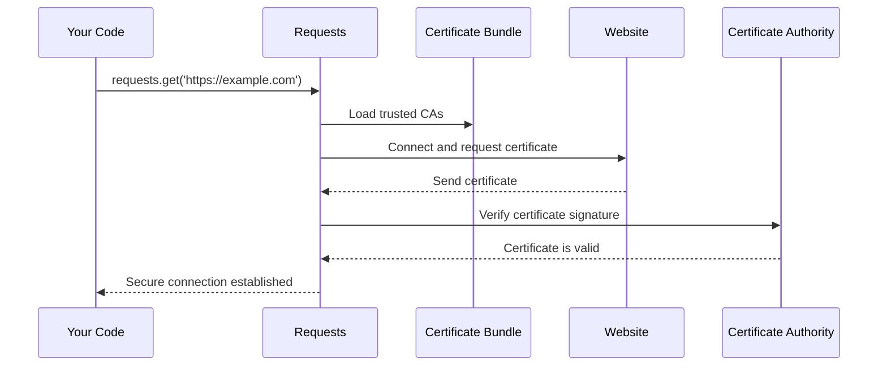

# Chapter 2: Security and Certificate Management

After learning about [Package Metadata and Versioning](01_package_metadata_and_versioning_.md), you now know how to identify which version of requests you're using. But there's another critical aspect we need to understand: how does requests keep your internet communications secure? Let's dive into the security features that protect you every time you make an HTTPS request.

## What Problem Does This Solve?

Imagine you're sending a confidential letter through the mail. How do you know it will reach the right person and won't be read by someone else along the way? You might use a sealed envelope and verify the recipient's identity before sending it.

The same problem exists when your Python program talks to websites! When you visit `https://api.github.com` or any secure website, how does your computer know it's really talking to GitHub and not some imposter trying to steal your data? This is where certificate management comes in - it's like having a trusted security guard that checks everyone's ID at the door.

Let's say you're building a program that needs to fetch user data from a secure API. Without proper certificate verification, a malicious actor could intercept your requests and steal sensitive information. The requests library solves this by automatically checking digital certificates - but how does it know which certificates to trust?

## Understanding Digital Certificates

Think of digital certificates like official government-issued ID cards for websites. Just as you trust a driver's license because it's issued by a government authority you recognize, your computer trusts website certificates because they're issued by trusted Certificate Authorities (CAs).

Here's what happens when you make a secure request:

```python
import requests

response = requests.get('https://api.github.com')
print("Connection successful!")
```

This simple code actually performs several security checks behind the scenes:
1. Connects to GitHub's servers
2. Receives GitHub's digital certificate
3. Verifies the certificate is valid and trustworthy
4. Establishes a secure, encrypted connection

## The Certificate Bundle

But how does requests know which Certificate Authorities to trust? This is where the certificate bundle comes in. Think of it as a phone book of trusted authorities - a list of all the organizations that are allowed to issue valid certificates.

The requests library uses a package called `certifi` that maintains this list:

```python
import requests.certs

# Get the location of the certificate bundle
cert_location = requests.certs.where()
print(f"Certificates stored at: {cert_location}")
```

This outputs something like:
```
Certificates stored at: /usr/local/lib/python3.9/site-packages/certifi/cacert.pem
```

This file contains hundreds of trusted certificate authorities from around the world.

## How Certificate Verification Works

Let's break down what happens when you make a secure request:



Here's the step-by-step process:

1. **You make a request** to a secure website
2. **Requests loads** the certificate bundle to know which authorities to trust
3. **Requests connects** to the website and asks for its certificate
4. **The website sends** its digital certificate
5. **Requests checks** if the certificate was signed by a trusted authority
6. **If valid**, requests establishes a secure connection
7. **If invalid**, requests raises an error to protect you

## The Simple Implementation

The entire certificate management system in requests is surprisingly simple. Here's the complete code:

```python
# This is the actual requests/certs.py file
from certifi import where

def get_certificate_bundle():
    return where()
```

That's it! The `where()` function from the `certifi` package returns the path to the certificate bundle file.

You can see this in action:

```python
from certifi import where

print("Certificate bundle location:", where())
```

## What Happens When Certificates Fail

Sometimes certificate verification fails, and requests protects you by raising an error:

```python
import requests

try:
    # This will fail if the certificate is invalid
    response = requests.get('https://expired.badssl.com')
except requests.exceptions.SSLError as e:
    print("Certificate verification failed!")
    print(f"Error: {e}")
```

This might output:
```
Certificate verification failed!
Error: certificate verify failed: certificate has expired
```

This error is actually good news - it means requests detected a security problem and protected you from a potentially dangerous connection!

## Customizing Certificate Verification

While the default certificate bundle works for almost all cases, sometimes you need to customize it:

```python
import requests

# Use a custom certificate bundle
response = requests.get(
    'https://example.com', 
    verify='/path/to/custom/cert.pem'
)
```

Or temporarily disable verification for testing (not recommended for production):

```python
import requests
import urllib3

# Disable SSL warnings for this example
urllib3.disable_warnings()

# Only do this for testing!
response = requests.get('https://example.com', verify=False)
```

## The Certificate Bundle File

The certificate bundle is a simple text file that contains hundreds of trusted certificates. Here's what a tiny part of it looks like:

```
-----BEGIN CERTIFICATE-----
MIIDSjCCAjKgAwIBAgIQRK+wgNajJ7qJMDmGLvhAazANBgkqhkiG9w0BAQUFADA/
MSQwIgYDVQQKExtEaWdpdGFsIFNpZ25hdHVyZSBUcnVzdCBDby4xFzAVBgNVBAMT
DkRTVCBSb290IENBIFgzMB4XDTAwMDkzMDIxMTIxOVoXDTIxMDkzMDE0MDExNVow
...
-----END CERTIFICATE-----
```

Each certificate in this file represents a trusted authority that can verify website identities.

## Behind the Scenes: The Complete Flow

When you import requests, here's what happens with certificate management:

1. **Import time**: Requests imports the `certifi` package
2. **First HTTPS request**: Requests calls `certifi.where()` to find certificates
3. **SSL connection**: Python's SSL library uses these certificates to verify the remote server
4. **Verification**: The certificate chain is checked against the trusted authorities
5. **Connection**: If everything checks out, your secure connection is established

## Why This Matters for You

Understanding certificate management helps you:

1. **Debug SSL errors** - "The certificate has expired" now makes sense
2. **Work with internal APIs** - You might need custom certificates for company servers
3. **Understand security** - You know your connections are actually secure
4. **Troubleshoot network issues** - Certificate problems are a common source of connection failures

The certificate management system runs automatically every time you make an HTTPS request, silently protecting you from security threats while keeping your code simple and clean.

## What You've Learned

In this chapter, you discovered how requests acts like a security guard for your internet connections. You learned that digital certificates are like ID cards for websites, and that requests uses a trusted certificate bundle to verify these IDs. The system automatically protects you from malicious websites while keeping your code simple - you just call `requests.get()` and the security happens behind the scenes.

Most importantly, you now understand that when requests raises an SSL error, it's not being difficult - it's protecting you from potentially dangerous connections!

Now that you understand how requests keeps your connections secure, you're ready to learn about [Dependency Integration and Compatibility](03_dependency_integration_and_compatibility_.md), where we'll explore how requests works with other Python packages to provide its full functionality.

