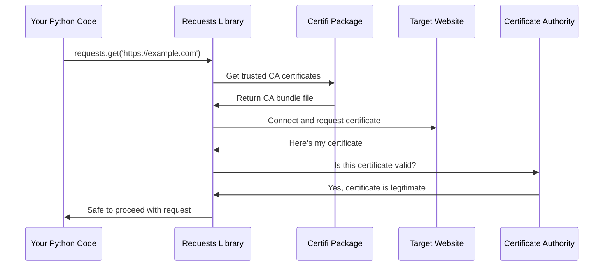

# Chapter 2: Security Certificate Management

Now that we understand how the `requests` library identifies itself through [Package Metadata and Versioning](01_package_metadata_and_versioning_.md), let's explore one of its most important security features: how it keeps your web requests safe from malicious websites.

## What is Security Certificate Management?

Imagine you're meeting someone for the first time in a crowded coffee shop. How do you know they're really who they claim to be? In the real world, you might ask to see their driver's license or ID card. The internet works similarly! When you visit a secure website (one that starts with `https://`), that website needs to prove its identity to your computer.

This proof comes in the form of a **security certificate** - think of it as a website's digital ID card. But just like you need to trust the government that issued someone's driver's license, your computer needs to trust the organization that issued the website's certificate.

Let's say you're building a Python script that needs to fetch data from `https://api.github.com`. How does the `requests` library know that it's really talking to GitHub and not an imposter trying to steal your data?

## The Problem: Fake Websites and Security Threats

Here's a scary scenario: You think you're sending a request to your bank's website, but actually, a malicious person has intercepted your connection and is pretending to be your bank. Without proper certificate verification, your sensitive information could be stolen!

```python
import requests

# This request needs to verify it's really talking to the real GitHub
response = requests.get('https://api.github.com/user', 
                       headers={'Authorization': 'token your-secret-token'})
```

When you run this code, how does `requests` know it's actually connecting to the real GitHub and not a fake site trying to steal your token?

## The Solution: Certificate Authorities and Trust

The `requests` library acts like a security guard with a trusted phone book. This "phone book" contains information about legitimate **Certificate Authorities** (CAs) - organizations that are trusted to verify website identities.

Think of Certificate Authorities like the DMV for websites:
- **DMV**: Issues driver's licenses after verifying your identity
- **Certificate Authority**: Issues security certificates after verifying a website's identity

When GitHub wants a security certificate, they prove their identity to a trusted CA, which then gives them a digital certificate that says "Yes, this really is GitHub."

## How Certificate Verification Works

Let's see what happens when you make a secure request:

```python
import requests

# The requests library automatically verifies the certificate
response = requests.get('https://httpbin.org/get')
print("Success! The certificate was valid.")
print(f"Status code: {response.status_code}")
```

Output:
```
Success! The certificate was valid.
Status code: 200
```

If the certificate verification fails, `requests` will raise an error to protect you:

```python
import requests

try:
    # This would fail if the certificate is invalid
    response = requests.get('https://expired.badssl.com/')
except requests.exceptions.SSLError as e:
    print("Certificate verification failed! Connection blocked for security.")
```

Output:
```
Certificate verification failed! Connection blocked for security.
```

This automatic protection happens because `requests` comes with a built-in list of trusted Certificate Authorities.

## What Happens Under the Hood

Let's walk through what happens step-by-step when you make a secure request:



Here's what each step means:

1. **Your code** makes a request to a secure website
2. **Requests** asks for the list of trusted Certificate Authorities
3. **Certifi** provides a file containing all trusted CAs
4. **Requests** connects to the website and asks for its certificate
5. **The website** sends back its security certificate
6. **Requests** checks if the certificate was issued by a trusted CA
7. If valid, **Requests** proceeds with your request safely

## The Certifi Package: Your Trusted Phone Book

The `requests` library doesn't maintain its own list of trusted Certificate Authorities. Instead, it relies on a specialized package called `certifi` that contains an up-to-date collection of trusted CAs.

Let's see how this works in the code:

```python
# This is what happens inside the requests library
from certifi import where

# Get the location of the certificate bundle
cert_location = where()
print(f"Certificates are stored at: {cert_location}")
```

Output:
```
Certificates are stored at: /path/to/site-packages/certifi/cacert.pem
```

The `where()` function tells `requests` exactly where to find the file containing all the trusted Certificate Authorities.

## Looking at the Certificate Management Code

Let's examine the actual code that handles certificate management in the `requests` library:

```python
# From src/requests/certs.py
from certifi import where

# This function returns the path to trusted certificates
def where():
    return certifi.where()
```

This simple code does something very important:
- It imports the `where` function from the `certifi` package
- When called, it returns the file path containing trusted Certificate Authorities
- The `requests` library uses this path to verify website certificates

The beauty of this approach is that the `certifi` package is maintained by security experts who regularly update it with the latest trusted Certificate Authorities. Your `requests` library automatically benefits from these security updates!

## Customizing Certificate Verification

Sometimes you might need to customize how certificate verification works. Here are a few examples:

**Using a custom certificate bundle:**
```python
import requests

# Use a custom certificate file
response = requests.get('https://httpbin.org/get', 
                       verify='/path/to/custom/certificates.pem')
```

**Disabling certificate verification (not recommended for production):**
```python
import requests

# WARNING: Only use this for testing!
response = requests.get('https://httpbin.org/get', verify=False)
```

The `verify` parameter controls how certificate verification works:
- `verify=True` (default): Use the standard trusted certificates
- `verify='/path/to/file'`: Use a custom certificate file
- `verify=False`: Skip verification (dangerous!)

## Why This Abstraction Matters

The Security Certificate Management abstraction is crucial because it:

1. **Protects your data**: Ensures you're communicating with legitimate websites
2. **Works automatically**: You don't need to manually manage certificates
3. **Stays updated**: The `certifi` package regularly updates trusted Certificate Authorities
4. **Provides flexibility**: You can customize certificate verification when needed

Without this system, every HTTPS request would be vulnerable to man-in-the-middle attacks where malicious actors could intercept and steal your sensitive data.

## Real-World Example: API Authentication

Let's see how this protects a real scenario where you're accessing a protected API:

```python
import requests

# Your secret API key
api_key = "your-secret-api-key"

# This request is automatically protected by certificate verification
response = requests.get(
    'https://api.example.com/protected-data',
    headers={'Authorization': f'Bearer {api_key}'}
)

if response.status_code == 200:
    print("Data retrieved safely!")
    print(response.json())
```

Behind the scenes, the `requests` library verified that it was really talking to `api.example.com` before sending your secret API key. This prevents attackers from stealing your credentials.

## Wrapping Up

Security Certificate Management in the `requests` library acts like a vigilant security guard, automatically verifying that websites are who they claim to be. By leveraging the `certifi` package's trusted Certificate Authority database, `requests` protects your data from malicious websites without requiring any additional work from you.

This security happens transparently - every time you make an HTTPS request, the certificate verification process runs automatically to keep you safe. The abstraction is so well-designed that you can focus on building your application while staying secure by default.

Next, we'll explore how `requests` manages its relationships with other Python packages in [Dependency Integration Layer](03_dependency_integration_layer_.md).

