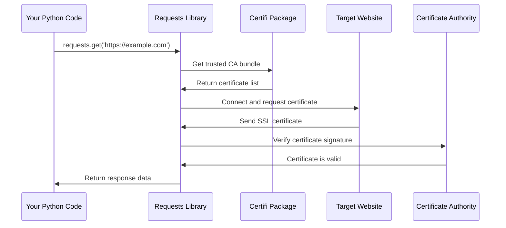

# Chapter 2: SSL Certificate Management

After learning about [Package Metadata and Versioning](01_package_metadata_and_versioning_.md), you now know how to identify which version of requests you're using. But there's another crucial piece of information that requests needs to verify: the identity of websites you're connecting to. This is where SSL certificate management comes in!

## The Problem: How Do You Know a Website Is Really Who It Claims to Be?

Imagine you're at a hotel and someone knocks on your door claiming to be room service. Before you open the door, you'd probably want to verify their identity, right? You might look through the peephole, check their uniform, or call the front desk to confirm.

The same principle applies when your Python program connects to websites. When you visit `https://github.com` or `https://api.twitter.com`, how does your code know it's really talking to the legitimate website and not an impostor trying to steal your data?

Let's look at a real example:

```python
import requests
response = requests.get('https://httpbin.org/get')
print("Connection successful!")
print(f"Status: {response.status_code}")
```

This simple code works perfectly and prints:
```
Connection successful!
Status: 200
```

But behind the scenes, requests performed a crucial security check to make sure `httpbin.org` is legitimate. Without this verification, you could be sending your data to a malicious website!

## What Are SSL Certificates?

Think of SSL certificates like official ID cards for websites. Just as your driver's license proves your identity to a police officer, an SSL certificate proves a website's identity to your browser or Python program.

An SSL certificate contains information like:
- **Website name**: Which domain this certificate is valid for
- **Expiration date**: When this "ID card" expires
- **Digital signature**: A cryptographic "seal" from a trusted authority

When you see that little lock icon 🔒 in your browser's address bar, it means the website's SSL certificate has been verified!

## The Certificate Authority System

But who issues these digital "ID cards" for websites? That's where Certificate Authorities (CAs) come in. Think of them as the government agencies that issue driver's licenses, but for websites.

Popular Certificate Authorities include:
- Let's Encrypt
- DigiCert
- GlobalSign
- Comodo

Your computer and Python need to know which Certificate Authorities to trust. This is where a "certificate bundle" comes in - it's like a phone book of trusted authorities.

## How Requests Handles SSL Certificates

The requests library makes SSL verification incredibly simple for you. Let's see what happens when you make a secure request:

```python
import requests

# This automatically verifies the SSL certificate
response = requests.get('https://httpbin.org/get')
print("Certificate verified successfully!")
```

If the certificate is invalid or suspicious, requests will protect you by raising an error:

```python
import requests
from requests.exceptions import SSLError

try:
    # This would fail with a bad certificate
    response = requests.get('https://untrusted-root.badssl.com/')
except SSLError:
    print("Warning: SSL certificate verification failed!")
```

This safety net prevents your program from accidentally connecting to malicious websites.

## The Magic Behind the Scenes

When you make an HTTPS request, here's what happens step by step:



Let's break this down:

1. **Your code** makes a request to a secure website
2. **Requests** asks for the list of trusted Certificate Authorities
3. **Certifi** provides the up-to-date list of trusted CAs
4. **Requests** connects to the website and asks for its certificate
5. **The website** sends its SSL certificate
6. **Requests** checks if the certificate was signed by a trusted CA
7. If valid, **requests** proceeds with your request

## Looking Under the Hood: The Code

The actual SSL certificate management in requests is surprisingly simple! Let's look at the core file:

```python
# This is the entire certs.py file!
from certifi import where

if __name__ == "__main__":
    print(where())
```

That's it! The requests library delegates all the heavy lifting to a specialized package called `certifi`. This is a great example of the "don't reinvent the wheel" principle in programming.

Let's see what this `where()` function does:

```python
from certifi import where
print("Certificate bundle location:")
print(where())
```

This outputs something like:
```
Certificate bundle location:
/usr/local/lib/python3.9/site-packages/certifi/cacert.pem
```

The `where()` function tells requests exactly where to find the file containing all trusted Certificate Authorities.

## What's Inside the Certificate Bundle?

The certificate bundle is a text file containing hundreds of trusted Certificate Authorities. Here's what a tiny piece looks like:

```
-----BEGIN CERTIFICATE-----
MIIDrzCCApegAwIBAgIQCDvgVpBCRrGhdWrJWZHHSjANBgkqhkiG9w0BAQUFADBh
MQswCQYDVQQGEwJVUzEVMBMGA1UEChMMRGlnaUNlcnQgSW5jMRkwFwYDVQQLExB3
...more cryptographic data...
-----END CERTIFICATE-----
```

Each certificate block represents one trusted authority. The requests library uses this file to verify that websites are legitimate.

## Why Use the Certifi Package?

You might wonder: "Why doesn't requests just bundle its own certificates?" Here's why using certifi is brilliant:

**Automatic Updates**: Certificate Authorities change over time. Some get compromised, new ones are created, and certificates expire. The certifi package is regularly updated with the latest trusted authorities.

**Shared Standard**: Many Python packages need SSL verification. By using certifi, they all use the same trusted certificate bundle, ensuring consistency.

**Expert Maintenance**: The certifi package is maintained by security experts who monitor the Certificate Authority ecosystem.

## Customizing Certificate Verification

Sometimes you might want to customize how SSL verification works:

```python
import requests

# Use default certificate verification (recommended)
response = requests.get('https://httpbin.org/get')

# Use a custom certificate bundle
response = requests.get('https://httpbin.org/get', 
                       verify='/path/to/custom/bundle.pem')

# Disable verification (dangerous - don't do this!)
response = requests.get('https://httpbin.org/get', verify=False)
```

The `verify` parameter lets you control SSL verification, but the default behavior is almost always what you want.

## When SSL Verification Fails

Sometimes you might encounter SSL errors. Here are the most common scenarios:

```python
import requests
from requests.exceptions import SSLError

try:
    response = requests.get('https://example.com')
except SSLError as e:
    print(f"SSL Error: {e}")
    # This might happen if:
    # - The website's certificate expired
    # - The certificate authority isn't trusted
    # - Someone is trying to intercept your connection
```

When this happens, it's usually protecting you from a security risk!

## The Security Guard Analogy

Think of SSL certificate management like a security guard at a fancy office building:

- **Certificate Bundle**: The guard's list of valid employee IDs
- **Website Certificate**: The ID card someone shows the guard
- **Verification Process**: The guard checking if the ID is on their trusted list
- **Successful Connection**: The guard lets the person enter the building
- **SSL Error**: The guard stops someone with a fake or expired ID

Just like a good security guard protects a building, SSL certificate management protects your data from malicious websites.

## Conclusion

SSL Certificate Management in requests works like a sophisticated security system that automatically verifies website identities. By delegating to the certifi package, requests ensures you always have up-to-date protection against malicious websites without any extra work on your part.

The beauty of this system is its simplicity from your perspective - just use `requests.get()` and the library handles all the security checks automatically. Under the hood, it's performing crucial verification to keep your data safe.

In our next chapter, we'll explore how requests handles different versions of Python dependencies through [Dependency Compatibility Layer](03_dependency_compatibility_layer_.md), ensuring your code works across different environments.

Remember: SSL certificate verification is your friend! It's the digital bouncer that keeps the bad guys out of your connections.

