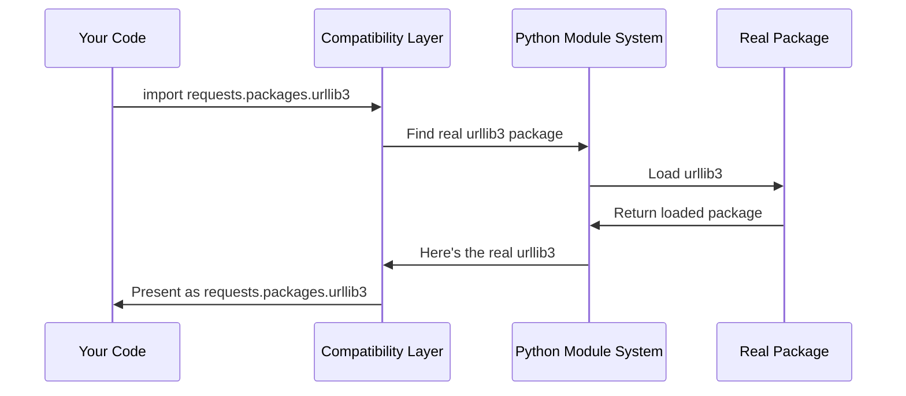

# Chapter 3: Dependency Compatibility Layer

After exploring [SSL Certificate Management](02_ssl_certificate_management_.md), you've seen how requests keeps your connections secure. But there's another challenge that requests faces: what happens when the library needs to update its internal structure without breaking everyone's existing code? This is where the Dependency Compatibility Layer comes to the rescue!

## The Problem: Moving Day Without Breaking Your Address

Imagine you've been living at 123 Main Street for years, and everyone knows how to find you there. Your friends send mail to that address, delivery drivers know the route, and all your accounts are registered there. Then one day, you need to move to a new house at 456 Oak Avenue.

The problem is: what happens to all the mail still being sent to your old address? What about friends who memorized your old address? If you just disappeared from 123 Main Street, everyone trying to reach you would get confused!

This exact scenario happens in software development. Let's say you wrote some code a year ago that looks like this:

```python
import requests.packages.urllib3
print("Using urllib3 through requests!")
```

This code expects to find `urllib3` inside the `requests.packages` folder. But what if the requests developers need to reorganize their code and move things around? Your old code would suddenly break!

The Dependency Compatibility Layer solves this problem by acting like a forwarding service for your old address.

## What is a Dependency Compatibility Layer?

Think of this layer as a helpful mail forwarding service. When someone sends mail to your old address, the post office automatically forwards it to your new address. The sender doesn't even know you moved!

In the requests library, this compatibility layer ensures that old import statements still work, even when the internal structure changes. It's like having a digital receptionist that says: "Oh, you're looking for urllib3? It's not here anymore, but let me connect you to where it actually lives now."

Let's see this in action:

```python
# This old-style import still works!
import requests.packages.urllib3
print("Found urllib3!")

# Even though urllib3 is actually installed separately
import urllib3
print("This is the same urllib3!")

# They're actually the same thing
print(requests.packages.urllib3 is urllib3)  # True!
```

The magic here is that `requests.packages.urllib3` and `urllib3` refer to the exact same thing, even though they have different names!

## The Moving Day Analogy in Action

Let's walk through a concrete example to understand how this works:

```python
# Old way (still works thanks to compatibility layer)
from requests.packages.urllib3 import PoolManager
pool = PoolManager()
print("Created pool manager the old way!")

# New way (direct import)
from urllib3 import PoolManager
pool2 = PoolManager() 
print("Created pool manager the new way!")
```

Both approaches create the exact same type of object. The compatibility layer ensures that your old code doesn't break when the library structure changes.

## Breaking Down the Magic Trick

The compatibility layer works like a clever magic trick with mirrors. When you ask for `requests.packages.urllib3`, Python doesn't actually look in a folder called `packages` inside requests. Instead, it redirects your request to the real `urllib3` package that's installed separately.

Here's how the trick works step by step:



Let's see what happens behind the scenes:

1. **Your code** tries to import `requests.packages.urllib3`
2. **The compatibility layer** intercepts this request
3. **Python's module system** finds the real `urllib3` package
4. **The real package** gets loaded into memory
5. **The compatibility layer** creates an alias so it appears to be at `requests.packages.urllib3`

## Looking Under the Hood: The Implementation

Now let's examine the actual code that makes this magic happen. The entire compatibility layer is surprisingly compact:

```python
import sys

# Import the real packages
for package in ("urllib3", "idna"):
    locals()[package] = __import__(package)
```

This first part imports the real packages (`urllib3` and `idna`) and makes them available locally. Think of it as getting the real addresses of where these packages actually live.

```python
# Create the compatibility aliases
for mod in list(sys.modules):
    if mod == package or mod.startswith(f"{package}."):
        sys.modules[f"requests.packages.{mod}"] = sys.modules[mod]
```

This second part creates the "forwarding addresses." It tells Python: "Whenever someone asks for `requests.packages.urllib3`, give them the real `urllib3` instead."

The `sys.modules` dictionary is like Python's phone book - it keeps track of all loaded packages and where to find them.

## A Real-World Example

Let's see this compatibility layer in action with a practical example:

```python
# These three imports all give you the same thing!
import urllib3
import requests.packages.urllib3 
from requests.packages import urllib3 as urllib3_alias

# Let's prove they're identical
print("Are they the same object?")
print(f"urllib3 is requests.packages.urllib3: {urllib3 is requests.packages.urllib3}")
print(f"ID of urllib3: {id(urllib3)}")
print(f"ID of requests.packages.urllib3: {id(requests.packages.urllib3)}")
```

This will output:
```
Are they the same object?
urllib3 is requests.packages.urllib3: True
ID of urllib3: 140234567890123
ID of requests.packages.urllib3: 140234567890123
```

The identical ID numbers prove that both names point to the exact same object in memory!

## The Character Detection Special Case

The compatibility layer handles a special case for character detection. Some systems have different packages for detecting text encoding:

```python
# The layer handles different character detection packages
try:
    from requests.packages import chardet
    print("Using chardet for character detection")
except ImportError:
    print("Chardet not available")
```

This flexibility ensures that requests works across different Python environments, whether they use `chardet`, `charset-normalizer`, or other character detection libraries.

## Why This Matters for You

Understanding the compatibility layer helps you in several ways:

**Legacy Code Support**: If you have old code that imports from `requests.packages`, it will continue to work without modification.

```python
# This old code still works fine
from requests.packages.urllib3.exceptions import MaxRetryError
```

**Flexibility**: You can choose whichever import style you prefer - both work identically.

**Future-Proofing**: When libraries evolve and restructure, compatibility layers protect your existing code from breaking.

## The Developer's Perspective

The requests developers included a humorous comment in their code:

```python
# This code exists for backwards compatibility reasons.
# I don't like it either. Just look the other way. :)
```

This shows that while compatibility layers are necessary, they're not always elegant. They're a compromise between clean code and practical needs - like keeping a forwarding address long after you've moved.

## When Compatibility Layers Get Removed

Eventually, compatibility layers might be removed in major version updates. This is why you'll sometimes see deprecation warnings:

```python
import warnings

# Libraries might warn about old import paths
warnings.warn("requests.packages.urllib3 is deprecated, use urllib3 directly", 
              DeprecationWarning)
```

These warnings give you time to update your code to use the new import paths before the old ones stop working.

## Best Practices

Here are some guidelines for working with compatibility layers:

**Prefer Direct Imports**: When writing new code, import packages directly:
```python
# Good: Direct import
import urllib3

# Works but old-style: Through compatibility layer  
import requests.packages.urllib3
```

**Update Gradually**: If you have old code, you can update it gradually without breaking anything.

**Read the Documentation**: Check if the library recommends specific import patterns.

## The Digital Mail Forwarding Service

Remember our moving analogy? The compatibility layer is like having a super-smart mail forwarding service that:

- **Never loses mail**: All your old import statements still work
- **Works instantly**: No delays or extra steps needed
- **Is invisible**: You don't even notice it's working
- **Handles everything**: Forwards not just the main package but all sub-packages too

This ensures that when libraries evolve and improve their internal structure, your existing code continues to work without any changes needed from you.

## Conclusion

The Dependency Compatibility Layer is like a diplomatic translator that ensures old and new code can coexist peacefully. By creating aliases and forwarding requests, it protects existing code from breaking when libraries need to reorganize their internal structure.

This layer demonstrates an important principle in software development: backward compatibility matters. It allows libraries to evolve and improve while respecting the investment that developers have made in existing code.

Understanding this concept prepares you to work confidently with evolving Python libraries, knowing that well-designed compatibility layers will protect your code from unexpected breakage.

The requests library's approach to dependency management shows how thoughtful engineering can solve the tension between innovation and stability - a balance that benefits everyone in the Python community.

