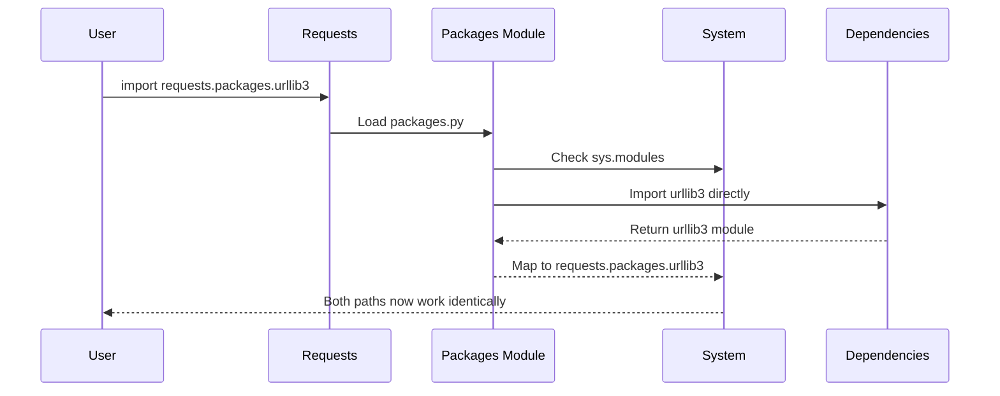

# Chapter 3: Dependency Integration and Compatibility

After learning about [Security and Certificate Management](02_security_and_certificate_management_.md), you now understand how requests keeps your connections secure using certificate bundles. But here's an interesting question: how does requests actually make those secure connections? The answer is that requests doesn't do all the heavy lifting itself - it relies on other specialized Python packages to handle different parts of the job, just like how a smartphone uses different chips for different functions (camera, WiFi, processor). Let's explore how requests acts as a universal adapter that makes all these pieces work together seamlessly.

## What Problem Does This Solve?

Imagine you're assembling a home entertainment system. You have a TV, a gaming console, a sound system, and a streaming device - all made by different companies with different connection ports and remote controls. Without a universal remote and some adapters, you'd need to juggle multiple remotes and worry about compatibility issues between devices.

The same challenge exists in Python packages! The requests library needs to handle URL encoding, SSL connections, HTTP protocols, and character detection. Instead of building all these features from scratch, requests uses specialized libraries that are experts in each area:

- **urllib3** - Handles the actual HTTP connections
- **idna** - Manages international domain names
- **chardet** - Detects text encoding in responses

But here's the tricky part: what if someone has been using `requests.packages.urllib3` in their code for years, and suddenly requests changes how it handles dependencies? Their code would break! Requests solves this with a clever compatibility system.

## Understanding the Compatibility Challenge

Let's say you wrote some code years ago that looks like this:

```python
import requests.packages.urllib3

# Disable SSL warnings
requests.packages.urllib3.disable_warnings()
```

This code expects to find urllib3 inside the requests package. But what if requests decides to use a different HTTP library, or if urllib3 gets installed separately on your system? Your old code should still work!

This is where dependency integration comes in - requests acts like a universal adapter that ensures old code keeps working while new code can use the latest features.

## The Universal Adapter System

Think of requests' dependency system like a universal power adapter for international travel. No matter what country you're in (what versions of dependencies you have), the adapter ensures your device (your code) still works.

Here's how you can see this in action:

```python
import requests.packages.urllib3
import urllib3

# These should point to the same thing!
print("Same library?", requests.packages.urllib3 is urllib3)
```

This outputs:
```
Same library? True
```

The magic is that `requests.packages.urllib3` is actually the same as the standalone `urllib3` package - requests just provides an alternate path to access it.

## How the Integration Works

Let's look at what happens when you import requests and try to use its packaged dependencies:



Here's what happens step by step:

1. **You import** `requests.packages.urllib3`
2. **Requests checks** what dependencies are available on your system
3. **Requests imports** the actual urllib3 package
4. **Requests creates** a mapping so `requests.packages.urllib3` points to the real urllib3
5. **Your code works** regardless of which path you use to access urllib3

## The Simple But Clever Implementation

The entire compatibility system is surprisingly compact. Here's the core logic:

```python
import sys

# Import the real packages
for package in ("urllib3", "idna"):
    locals()[package] = __import__(package)
```

This code imports urllib3 and idna directly into the current namespace.

Then comes the clever part - creating the compatibility mappings:

```python
# Create the requests.packages.* mappings
for mod in list(sys.modules):
    if mod == package or mod.startswith(f"{package}."):
        sys.modules[f"requests.packages.{mod}"] = sys.modules[mod]
```

This creates aliases so that `requests.packages.urllib3` points to the exact same object as `urllib3`.

## Special Handling for Character Detection

Character detection (figuring out if text is in English, Chinese, etc.) is handled specially because there are multiple packages that can do this job:

```python
from .compat import chardet

if chardet is not None:
    # Create mappings for whichever chardet package is available
    target = chardet.__name__
    for mod in list(sys.modules):
        if mod == target or mod.startswith(f"{target}."):
            sys.modules[f"requests.packages.{mod}"] = sys.modules[mod]
```

This means requests can work with different character detection libraries while providing a consistent interface.

## Why This Matters for Backward Compatibility

This system solves a real problem. Let's say you have old code like this:

```python
# Old way - still works!
from requests.packages.urllib3.util.retry import Retry

retry_strategy = Retry(total=3)
```

And new code can use the modern approach:

```python
# New way - also works!
from urllib3.util.retry import Retry

retry_strategy = Retry(total=3)
```

Both approaches work identically because they reference the exact same objects in memory.

## The Module System Integration

Python's module system (`sys.modules`) is like a phone book that keeps track of all imported packages. The requests compatibility system adds extra entries to this phone book:

```python
import sys
import requests.packages.urllib3

# Check what's in the module system
print("urllib3" in sys.modules)  # True
print("requests.packages.urllib3" in sys.modules)  # Also True!
```

Both entries point to the same module object, so there's no duplication or waste of memory.

## What Happens Behind the Scenes

When you import requests, here's the complete flow:

1. **Package loading**: Requests loads its packages.py file
2. **Dependency discovery**: It checks what HTTP libraries are available
3. **Direct imports**: It imports urllib3, idna, and chardet normally
4. **Alias creation**: It creates `requests.packages.*` aliases pointing to the real packages
5. **Module registration**: It registers both the original and alias names in sys.modules
6. **Ready for use**: Now both `urllib3` and `requests.packages.urllib3` work identically

## Real-World Benefits

This compatibility system provides several benefits:

**For users upgrading requests:**
```python
# This code from 2015 still works in 2024!
import requests.packages.urllib3 as urllib3
```

**For library developers:**
```python
# Can safely use either approach
try:
    from urllib3 import PoolManager
except ImportError:
    from requests.packages.urllib3 import PoolManager
```

**For system administrators:**
```python
# Disable warnings regardless of setup
import requests.packages.urllib3
requests.packages.urllib3.disable_warnings()
```

## The Developer's Note

The requests developers even included a comment about this system:

```python
# This code exists for backwards compatibility reasons.
# I don't like it either. Just look the other way. :)
```

This honest comment shows that while the system works well, it's a compromise to maintain backward compatibility rather than the "cleanest" possible design.

## Why This Design Choice Matters

The compatibility system demonstrates an important principle in software development: **stability over purity**. While it might be "cleaner" to force everyone to import dependencies directly, requests prioritizes not breaking existing code.

This decision means that:
- Old tutorials and examples keep working
- Large codebases don't need updates when upgrading requests
- The transition between different dependency versions is seamless

## What You've Learned

In this chapter, you discovered how requests acts as a universal adapter for its dependencies. You learned that `requests.packages.urllib3` is actually just another name for the regular `urllib3` package, and that this system exists to ensure backward compatibility. The implementation uses Python's module system to create aliases, ensuring that old code continues to work even as the underlying dependencies evolve.

Most importantly, you now understand that this system is like a universal remote control - it provides a consistent interface regardless of what's happening behind the scenes, making your code more robust and future-proof.

This compatibility system shows how thoughtful library design can balance innovation with stability, ensuring that the requests library can evolve while keeping the millions of projects that depend on it working smoothly.

You've now completed your journey through the core concepts of the requests library! You've learned about [Package Metadata and Versioning](01_package_metadata_and_versioning_.md) for identifying packages, [Security and Certificate Management](02_security_and_certificate_management_.md) for secure connections, and Dependency Integration and Compatibility for seamless package interactions. Together, these concepts form the foundation that makes requests such a reliable and user-friendly library for HTTP communications in Python.

