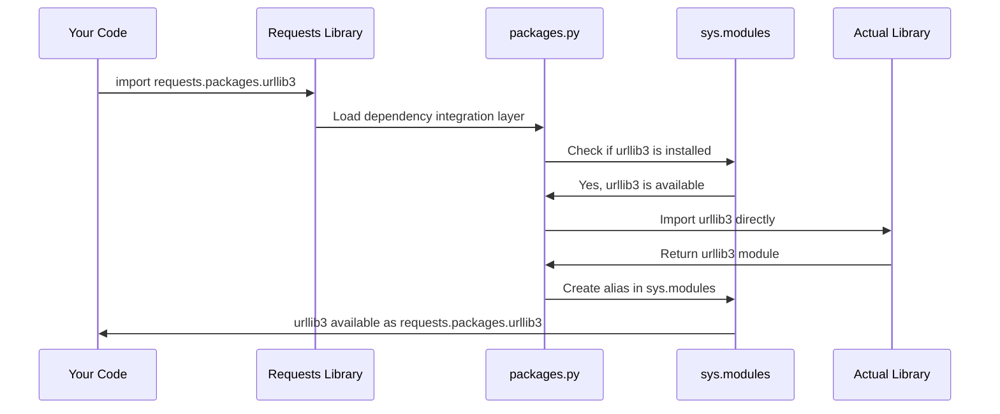

# Chapter 3: Dependency Integration Layer

After learning how the `requests` library manages its identity through [Package Metadata and Versioning](01_package_metadata_and_versioning_.md) and keeps us safe with [Security Certificate Management](02_security_certificate_management_.md), let's explore one of its most clever features: how it seamlessly integrates with other Python libraries to provide you with a unified, simple interface.

## What is a Dependency Integration Layer?

Imagine you have a universal remote control that works with any TV brand - Sony, Samsung, LG, or any other manufacturer. Instead of learning different button layouts for each brand, you use the same simple interface for all of them. The universal remote acts as a **translator**, converting your button presses into the specific commands each TV brand understands.

The `requests` library works similarly! It depends on several specialized libraries to do its job:
- **urllib3**: Handles the actual HTTP connections and network communication
- **chardet**: Automatically detects what text encoding websites use (like UTF-8 or ASCII)
- **idna**: Manages international domain names (websites with non-English characters)

But here's the magic: you don't need to learn how to use each of these libraries separately. The `requests` library provides a **Dependency Integration Layer** that makes all these different tools work together seamlessly, appearing as if they're all part of one unified system.

## The Problem: Managing Multiple Libraries

Let's see what using these libraries directly would look like without `requests`:

```python
# Without requests - you'd need to manage multiple libraries
import urllib3
import chardet

# Create a connection pool
http = urllib3.PoolManager()

# Make a request
response = http.request('GET', 'https://httpbin.org/get')

# Detect the text encoding manually
detected_encoding = chardet.detect(response.data)
text = response.data.decode(detected_encoding['encoding'])
```

This requires you to:
1. Learn multiple different library interfaces
2. Manually coordinate between them
3. Handle encoding detection yourself
4. Manage connection pools and other complex details

Compare this to the simple `requests` approach:

```python
# With requests - everything works together automatically
import requests

response = requests.get('https://httpbin.org/get')
text = response.text  # Encoding automatically detected and handled!
```

The Dependency Integration Layer makes this simplicity possible by hiding all the complexity behind a clean, easy-to-use interface.

## How Backward Compatibility Works

Here's where things get really interesting. The `requests` library maintains something called **backward compatibility**. This means that old code written years ago still works with newer versions of `requests`, even as the underlying libraries change and evolve.

Let's say you wrote code in 2018 that looked like this:

```python
# Old code from 2018 - still works today!
import requests.packages.urllib3 as urllib3

# Disable SSL warnings for testing
urllib3.disable_warnings()
```

Even though the internal structure of `requests` has changed over the years, this old code continues to work because the Dependency Integration Layer maintains these familiar pathways.

## The Universal Adapter in Action

Let's see how you can access the underlying libraries through `requests`:

```python
import requests

# Access urllib3 through requests
print("urllib3 version:", requests.packages.urllib3.__version__)

# Access chardet through requests  
print("chardet available:", hasattr(requests.packages, 'chardet'))

# These are the same libraries, just accessible through requests
import urllib3
print("Direct urllib3 version:", urllib3.__version__)
```

Output:
```
urllib3 version: 1.26.18
chardet available: True
Direct urllib3 version: 1.26.18
```

Notice how `requests.packages.urllib3` gives you access to the exact same urllib3 library, but through the `requests` interface. It's like having multiple entrances to the same building!

## What Happens Under the Hood

Let's walk through what happens when you access a dependency through the integration layer:



Here's what each step means:

1. **Your code** tries to import a library through the requests.packages interface
2. **Requests** activates its dependency integration layer
3. **The packages module** checks if the required library is installed on your system
4. **Python's module system** confirms the library is available
5. **The integration layer** imports the library directly
6. **The actual library** is loaded into memory
7. **An alias is created** so you can access it through requests.packages
8. **You get access** to the library through both the direct import and the requests interface

## Looking at the Integration Code

Let's examine the actual code that makes this magic happen:

```python
# From src/requests/packages.py
import sys

# Step 1: Import libraries directly
for package in ("urllib3", "idna"):
    locals()[package] = __import__(package)
```

This code does something clever:
- It loops through important dependency names
- For each one, it imports the library directly using `__import__()`
- It stores each library in the local namespace

```python
# Step 2: Create aliases in the module system
for mod in list(sys.modules):
    if mod == package or mod.startswith(f"{package}."):
        sys.modules[f"requests.packages.{mod}"] = sys.modules[mod]
```

This second part creates the "universal remote" functionality:
- It looks at all currently loaded Python modules
- For each dependency-related module, it creates an alias
- Now you can access `urllib3` as both `urllib3` and `requests.packages.urllib3`

## Special Handling for chardet

The `chardet` library (used for encoding detection) gets special treatment because it might not always be available:

```python
# From src/requests/packages.py
from .compat import chardet

if chardet is not None:
    # Create aliases for chardet modules
    target = chardet.__name__
    for mod in list(sys.modules):
        if mod == target or mod.startswith(f"{target}."):
            imported_mod = sys.modules[mod]
            sys.modules[f"requests.packages.{mod}"] = imported_mod
```

This code:
1. **Safely imports chardet** through the compatibility layer
2. **Checks if it's available** (it might not be installed)
3. **Creates aliases only if found**, preventing errors if it's missing
4. **Maps all chardet submodules** to the requests.packages namespace

## Why This Design is Brilliant

The Dependency Integration Layer solves several important problems:

**1. Backward Compatibility**
```python
# Old code continues to work
import requests.packages.urllib3.poolmanager

# Same result as newer approaches
import urllib3.poolmanager
```

**2. Simplified Dependency Management**
```python
# You only need to install 'requests'
# It automatically brings in urllib3, idna, etc.
pip install requests
```

**3. Consistent Interface**
```python
# Everything accessed through requests feels unified
response = requests.get('https://example.com')
connection_pool = requests.packages.urllib3.PoolManager()
```

## Real-World Example: Handling SSL Warnings

Let's see how this helps in a practical scenario where you need to disable SSL warnings during development:

```python
import requests

# Method 1: Through the integration layer (backward compatible)
requests.packages.urllib3.disable_warnings()

# Method 2: Direct import (also works)
import urllib3
urllib3.disable_warnings()

# Both methods do exactly the same thing!
response = requests.get('https://httpbin.org/get', verify=False)
print("Request completed without SSL warnings")
```

The integration layer gives you flexibility - use whichever approach feels more natural for your code style.

## Understanding the Module System Magic

The integration layer leverages Python's `sys.modules` dictionary, which is like Python's internal phone book of all loaded modules:

```python
import sys
import requests.packages.urllib3

# These point to the exact same object in memory
direct_urllib3 = __import__('urllib3')
integrated_urllib3 = requests.packages.urllib3

print("Same object?", direct_urllib3 is integrated_urllib3)  # True
print("In sys.modules:", 'requests.packages.urllib3' in sys.modules)  # True
```

This demonstrates that the integration layer doesn't create copies - it creates **aliases** that point to the same actual library objects.

## Benefits for Library Users

This abstraction provides several advantages:

**1. Learning Curve Reduction**
- You only need to learn the `requests` interface
- Access to powerful underlying libraries when needed
- No need to study multiple library documentation sets

**2. Code Maintenance**
- Existing code continues working as libraries evolve
- Gradual migration paths to newer approaches
- Consistent behavior across different environments

**3. Flexibility**
- Use simple `requests` interface for common tasks
- Drop down to lower-level libraries for advanced features
- Mix and match approaches as needed

## Wrapping Up

The Dependency Integration Layer is like a universal translator that makes multiple specialized libraries work together as one cohesive system. By providing aliases and maintaining backward compatibility, `requests` gives you the best of both worlds: simplicity for everyday use and access to powerful underlying tools when you need them.

This elegant abstraction means you can start with simple `requests.get()` calls and gradually explore more advanced features without having to abandon your existing code or learn entirely new interfaces. The integration layer ensures that as you grow as a developer, the `requests` library can grow with you.

This concludes our exploration of the core abstractions that make the `requests` library so powerful and user-friendly. Understanding these foundational concepts - package metadata, security management, and dependency integration - gives you insight into how modern Python libraries are designed to be both simple and sophisticated.

