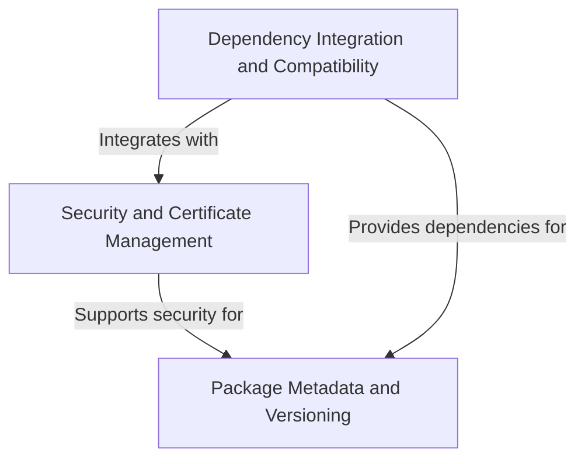

# Tutorial: requests

The **requests** library is a popular Python package that makes *HTTP requests* simple and human-friendly. 
It provides an easy way to send web requests (like GET, POST) to websites and APIs, handling all the 
complex details of *security*, *certificates*, and *compatibility* behind the scenes. Think of it as a 
**universal translator** that lets your Python code talk to any website or web service effortlessly.

**Source Repository:** [https://github.com/psf/requests](https://github.com/psf/requests)

## Chapters

1. [Package Metadata and Versioning
](01_package_metadata_and_versioning_.md)
2. [Security and Certificate Management
](02_security_and_certificate_management_.md)
3. [Dependency Integration and Compatibility
](03_dependency_integration_and_compatibility_.md)
