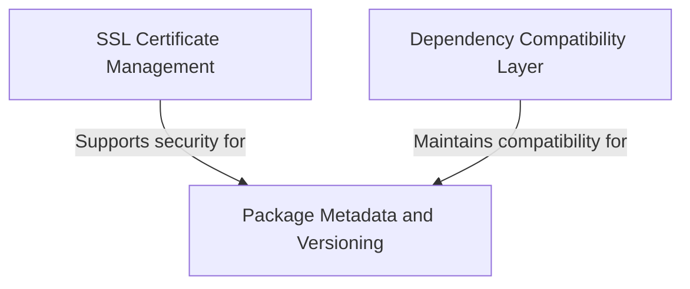

# Tutorial: requests

The **requests** library is a popular Python package that makes it *incredibly easy* to send HTTP requests to websites and APIs. 
Think of it as a **user-friendly bridge** between your Python code and the internet - instead of dealing with complex low-level networking code, 
you can simply use requests to *fetch web pages, send data to servers, or communicate with web services* in just a few lines of code. 
The library handles all the complicated stuff like **SSL security**, **authentication**, and **data encoding** behind the scenes.

**Source Repository:** [https://github.com/psf/requests](https://github.com/psf/requests)

## Chapters

1. [Package Metadata and Versioning
](01_package_metadata_and_versioning_.md)
2. [SSL Certificate Management
](02_ssl_certificate_management_.md)
3. [Dependency Compatibility Layer
](03_dependency_compatibility_layer_.md)
