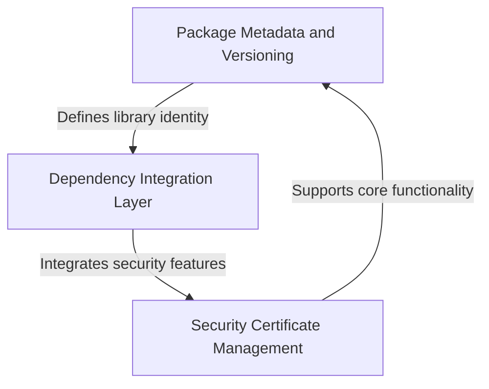

# Tutorial: requests

The **requests** library is a popular Python package that makes it *incredibly easy* to send HTTP requests and interact with web services. 
It provides a **human-friendly** interface for making GET, POST, and other HTTP requests, handling things like authentication, cookies, and SSL certificates automatically.
Think of it as a *simplified way* to communicate with websites and APIs without having to deal with the complex underlying networking details.

**Source Repository:** [https://github.com/psf/requests](https://github.com/psf/requests)

## Chapters

1. [Package Metadata and Versioning
](01_package_metadata_and_versioning_.md)
2. [Security Certificate Management
](02_security_certificate_management_.md)
3. [Dependency Integration Layer
](03_dependency_integration_layer_.md)
