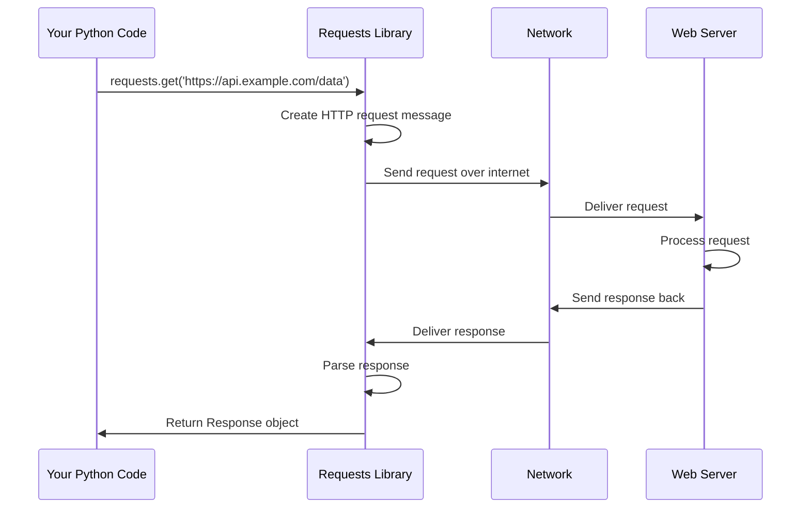

# Chapter 1: HTTP Request/Response Cycle

Welcome to the world of HTTP communication! In this chapter, we'll explore the fundamental concept that makes the `requests` library so powerful: the HTTP Request/Response Cycle. Think of this as learning how to have a conversation with websites and web services.

## What Problem Does This Solve?

Imagine you want to get information from a website, submit a form, or interact with a web service. Without the `requests` library, you'd need to write complex code to handle network connections, format HTTP messages, and parse responses. The requests library solves this by providing a simple, human-friendly way to communicate with web servers.

Let's start with a concrete example: getting information about a book from an online API.

```python
import requests

# Get information about a book
response = requests.get('https://api.github.com/users/octocat')
print(response.status_code)  # Output: 200 (success!)
```

This simple line of code hides a lot of complexity! Let's understand what's happening behind the scenes.

## The Postal Service Analogy

The HTTP Request/Response Cycle works just like sending a letter through the postal service:

1. **Writing a Letter (Request)**: You write a letter with specific information
2. **Addressing the Envelope (URL)**: You put the destination address on it
3. **Adding Special Instructions (Headers)**: You might add "Express Mail" or "Fragile"
4. **Sending It Off**: The postal service handles delivery
5. **Getting a Reply (Response)**: You receive a response back

Let's see how this maps to HTTP:

```python
# This is like writing and sending a letter
response = requests.get('https://httpbin.org/get')
```

## Breaking Down the Request/Response Cycle

### 1. The Request - Your Letter to the Web

When you make a request, you're creating a message with several components:

```python
# A simple GET request - like asking "Please send me information"
response = requests.get('https://httpbin.org/get')
```

This creates a request with:
- **Method**: GET (asking for information)
- **URL**: The web address where you want to send your request
- **Headers**: Special instructions (automatically added by requests)

### 2. Sending Data - Adding Contents to Your Letter

Sometimes you want to send information along with your request:

```python
# Sending data - like including a filled-out form in your letter
data = {'name': 'Alice', 'age': 25}
response = requests.post('https://httpbin.org/post', data=data)
```

This POST request is like sending a form to be processed.

### 3. The Response - Getting Your Reply

Every request gets a response back:

```python
response = requests.get('https://httpbin.org/get')
print(f"Status: {response.status_code}")  # Output: Status: 200
print(f"Content: {response.text[:100]}")  # First 100 characters of response
```

The response contains:
- **Status Code**: Whether your request succeeded (200 = success)
- **Content**: The actual information you requested
- **Headers**: Additional information about the response

## Different Types of Requests

Just like you can send different types of mail, there are different HTTP methods:

```python
# GET - "Please send me information"
response = requests.get('https://httpbin.org/get')

# POST - "Please process this information"
response = requests.post('https://httpbin.org/post', data={'key': 'value'})
```

```python
# PUT - "Please update this information"
response = requests.put('https://httpbin.org/put', data={'key': 'new_value'})

# DELETE - "Please remove this information"
response = requests.delete('https://httpbin.org/delete')
```

Each method tells the server what kind of action you want to perform.

## What Happens Under the Hood

Let's follow what happens when you make a simple request:



### Step-by-Step Breakdown

1. **You call a requests function**: `requests.get()`, `requests.post()`, etc.
2. **Requests creates an HTTP message**: It formats your request according to HTTP standards
3. **The message travels over the internet**: Network infrastructure handles delivery
4. **The server processes your request**: It figures out what you're asking for
5. **The server sends back a response**: Contains the data or confirmation you requested
6. **Requests parses the response**: It makes the response easy for you to work with
7. **You get a Response object**: Contains all the information from the server

## Looking at the Code Implementation

The magic happens in the `api.py` file. Let's look at how the `get()` function works:

```python
def get(url, params=None, **kwargs):
    """Sends a GET request."""
    return request("get", url, params=params, **kwargs)
```

This function is beautifully simple! It just calls a more general `request()` function with the method set to "get".

The `request()` function does the heavy lifting:

```python
def request(method, url, **kwargs):
    """Constructs and sends a Request."""
    with sessions.Session() as session:
        return session.request(method=method, url=url, **kwargs)
```

This creates a session (like opening a connection to the postal service) and uses it to send your request.

## A Complete Example

Let's put it all together with a practical example:

```python
import requests

# Make a request to get user information
response = requests.get('https://api.github.com/users/octocat')
```

```python
# Check if the request was successful
if response.status_code == 200:
    print("Success! We got the data.")
    print(f"User info: {response.json()['name']}")
else:
    print(f"Something went wrong. Status code: {response.status_code}")
```

This example shows the complete cycle: making a request, checking if it succeeded, and using the response data.

## Key Takeaways

The HTTP Request/Response Cycle is the foundation of web communication. The `requests` library makes this incredibly simple by:

1. **Hiding complexity**: You don't need to worry about HTTP formatting, network connections, or parsing responses
2. **Providing simple functions**: `get()`, `post()`, `put()`, `delete()` for different types of requests
3. **Returning easy-to-use objects**: Response objects that make it simple to access data and status information

In our next chapter, [Data Structures and Status Codes](02_data_structures_and_status_codes_.md), we'll dive deeper into understanding the Response objects you get back and what those status codes really mean!

