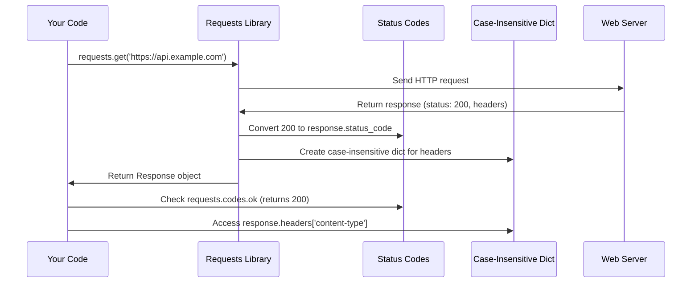

# Chapter 2: Data Structures and Status Codes

In our [previous chapter](01_http_request_response_cycle_.md), we learned how to send HTTP requests and receive responses. But what happens when you need to check if your request succeeded? Or when you want to work with HTTP headers that might be written as "Content-Type" or "content-type"? This chapter will solve these exact problems!

## What Problem Does This Solve?

Imagine you're building a weather app that gets data from a weather API. You need to:
1. Check if your request was successful (did the server respond with "OK" or "Not Found"?)
2. Work with HTTP headers that might have different capitalizations
3. Make your code readable by using meaningful names instead of cryptic numbers

Let's see this problem in action:

```python
import requests

response = requests.get('https://api.weather.com/current')
print(response.status_code)  # Output: 200 (but what does 200 mean?)
```

Instead of memorizing that `200` means "success" and `404` means "not found", wouldn't it be nice to write code like this?

```python
if response.status_code == requests.codes.ok:
    print("Success!")
elif response.status_code == requests.codes.not_found:
    print("Weather data not found!")
```

Much more readable, right? Let's learn how the `requests` library makes this possible!

## The Two Key Building Blocks

The `requests` library provides two essential tools:

1. **Case-Insensitive Dictionaries**: For handling HTTP headers where capitalization doesn't matter
2. **Status Code Names**: Human-readable names for HTTP response codes

Think of these as a translator and a dictionary that make web communication much easier to understand.

## Understanding Status Codes - Your Response Translator

### The Restaurant Order Analogy

Status codes work like the responses you get when ordering food at a restaurant:

- **200 (OK)**: "Here's your order!" - Everything worked perfectly
- **404 (Not Found)**: "Sorry, we don't have that dish" - The requested item doesn't exist
- **500 (Internal Server Error)**: "Our kitchen is having problems" - Something went wrong on the server

Let's see how to use these in real code:

```python
import requests

response = requests.get('https://httpbin.org/status/200')
print(response.status_code)  # Output: 200
```

Now, instead of remembering what `200` means, you can use the `codes` object:

```python
print(requests.codes.ok)              # Output: 200
print(requests.codes.not_found)       # Output: 404
print(requests.codes.server_error)    # Output: 500
```

### Making Your Code More Readable

Here's a practical example of checking different status codes:

```python
response = requests.get('https://api.github.com/users/octocat')

if response.status_code == requests.codes.ok:
    print("Got the user data successfully!")
    user_data = response.json()
    print(f"User: {user_data['name']}")
```

```python
elif response.status_code == requests.codes.not_found:
    print("User doesn't exist")
elif response.status_code == requests.codes.server_error:
    print("GitHub is having problems")
```

This code is much easier to understand than using raw numbers!

### Multiple Names for the Same Code

The `codes` object is flexible - it provides multiple names for the same status code:

```python
# All of these are the same!
print(requests.codes.ok)        # 200
print(requests.codes.okay)      # 200
print(requests.codes.all_good)  # 200
```

This flexibility makes your code more natural to read and write.

## Case-Insensitive Dictionaries - Your Header Helper

### The Filing Cabinet Analogy

HTTP headers are like labels on filing cabinets. Whether you write "Content-Type", "content-type", or "CONTENT-TYPE", you're talking about the same thing. Case-insensitive dictionaries understand this and treat them all the same way.

Let's see this in action:

```python
response = requests.get('https://httpbin.org/json')
headers = response.headers

print(headers['Content-Type'])    # Works!
print(headers['content-type'])    # Also works!
print(headers['CONTENT-TYPE'])    # This works too!
```

All three ways of accessing the header return the same value, even though the actual header might be stored as "Content-Type".

### Why This Matters

Without case-insensitive dictionaries, you'd have to worry about how exactly the server capitalized each header:

```python
# Without case-insensitive dictionaries (this would be painful!)
headers = {'Content-Type': 'application/json'}

# These would all fail except the first one:
# headers['content-type']  # KeyError!
# headers['CONTENT-TYPE']  # KeyError!
```

But with `requests`, it just works regardless of capitalization!

### Working with Headers

Here's how you typically work with response headers:

```python
response = requests.get('https://httpbin.org/json')

# Check what type of content we received
content_type = response.headers['content-type']
print(f"Content type: {content_type}")  # Output: application/json
```

```python
# Check if the response is compressed
encoding = response.headers.get('content-encoding', 'none')
print(f"Encoding: {encoding}")
```

The `.get()` method works just like with regular dictionaries, providing a default value if the header doesn't exist.

## How It Works Under the Hood

Let's understand what happens when you use these features:



### Step-by-Step Breakdown

1. **You make a request**: Using `requests.get()` or similar functions
2. **Server responds**: Returns a status code (like 200) and headers
3. **Requests processes the status code**: Makes it available as `response.status_code`
4. **Requests creates case-insensitive headers**: Wraps headers in a special dictionary
5. **You use friendly names**: Access `requests.codes.ok` instead of memorizing `200`
6. **You access headers easily**: Use any capitalization for header names

## Looking at the Implementation

### The Status Codes System

The magic happens in the `status_codes.py` file. Let's look at how it works:

```python
# This is how status codes are defined
_codes = {
    200: ("ok", "okay", "all_ok", "all_okay", "all_good"),
    404: ("not_found", "-o-"),
    500: ("internal_server_error", "server_error"),
    # ... many more
}
```

The system creates a `LookupDict` that lets you access status codes by name:

```python
codes = LookupDict(name="status_codes")
# Now you can use codes.ok, codes.not_found, etc.
```

### The Case-Insensitive Dictionary

In `structures.py`, the `CaseInsensitiveDict` class solves the header problem:

```python
class CaseInsensitiveDict:
    def __getitem__(self, key):
        # Convert the key to lowercase for lookup
        return self._store[key.lower()][1]
```

This means when you access `headers['Content-Type']`, it actually looks up `'content-type'` internally, making capitalization irrelevant.

## A Complete Real-World Example

Let's put everything together with a practical example - checking if a website's API is working:

```python
import requests

def check_api_health(url):
    response = requests.get(url)
    
    # Use readable status code names
    if response.status_code == requests.codes.ok:
        print("✅ API is working!")
        
        # Work with headers (any capitalization works)
        content_type = response.headers.get('content-type', 'unknown')
        print(f"📄 Content type: {content_type}")
        
        return True
```

```python
    elif response.status_code == requests.codes.not_found:
        print("❌ API endpoint not found")
        return False
    
    elif response.status_code == requests.codes.server_error:
        print("🔧 Server is having problems")
        return False
    
    else:
        print(f"⚠️  Unexpected status: {response.status_code}")
        return False

# Test it out!
check_api_health('https://httpbin.org/json')
```

This example shows both concepts working together to create clean, readable code.

## Key Takeaways

Data structures and status codes in the `requests` library solve two fundamental problems:

1. **Human-readable status codes**: Use `requests.codes.ok` instead of memorizing that `200` means success
2. **Case-insensitive headers**: Access headers with any capitalization - `'Content-Type'`, `'content-type'`, or `'CONTENT-TYPE'` all work the same

These features make your code:
- **More readable**: `codes.not_found` is clearer than `404`
- **More robust**: Headers work regardless of capitalization
- **More maintainable**: Other developers can understand your code easily

The `requests` library handles all the complexity behind the scenes, so you can focus on building your application instead of wrestling with HTTP details.

In our next chapter, [Exception Handling System](03_exception_handling_system_.md), we'll learn how to gracefully handle when things go wrong with your HTTP requests!

