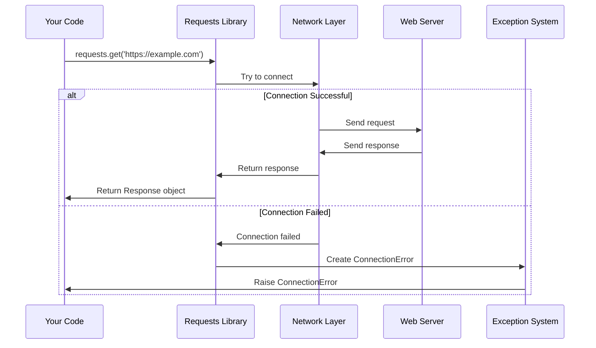

# Chapter 3: Exception Handling System

Welcome back! In our [previous chapter](02_data_structures_and_status_codes_.md), we learned how to work with responses and status codes when everything goes right. But what happens when things go wrong? What if your internet connection drops, the server is down, or you're trying to reach a website that doesn't exist?

This chapter will teach you how to handle these situations gracefully using the `requests` library's exception handling system.

## What Problem Does This Solve?

Imagine you're building a weather app that fetches data from a weather API. Without proper error handling, your app might crash when:

- Your user has no internet connection
- The weather service is temporarily down
- The API URL is wrong
- The server takes too long to respond

Let's see what happens without error handling:

```python
import requests

# This might crash your program!
response = requests.get('https://fake-weather-api.com/data')
print(response.json())  # What if this fails?
```

If the website doesn't exist or your internet is down, this code will stop your entire program with an error. That's not a good user experience!

With the exception handling system, you can write code like this instead:

```python
try:
    response = requests.get('https://fake-weather-api.com/data')
    print("Weather data:", response.json())
except requests.ConnectionError:
    print("😞 Can't connect to the weather service. Check your internet!")
except requests.Timeout:
    print("⏰ The weather service is taking too long to respond.")
```

Much better! Your app stays running and gives helpful messages to users.

## The Delivery Service Analogy

Think of the exception handling system like a comprehensive error reporting system for a delivery service:

- **ConnectionError**: "We can't find the address" - like when a website doesn't exist
- **Timeout**: "The delivery is taking too long" - when servers are slow
- **HTTPError**: "The package was rejected at the destination" - when servers return error status codes
- **RequestException**: "Something went wrong with the delivery" - a general catch-all error

Each type of error tells you exactly what went wrong, so you can handle it appropriately.

## Types of Exceptions - Your Error Categories

The `requests` library organizes errors into different categories, just like a delivery service categorizes different types of problems.

### 1. Connection Problems - Can't Reach the Destination

```python
import requests

try:
    response = requests.get('https://this-website-does-not-exist.com')
except requests.ConnectionError:
    print("❌ Can't connect to the website!")
```

This happens when:
- The website doesn't exist
- Your internet connection is down
- The server is completely offline

### 2. Timeout Problems - Taking Too Long

```python
try:
    # Wait only 3 seconds before giving up
    response = requests.get('https://httpbin.org/delay/5', timeout=3)
except requests.Timeout:
    print("⏰ The request took too long!")
```

This happens when:
- The server is very slow to respond
- Network connection is poor
- The server is overloaded

### 3. HTTP Errors - Server Says "No"

```python
try:
    response = requests.get('https://httpbin.org/status/404')
    response.raise_for_status()  # This will raise an exception for 4xx and 5xx status codes
except requests.HTTPError:
    print("🚫 The server returned an error!")
```

This happens when:
- You request a page that doesn't exist (404)
- You don't have permission (403)
- The server has internal problems (500)

### 4. General Request Problems - Catch-All

```python
try:
    response = requests.get('https://example.com')
except requests.RequestException:
    print("😕 Something went wrong with the request!")
```

This catches any request-related problem that might occur.

## The Exception Hierarchy - How Errors Are Organized

The exceptions are organized in a hierarchy, like a family tree:

```
RequestException (the grandparent - catches everything)
├── HTTPError (server returned an error status)
├── ConnectionError (can't connect)
│   ├── ProxyError (proxy problems)
│   └── SSLError (security certificate problems)
└── Timeout (too slow)
    ├── ConnectTimeout (connecting took too long)
    └── ReadTimeout (reading data took too long)
```

This hierarchy lets you catch errors at different levels of specificity.

## Handling Multiple Types of Errors

Here's how to handle different types of problems in one go:

```python
import requests

def get_weather_data(city):
    try:
        url = f'https://api.weather.com/current/{city}'
        response = requests.get(url, timeout=5)
        response.raise_for_status()  # Raise an exception for bad status codes
        return response.json()
        
    except requests.ConnectionError:
        return "❌ Can't connect to weather service. Check your internet!"
```

```python
    except requests.Timeout:
        return "⏰ Weather service is too slow. Try again later!"
    
    except requests.HTTPError:
        return "🚫 Weather service returned an error. City might not exist!"
    
    except requests.RequestException:
        return "😕 Something unexpected went wrong!"

# Test it out
print(get_weather_data('London'))
```

## What Happens Under the Hood

Let's follow what happens when you make a request that might fail:



### Step-by-Step Breakdown

1. **You make a request**: Using `requests.get()` or similar
2. **Requests tries to connect**: Attempts to reach the server
3. **Network layer handles connection**: Either succeeds or fails
4. **If successful**: You get a Response object back
5. **If failed**: The exception system creates the appropriate error
6. **Exception is raised**: Your code can catch and handle it

## Looking at the Implementation

The magic happens in the `exceptions.py` file. Let's see how the exception hierarchy is built:

### The Base Exception Class

```python
class RequestException(IOError):
    """There was an ambiguous exception that occurred while handling your request."""
    
    def __init__(self, *args, **kwargs):
        response = kwargs.pop("response", None)
        self.response = response
        self.request = kwargs.pop("request", None)
```

This is the base class that all other request exceptions inherit from. It stores information about the request and response that caused the error.

### Specific Exception Types

```python
class ConnectionError(RequestException):
    """A Connection error occurred."""

class Timeout(RequestException):
    """The request timed out."""

class HTTPError(RequestException):
    """An HTTP error occurred."""
```

Each exception type inherits from `RequestException`, which means you can catch them individually or all at once.

### More Specific Timeout Exceptions

```python
class ConnectTimeout(ConnectionError, Timeout):
    """The request timed out while trying to connect to the remote server."""

class ReadTimeout(Timeout):
    """The server did not send any data in the allotted amount of time."""
```

Notice how `ConnectTimeout` inherits from both `ConnectionError` and `Timeout`. This means it can be caught by either type of exception handler!

## A Complete Real-World Example

Let's build a robust function that handles all the common problems:

```python
import requests

def fetch_user_profile(username):
    """Safely fetch a user's GitHub profile with proper error handling."""
    
    try:
        url = f'https://api.github.com/users/{username}'
        response = requests.get(url, timeout=10)
        
        # Check if the status code indicates an error
        if response.status_code == 404:
            return {"error": f"User '{username}' not found"}
```

```python
        elif response.status_code != 200:
            return {"error": f"GitHub API error: {response.status_code}"}
        
        return {"success": True, "data": response.json()}
        
    except requests.ConnectionError:
        return {"error": "Can't connect to GitHub. Check your internet connection!"}
```

```python
    except requests.Timeout:
        return {"error": "GitHub is taking too long to respond. Try again later!"}
    
    except requests.RequestException as e:
        return {"error": f"Unexpected error: {str(e)}"}

# Test with different scenarios
print(fetch_user_profile('octocat'))        # Should work
print(fetch_user_profile('nonexistentuser123'))  # Should return user not found
```

This example shows how to:
- Handle specific error types differently
- Provide helpful error messages to users
- Keep your application running even when requests fail
- Return consistent data structures (always a dictionary with success/error info)

## Advanced Error Handling Techniques

### Using Exception Information

You can get more details about what went wrong:

```python
try:
    response = requests.get('https://httpbin.org/status/500')
    response.raise_for_status()
except requests.HTTPError as e:
    print(f"HTTP Error: {e}")
    print(f"Status Code: {e.response.status_code}")
    print(f"Response Text: {e.response.text}")
```

### Catching Multiple Exception Types

```python
try:
    response = requests.get('https://example.com')
except (requests.ConnectionError, requests.Timeout) as e:
    print(f"Network problem: {e}")
except requests.RequestException as e:
    print(f"Other request problem: {e}")
```

## Key Takeaways

The Exception Handling System in `requests` provides a comprehensive way to deal with things that can go wrong:

1. **Categorized Errors**: Different exception types for different problems (connection, timeout, HTTP errors)
2. **Hierarchical Structure**: Catch errors at the level of specificity you need
3. **Helpful Information**: Exceptions include details about what went wrong
4. **Graceful Degradation**: Keep your application running even when requests fail

The exception system makes your applications:
- **More robust**: They don't crash when network problems occur
- **User-friendly**: You can provide helpful error messages
- **Easier to debug**: Clear error types tell you exactly what went wrong

By properly handling exceptions, you can build applications that work reliably even when the network doesn't cooperate!

This completes our journey through the core concepts of the `requests` library. You now understand the [HTTP Request/Response Cycle](01_http_request_response_cycle_.md), how to work with [Data Structures and Status Codes](02_data_structures_and_status_codes_.md), and how to handle errors gracefully with the Exception Handling System. You're ready to build robust applications that communicate with web services!

