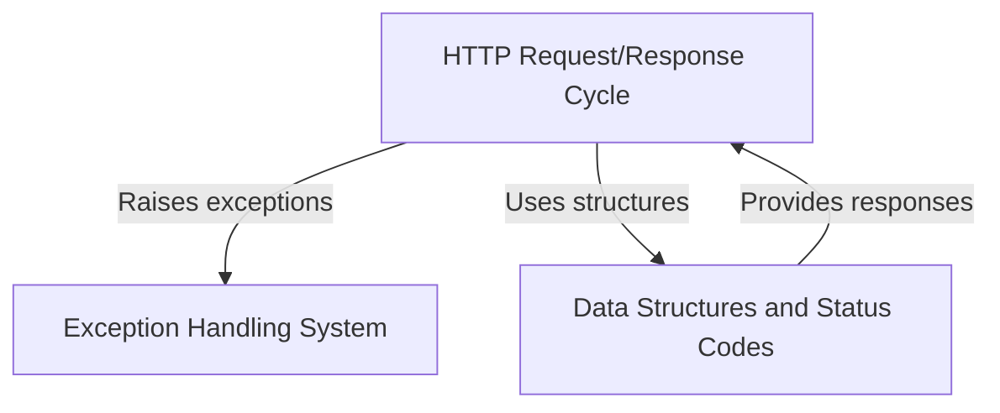

# Tutorial: requests

**Requests** is a popular Python library that makes *HTTP communication* simple and human-friendly. 
Instead of dealing with complex low-level networking code, developers can use intuitive functions like 
`requests.get()` and `requests.post()` to interact with web APIs and websites. The library handles all 
the technical details of *HTTP requests and responses*, provides clear *error messages* when things go wrong, 
and offers convenient *data structures* for working with headers and status codes.

**Source Repository:** [https://github.com/psf/requests](https://github.com/psf/requests)

## Chapters

1. [HTTP Request/Response Cycle
](01_http_request_response_cycle_.md)
2. [Data Structures and Status Codes
](02_data_structures_and_status_codes_.md)
3. [Exception Handling System
](03_exception_handling_system_.md)
