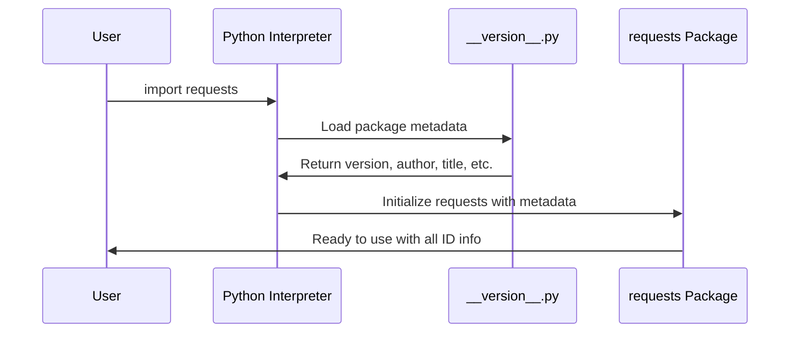

# Chapter 1: Package Metadata and Version Management

## What Problem Does This Solve?

Imagine you're at a grocery store looking at two bottles of ketchup. One has a clear label showing the brand name, version, expiration date, and manufacturer information. The other bottle has no label at all. Which one would you trust?

Software packages face the same challenge! When you install the `requests` library, both you and your computer need to know crucial information like:
- What version am I using?
- Who created this library?
- Is this the real `requests` library or a fake one?
- What license does it use?

This is exactly what **Package Metadata and Version Management** solves - it's like the official ID card for the `requests` library that contains all the essential identification information.

## A Real-World Use Case

Let's say you're working on a project and suddenly your code breaks. You suspect it might be because you're using an old version of `requests`. How can you quickly check what version you have installed?

```python
import requests
print(f"I'm using requests version: {requests.__version__}")
```

This will output something like:
```
I'm using requests version: 2.34.2
```

Now you know exactly which version you're working with! This simple check can save hours of debugging.

## Key Concepts Broken Down

### 1. Package Identity Information
Think of this as the "name tag" of the library. It tells everyone (including other programs) what this package is called and what it does.

### 2. Version Numbers
Just like how your phone gets iOS 16.1, 16.2, etc., software libraries have version numbers. This helps track improvements, bug fixes, and new features.

### 3. Author and Licensing Details
This is like the "copyright page" in a book - it tells you who created it and how you're allowed to use it.

## How to Use Package Metadata

Let's explore the different pieces of information you can access:

```python
import requests

# Check the package name
print(f"Package name: {requests.__title__}")
```
Output: `Package name: requests`

```python
# See what this package does
print(f"Description: {requests.__description__}")
```
Output: `Description: Python HTTP for Humans.`

```python
# Find out who made it
print(f"Created by: {requests.__author__}")
```
Output: `Created by: Kenneth Reitz`

```python
# Check the license
print(f"License: {requests.__license__}")
```
Output: `License: Apache-2.0`

Each of these commands accesses a special variable that contains metadata about the package. These variables all start with double underscores (`__`) - this is Python's way of marking them as "special" information.

## What Happens Under the Hood?

When you import the `requests` library, Python needs to load all this identification information. Let's see how this works step by step:



Here's what happens in simple terms:
1. You ask Python to import `requests`
2. Python first loads a special file called `__version__.py`
3. This file contains all the ID card information
4. Python attaches this information to the `requests` package
5. Now you can access details like `requests.__version__`

## The Implementation Details

All this metadata lives in a dedicated file. Let's look at how it's organized:

```python
# Basic identification
__title__ = "requests"
__description__ = "Python HTTP for Humans."
__version__ = "2.34.2"
```

The title and description are straightforward - they tell you the name and purpose of the library.

```python
# Author information
__author__ = "Kenneth Reitz"
__author_email__ = "me@kennethreitz.org"
```

This shows who created the library and how to contact them if needed.

```python
# Legal and technical details
__license__ = "Apache-2.0"
__url__ = "https://requests.readthedocs.io"
```

The license tells you how you're allowed to use this code, and the URL points to the official documentation.

```python
# Special technical fields
__build__ = 0x023402
__cake__ = "\u2728 \U0001f370 \u2728"
```

The `__build__` number is a technical identifier for this specific version. The `__cake__` is just a fun easter egg that the creator added - it shows that even serious software can have personality!

## Why This Matters for You

Understanding package metadata helps you:
- **Debug faster**: Quickly check if version conflicts are causing issues
- **Stay secure**: Verify you're using the official, legitimate version
- **Track compatibility**: Know which version works with your other libraries
- **Give proper credit**: Understand licensing requirements for your projects

As you work with more Python packages, you'll find this metadata incredibly useful for managing your projects professionally.

## What We Learned

In this chapter, we discovered how the `requests` library maintains its identity through package metadata. Just like a product label in a store, this metadata provides essential information about version numbers, authorship, and licensing that both humans and computers can reference.

We learned how to access this information using special variables like `__version__` and `__author__`, and we saw how Python loads this data when importing the package.

Next, we'll explore how `requests` handles one of the most critical aspects of web security: managing SSL certificates to ensure your connections are safe and trustworthy. Continue to [SSL Certificate Management](02_ssl_certificate_management_.md) to learn how `requests` keeps your data secure.

