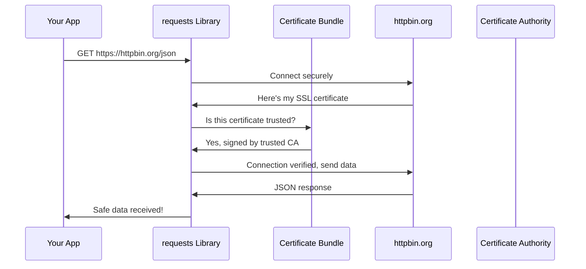

# Chapter 2: SSL Certificate Management

Building on what we learned about [Package Metadata and Version Management](01_package_metadata_and_version_management_.md), let's explore another crucial aspect of the `requests` library: keeping your web connections secure and trustworthy.

## What Problem Does This Solve?

Imagine you're trying to call your friend, but you're not sure if the phone number you have is really theirs or if it belongs to someone pretending to be your friend. You'd want some way to verify that you're actually talking to the right person, wouldn't you?

The same problem exists when your computer talks to websites over the internet. When you visit `https://github.com` or `https://google.com`, how does your computer know it's really talking to the legitimate website and not some malicious imposter trying to steal your data?

This is exactly what **SSL Certificate Management** solves! It acts like a trusted phone book of verified websites, ensuring that when `requests` connects to an HTTPS site, it's talking to the real deal and not a fake.

## A Real-World Use Case

Let's say you're building an app that needs to fetch data from a secure API:

```python
import requests

# This looks simple, but a lot happens behind the scenes!
response = requests.get('https://api.github.com/users/octocat')
print(response.json()['name'])
```

Output: `The Octocat`

When this code runs, `requests` automatically checks that `api.github.com` is the real GitHub API and not someone pretending to be GitHub. If the certificate isn't valid, `requests` will refuse to connect and protect your data!

## Key Concepts Broken Down

### 1. SSL Certificates - Digital ID Cards
Think of SSL certificates like official government-issued ID cards for websites. Just like you trust a driver's license because it's issued by a trusted authority, websites get certificates from trusted Certificate Authorities (CAs).

### 2. Certificate Authorities (CAs) - The Trust Network
Certificate Authorities are like the DMV for websites - they're trusted organizations that verify a website's identity before issuing certificates. Examples include DigiCert, Let's Encrypt, and VeriSign.

### 3. Certificate Bundle - The Trusted Phone Book
This is a file containing hundreds of trusted Certificate Authorities. It's like having an official phone book where you can look up whether a certificate issuer is legitimate.

## How SSL Certificate Verification Works

Let's see what happens when you make a secure request:

```python
import requests

# Making a secure connection
response = requests.get('https://httpbin.org/json')
```

Here's what `requests` does behind the scenes:



Let's break down what happens:
1. Your app asks `requests` to get data from a secure website
2. `requests` connects to the website
3. The website shows its SSL certificate (like showing an ID card)
4. `requests` checks the certificate against its trusted certificate bundle
5. If the certificate is valid and trusted, the connection proceeds
6. Your app gets the data safely!

## Finding and Using the Certificate Bundle

The `requests` library relies on a separate package called `certifi` to provide the trusted certificate bundle. Let's see how to find this bundle:

```python
import requests.certs

# Find where the certificate bundle is stored
cert_location = requests.certs.where()
print(f"Certificates are stored at: {cert_location}")
```

This will output something like:
```
Certificates are stored at: /usr/local/lib/python3.9/site-packages/certifi/cacert.pem
```

This file contains hundreds of trusted certificates that `requests` uses to verify websites.

## What Happens Under the Hood?

Let's look at how the certificate management system is implemented. The entire SSL certificate management in `requests` is surprisingly simple - it relies on the `certifi` package:

```python
# This is the complete implementation!
from certifi import where
```

The `certifi.where()` function returns the path to the certificate bundle file. That's it! The beauty is in its simplicity.

Let's see what this certificate bundle looks like:

```python
import requests.certs

# Read the first few lines of the certificate bundle
cert_path = requests.certs.where()
with open(cert_path, 'r') as f:
    first_lines = [f.readline().strip() for _ in range(10)]

for line in first_lines:
    print(line)
```

This will show you something like:
```
##
## Bundle of CA Root Certificates
##
## Certificate data from Mozilla
##
## This is a bundle of X.509 certificates of public
## Certificate Authorities (CA). These were automatically
## extracted from Mozilla's root certificates file (certdata.txt).
```

The bundle is essentially a text file containing hundreds of certificates from trusted authorities worldwide.

## Customizing Certificate Verification

Sometimes you might need to use custom certificates or disable verification for testing:

```python
import requests

# Use a custom certificate bundle
response = requests.get('https://example.com', 
                       verify='/path/to/custom/bundle.pem')
```

For testing only, you can disable verification (never do this in production!):

```python
import requests
from requests.packages.urllib3.exceptions import InsecureRequestWarning

# Disable SSL warnings for this example
requests.packages.urllib3.disable_warnings(InsecureRequestWarning)

# Skip certificate verification (DANGEROUS!)
response = requests.get('https://example.com', verify=False)
```

The `verify=False` parameter tells `requests` to skip certificate checking entirely. This is like accepting a phone call from any number without checking if it's really your friend - use this only for testing!

## The Implementation Deep Dive

The certificate management system in `requests` is elegantly simple. Here's the complete `certs.py` file:

```python
from certifi import where

if __name__ == "__main__":
    print(where())
```

That's the entire implementation! Here's why this works so well:

1. **Separation of Concerns**: `requests` focuses on HTTP functionality while `certifi` handles certificate management
2. **Automatic Updates**: The `certifi` package gets updated regularly with new trusted certificates
3. **Cross-Platform**: Works the same way on Windows, Mac, and Linux

When `requests` needs to verify an SSL certificate, it calls `certifi.where()` to get the path to the certificate bundle, then uses Python's built-in SSL libraries to perform the actual verification.

## Why This Matters for You

Understanding SSL certificate management helps you:
- **Stay secure**: Your data remains protected from man-in-the-middle attacks
- **Debug connection issues**: Know why some HTTPS requests might fail
- **Handle corporate networks**: Understand how to work with custom certificates
- **Build trust**: Ensure your applications connect only to legitimate services

The automatic certificate verification in `requests` means you get enterprise-level security without writing a single line of security code!

## What We Learned

In this chapter, we discovered how `requests` acts as a security guard for your web connections. Just like checking ID cards at a secure building, `requests` verifies that every HTTPS website you connect to has valid credentials from trusted authorities.

We learned that this security system relies on a trusted certificate bundle (like an official phone book) and automatically protects your data without any extra work from you. The implementation is beautifully simple - `requests` delegates this critical security function to the specialized `certifi` package.

Most importantly, we saw that this security happens automatically. Every time you use `requests.get()` with an `https://` URL, you're getting protection that would take security experts months to implement from scratch.

Next, we'll explore how `requests` manages its relationships with other Python packages and maintains compatibility across different versions and environments. Continue to [Dependency Integration and Backwards Compatibility](03_dependency_integration_and_backwards_compatibility_.md) to learn how `requests` plays nicely with the broader Python ecosystem.

