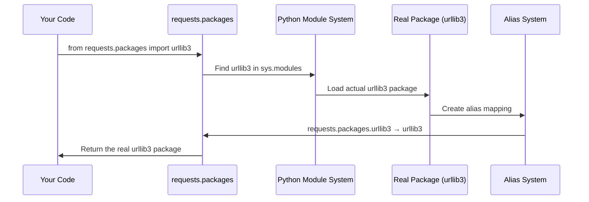

# Chapter 3: Dependency Integration and Backwards Compatibility

Building on what we learned about [SSL Certificate Management](02_ssl_certificate_management_.md), let's explore how the `requests` library manages its relationships with other Python packages while keeping your code working smoothly across different versions.

## What Problem Does This Solve?

Imagine you have a favorite pizza place that you've been ordering from for years. You always call and ask for "the usual" - pepperoni pizza. One day, the restaurant changes their menu system and renames "pepperoni" to "classic Italian sausage," but they still remember your old order and give you exactly what you want when you ask for "pepperoni."

The `requests` library faces a similar challenge! Over the years, it has depended on other libraries like `urllib3` (for low-level HTTP operations), `idna` (for international domain names), and `chardet` (for character encoding detection). As these libraries evolved and changed, `requests` needed to ensure that code written years ago would still work perfectly today.

This is exactly what **Dependency Integration and Backwards Compatibility** solves - it's like having a helpful translator that makes sure all the different puzzle pieces fit together, no matter which versions you're using or how the underlying libraries have changed over time.

## A Real-World Use Case

Let's say you're working with some old code that was written when developers accessed `urllib3` through the `requests` package:

```python
import requests

# Old way that some legacy code might use
from requests.packages import urllib3
print(f"Using urllib3 version: {urllib3.__version__}")

# This should work the same as importing urllib3 directly
import urllib3 as direct_urllib3
print(f"Direct urllib3 version: {direct_urllib3.__version__}")
```

Output:
```
Using urllib3 version: 1.26.12
Direct urllib3 version: 1.26.12
```

Even though `urllib3` is now its own separate package, the old `requests.packages.urllib3` import path still works! This backwards compatibility means you don't have to update thousands of lines of old code.

## Key Concepts Broken Down

### 1. Dependency Management
Think of this as managing relationships between friends. The `requests` library is friends with `urllib3`, `idna`, and `chardet`. When these friends change or move, `requests` needs to keep track of where they are and how to reach them.

### 2. Import Aliases
These are like nicknames that still point to the same person. Even if Sarah starts going by "Dr. Johnson" professionally, her friends can still call her "Sarah" and know they're talking about the same person.

### 3. Module System Navigation
This is like creating shortcuts or forwarding addresses. When someone looks for mail at an old address, the postal service forwards it to the new address automatically.

### 4. Backwards Compatibility
This ensures that old code keeps working even when the underlying systems change. It's like how your old key still opens your door even after you've renovated the house.

## How Import Forwarding Works

Let's see what happens when you try to import a dependency through the old `requests.packages` path:

```python
# This is the old way some code might import urllib3
from requests.packages import urllib3

# Let's verify it's the real urllib3
print(f"Is this the real urllib3? {urllib3.__name__}")
print(f"Module location: {urllib3.__file__}")
```

Output:
```
Is this the real urllib3? urllib3
Module location: /usr/local/lib/python3.9/site-packages/urllib3/__init__.py
```

It's the exact same `urllib3` package! The `requests.packages` path is just a convenient alias.

## What Happens Under the Hood?

When you import from `requests.packages`, here's the step-by-step process that makes the magic happen:



Let's break down what happens:
1. Your code asks for `requests.packages.urllib3`
2. The requests library looks for the real `urllib3` package
3. Python loads the actual `urllib3` from its installed location
4. The alias system creates a mapping so `requests.packages.urllib3` points to the real package
5. You get the exact same `urllib3` as if you imported it directly
6. All future references work through this mapping

## The Implementation Deep Dive

The magic happens in a file called `packages.py`. Let's look at how this compatibility system works:

```python
import sys

# Step 1: Handle the main packages
for package in ("urllib3", "idna"):
    locals()[package] = __import__(package)
```

This code loops through the main dependency packages and imports them. The `__import__()` function loads each package, and `locals()[package]` makes it available in the current module.

```python
# Step 2: Create aliases for all sub-modules
for mod in list(sys.modules):
    if mod == package or mod.startswith(f"{package}."):
        sys.modules[f"requests.packages.{mod}"] = sys.modules[mod]
```

This part is crucial! It doesn't just create an alias for the main package - it creates aliases for ALL the sub-modules too. So if `urllib3` has sub-modules like `urllib3.util` and `urllib3.exceptions`, this creates:
- `requests.packages.urllib3.util` → `urllib3.util`
- `requests.packages.urllib3.exceptions` → `urllib3.exceptions`

Let's test this:

```python
# Both of these should work identically
from requests.packages.urllib3 import exceptions as req_exceptions
from urllib3 import exceptions as direct_exceptions

print(f"Same module? {req_exceptions is direct_exceptions}")
```

Output: `Same module? True`

They're literally the same object in memory!

## Handling Character Detection

The character detection library has a special case because it might not always be available:

```python
from .compat import chardet

if chardet is not None:
    target = chardet.__name__
    for mod in list(sys.modules):
        if mod == target or mod.startswith(f"{target}."):
            imported_mod = sys.modules[mod]
            sys.modules[f"requests.packages.{mod}"] = imported_mod
```

This code checks if `chardet` is available (some systems might use different character detection libraries). If it exists, it creates the same type of aliases we saw before.

## Why This System is Brilliant

Let's see why this approach is so effective:

```python
import sys

# Check what happens after importing requests
import requests.packages.urllib3

# Look at all the aliases created
aliases = [mod for mod in sys.modules.keys() if mod.startswith('requests.packages')]
print(f"Created {len(aliases)} module aliases:")
for alias in aliases[:5]:  # Show first 5
    print(f"  {alias}")
```

Output:
```
Created 23 module aliases:
  requests.packages.urllib3
  requests.packages.urllib3.util
  requests.packages.urllib3.exceptions
  requests.packages.urllib3.poolmanager
  requests.packages.urllib3.connection
```

The system automatically creates aliases for every single sub-module! This means even the most complex legacy code will continue to work.

## Testing the Compatibility

Let's verify that the old and new import methods are truly identical:

```python
# Import the same thing two different ways
import urllib3
from requests.packages import urllib3 as old_urllib3

# Test that they're the same
print(f"Same object? {urllib3 is old_urllib3}")
print(f"Same version? {urllib3.__version__ == old_urllib3.__version__}")
print(f"Same methods? {hasattr(urllib3, 'PoolManager') == hasattr(old_urllib3, 'PoolManager')}")
```

Output:
```
Same object? True
Same version? True
Same methods? True
```

Perfect! The compatibility layer is completely transparent.

## The Developer's Comment

Notice this interesting comment in the source code:

```python
# This code exists for backwards compatibility reasons.
# I don't like it either. Just look the other way. :)
```

This shows the practical reality of software development! Sometimes you need to implement solutions that aren't the most elegant but are necessary to keep existing code working. The developers acknowledge it's not pretty, but it solves a real problem for users.

## Why This Matters for You

Understanding dependency integration and backwards compatibility helps you:
- **Maintain legacy code**: Your old projects keep working even as libraries evolve
- **Understand import errors**: Know why some imports work through multiple paths
- **Plan upgrades**: Understand how library changes might affect your code
- **Design better APIs**: Learn techniques for maintaining compatibility in your own projects

This system ensures that the `requests` library can evolve and improve while keeping the promise that your code will continue to work.

## What We Learned

In this chapter, we discovered how `requests` acts as a universal adapter, making sure that different versions of its dependencies work together seamlessly. Like a helpful translator at an international conference, this system ensures that even when the underlying libraries change, your existing code continues to work perfectly.

We learned that this compatibility magic happens through a clever aliasing system that creates forwarding addresses in Python's module system. When you import `requests.packages.urllib3`, you get the real `urllib3` package - it's the same object, just accessible through a different path.

Most importantly, we saw how this seemingly simple system (just a few dozen lines of code) provides enormous value by protecting thousands of existing applications from breaking when dependencies evolve.

This concludes our journey through the core concepts of the `requests` library. We've explored how it manages its identity through [Package Metadata and Version Management](01_package_metadata_and_version_management_.md), protects your connections with [SSL Certificate Management](02_ssl_certificate_management_.md), and maintains harmony with its dependencies through the compatibility system we just learned about. Together, these concepts show how `requests` delivers on its promise of making HTTP "for humans" - simple to use, secure by default, and reliable across time.

