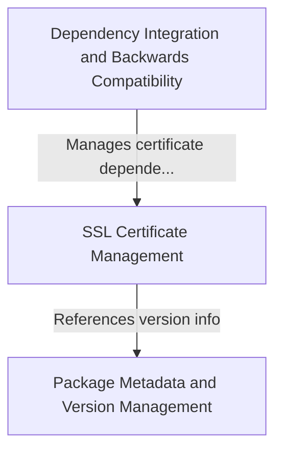

# Tutorial: requests

**Requests** is a popular Python library that makes it *incredibly easy* to send HTTP requests and communicate with websites and APIs. 
Think of it as a **user-friendly translator** that lets your Python code talk to web servers - whether you're downloading data, 
submitting forms, or interacting with REST APIs. The library handles all the complex networking details behind the scenes, 
so developers can focus on *what* they want to retrieve rather than *how* to retrieve it safely and efficiently.

**Source Repository:** [https://github.com/psf/requests](https://github.com/psf/requests)

## Chapters

1. [Package Metadata and Version Management
](01_package_metadata_and_version_management_.md)
2. [SSL Certificate Management
](02_ssl_certificate_management_.md)
3. [Dependency Integration and Backwards Compatibility
](03_dependency_integration_and_backwards_compatibility_.md)
