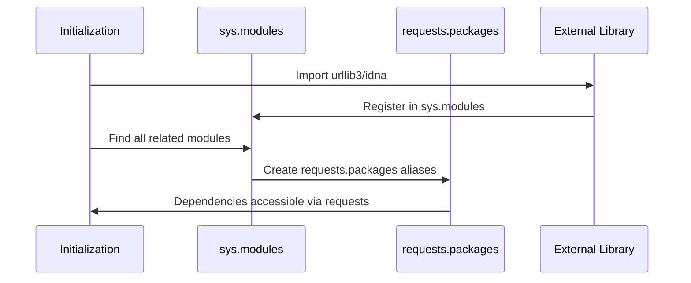

# Chapter 1: Dependency Integration Layer

Welcome to your journey into understanding how the `requests` library works under the hood! In this first chapter, we'll explore one of the most clever design patterns in the library: the Dependency Integration Layer.

## The Problem: Managing Multiple Dependencies

Imagine you're building a Swiss Army knife. You need different tools - a blade, scissors, a screwdriver - but you want users to access everything through one unified handle. You don't want users to carry around separate tools or worry about which manufacturer made each component.

The `requests` library faces a similar challenge. It relies on several powerful libraries to do its work:
- `urllib3` - handles the actual HTTP connections
- `idna` - manages international domain names
- `chardet` - detects text encoding

Without a dependency integration layer, users would need to import and manage these libraries separately:

```python
import urllib3
import idna
import chardet
import requests

# This would be confusing and messy!
```

Instead, `requests` creates a unified interface where everything appears to come from the `requests` package itself.

## The Solution: A Universal Adapter

The Dependency Integration Layer acts like a universal adapter that makes different puzzle pieces fit together seamlessly. Here's how it works from a user's perspective:

```python
import requests

# All dependencies are accessible through requests.packages
from requests.packages import urllib3
from requests.packages import idna
from requests.packages import chardet
```

This elegant solution means users only need to remember one import path: `requests.packages`. Everything else flows naturally from there.

## Key Concepts

### 1. Package Aliasing
The system creates aliases so that `requests.packages.urllib3` points to the same thing as just `urllib3`. It's like giving someone a nickname - both names refer to the same person.

### 2. Module Identity Preservation
When you access `requests.packages.urllib3.something`, you get exactly the same object as `urllib3.something`. The system preserves the identity of all objects, ensuring no functionality is lost.

### 3. Backwards Compatibility
This layer ensures that old code continues to work even as the underlying dependencies change or get updated.

## How It Works: Step-by-Step Process

Let's walk through what happens when the dependency integration layer initializes:



Here's what happens step by step:

1. **Import the external library** - The system imports `urllib3` and `idna` directly
2. **Scan system modules** - It looks through all loaded modules to find related components
3. **Create aliases** - For each found module, it creates a `requests.packages.*` alias
4. **Preserve identity** - The aliases point to the exact same objects as the originals

## Internal Implementation

Let's examine the actual code that makes this magic happen. The implementation lives in `src/requests/packages.py`:

### Step 1: Import Core Dependencies

```python
import sys
from .compat import chardet

for package in ("urllib3", "idna"):
    locals()[package] = __import__(package)
```

This code imports `urllib3` and `idna` dynamically and stores them in the local namespace. The `__import__()` function loads the packages just like a normal `import` statement would.

### Step 2: Create Package Aliases

```python
for mod in list(sys.modules):
    if mod == package or mod.startswith(f"{package}."):
        sys.modules[f"requests.packages.{mod}"] = sys.modules[mod]
```

This is where the real magic happens! The code:
- Loops through all loaded modules in `sys.modules`
- Finds modules that belong to our target packages
- Creates new entries in `sys.modules` with the `requests.packages.` prefix

### Step 3: Handle Special Cases

```python
if chardet is not None:
    target = chardet.__name__
    for mod in list(sys.modules):
        if mod == target or mod.startswith(f"{target}."):
            imported_mod = sys.modules[mod]
            sys.modules[f"requests.packages.{mod}"] = imported_mod
```

The `chardet` library gets special treatment because it might have different names or might not be available. The code carefully handles these edge cases to ensure reliability.

## Real-World Example

Let's see this in action with a practical example:

```python
# Instead of this complicated approach:
import urllib3
pool = urllib3.PoolManager()

# Users can do this unified approach:
from requests.packages import urllib3
pool = urllib3.PoolManager()
```

Both approaches create exactly the same `PoolManager` object, but the second approach keeps everything organized under the `requests` umbrella.

## Why This Matters

This dependency integration layer provides several crucial benefits:

1. **Simplified imports** - Users only need to remember `requests.packages`
2. **Version consistency** - All dependencies work together harmoniously
3. **Backwards compatibility** - Old code continues to work
4. **Clean namespace** - Everything stays organized under `requests`

Think of it like a well-organized toolbox where every tool has its designated spot, making it easy to find what you need without creating a mess.

## Conclusion

The Dependency Integration Layer is the foundation that makes `requests` so user-friendly. By creating a universal adapter for its dependencies, `requests` presents a clean, unified interface while leveraging powerful specialized libraries under the hood.

This elegant solution demonstrates how good software design can hide complexity while preserving functionality. Users get the best of both worlds: simplicity and power.

In our next chapter, we'll explore how `requests` manages its [Package Metadata and Versioning](02_package_metadata_and_versioning_.md) to ensure consistent behavior across different installations and updates.

