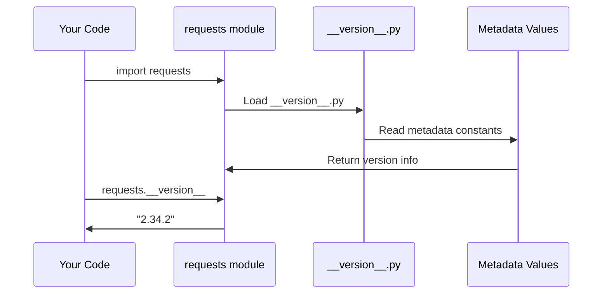

# Chapter 2: Package Metadata and Versioning

In [Chapter 1: Dependency Integration Layer](01_dependency_integration_layer_.md), we learned how `requests` creates a unified interface for managing its dependencies. Now, let's explore another fundamental aspect: how `requests` identifies itself to the world through its Package Metadata and Versioning system.

## The Problem: Identifying Your Software

Imagine you walk into a store and see products without any labels - no brand names, no version numbers, no descriptions. How would you know what you're buying? How would you know if it's the latest version or if it's compatible with what you need?

Software packages face the same challenge. When you install `requests`, Python needs to know:
- What is this package called?
- What version am I installing?
- Who created it?
- What does it do?
- Is it compatible with my system?

Without this information, package managers would be lost, developers couldn't specify dependencies, and users wouldn't know what they're working with.

## The Solution: A Digital ID Card

The Package Metadata and Versioning system acts like a digital ID card for the `requests` library. Just like a driver's license contains your name, photo, and expiration date, this system contains all the essential information about the package.

Here's how you can access this information:

```python
import requests

print(requests.__version__)  # Shows: "2.34.2"
print(requests.__title__)    # Shows: "requests"
print(requests.__author__)   # Shows: "Kenneth Reitz"
```

This simple interface gives you instant access to the package's identity and version information.

## Key Concepts

### 1. Version Numbers
Version numbers follow a pattern like "2.34.2" where each number has meaning:
- **Major version** (2): Big changes that might break existing code
- **Minor version** (34): New features that don't break existing code  
- **Patch version** (2): Bug fixes and small improvements

### 2. Package Attributes
These are special variables that start and end with double underscores (like `__version__`) that store metadata about the package.

### 3. Build Numbers
Internal tracking numbers used by developers to identify specific builds during development.

## How It Works: The Metadata Storage

Let's walk through what happens when you access package metadata:



Here's what happens step by step:

1. **You import requests** - Python loads the requests module
2. **Metadata file loads** - The `__version__.py` file is automatically loaded
3. **Constants are defined** - All the metadata values are set as module attributes
4. **Values become accessible** - You can now access them through the requests module

## Internal Implementation

Let's examine how this metadata system is actually implemented. The magic happens in the `src/requests/__version__.py` file:

### Step 1: Define Core Metadata

```python
__title__ = "requests"
__description__ = "Python HTTP for Humans."
__url__ = "https://requests.readthedocs.io"
__version__ = "2.34.2"
```

These variables store the basic identity information. The double underscores are a Python convention for special attributes that describe the module itself.

### Step 2: Add Author Information

```python
__author__ = "Kenneth Reitz"
__author_email__ = "me@kennethreitz.org"
__license__ = "Apache-2.0"
__copyright__ = "Copyright Kenneth Reitz"
```

This section provides attribution and legal information, telling users who created the software and under what terms they can use it.

### Step 3: Create Build Tracking

```python
__build__ = 0x023402
__cake__ = "\u2728 \U0001f370 \u2728"
```

The `__build__` number is a hexadecimal representation of the version (0x023402 = 2.34.2). The `__cake__` is a fun Easter egg that shows the creator's personality!

## Real-World Usage Examples

### Checking Version Compatibility

```python
import requests

# Check if you have a recent version
if requests.__version__ >= "2.30.0":
    print("You have a modern version!")
else:
    print("Consider updating requests")
```

This code helps you ensure you're using a version that has the features you need.

### Debugging and Support

```python
import requests

print(f"Using {requests.__title__} v{requests.__version__}")
print(f"Author: {requests.__author__}")
print(f"License: {requests.__license__}")
```

When reporting bugs or asking for help, this information helps developers understand your setup.

### Package Manager Integration

Package managers like pip use this metadata when installing:

```bash
pip install requests==2.34.2  # Installs specific version
pip install requests>=2.30.0  # Installs version 2.30.0 or newer
```

The version information enables precise dependency management.

## The Setup Integration

The metadata also integrates with Python's packaging system through `setup.py`:

```python
import sys

if sys.version_info < (3, 10):
    sys.stderr.write("Requests requires Python 3.10 or later.\n")
    sys.exit(1)

from setuptools import setup
setup()
```

This simple setup file ensures that `requests` only installs on compatible Python versions, preventing installation problems before they occur.

## Version Evolution Example

Let's see how version numbers change over time:

```python
# Version 2.33.0 - Added new features
# Version 2.33.1 - Fixed small bugs  
# Version 2.34.0 - Added more features
# Version 2.34.2 - Fixed more bugs (current)
```

Each number increase tells a story about what changed, helping developers make informed decisions about when to upgrade.

## Why This Matters

This metadata system provides several crucial benefits:

1. **Dependency Management** - Other packages can specify which version of requests they need
2. **Debugging Support** - Users can easily report version information with bug reports
3. **Feature Detection** - Code can check versions to use appropriate features
4. **Legal Compliance** - License information is clearly available
5. **Package Discovery** - Users can find documentation and source code through the URLs

Think of it like the nutrition label on food - it gives you all the essential information you need to make informed decisions.

## Conclusion

The Package Metadata and Versioning system is the identity foundation of the `requests` library. By providing clear, accessible information about the package's name, version, author, and other details, it enables seamless integration with Python's packaging ecosystem while helping users understand exactly what they're working with.

This system demonstrates how good software design makes essential information easily accessible through simple, consistent interfaces. Whether you're debugging an issue, managing dependencies, or just curious about the software you're using, this metadata is always there to help.

In our next chapter, we'll explore how `requests` handles [Security Certificate Management](03_security_certificate_management_.md) to ensure safe and secure HTTP communications.

