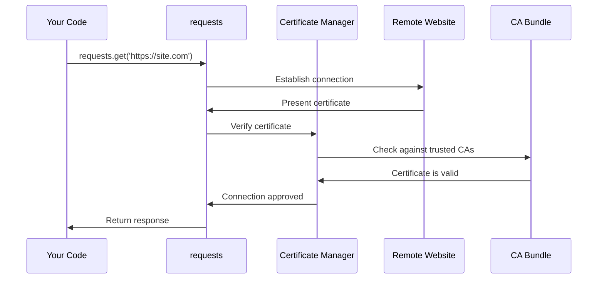

# Chapter 3: Security Certificate Management

In [Chapter 2: Package Metadata and Versioning](02_package_metadata_and_versioning_.md), we learned how `requests` identifies itself through metadata. Now let's explore a critical security feature: how `requests` verifies that the websites you connect to are legitimate and safe.

## The Problem: How Do You Know Who You're Really Talking To?

Imagine you're at a crowded party and someone walks up to you claiming to be your friend Sarah. But the room is dimly lit, and you can't clearly see their face. How do you verify they're really Sarah and not someone pretending to be her?

The internet has the same problem. When you visit a website like `https://github.com`, how does your computer know it's really talking to GitHub's servers and not to a malicious imposter trying to steal your password?

This is where Security Certificate Management comes in. It acts like a trusted bouncer at a club who checks everyone's ID against a list of valid identification authorities.

## The Solution: Digital Bouncers with ID Lists

When you make an HTTPS request, websites present digital certificates (like digital IDs) to prove their identity. But just like fake IDs exist, fake certificates can be created too. So your computer needs a trusted list of "certificate authorities" - organizations that are allowed to issue valid digital IDs.

Here's how this works in practice with `requests`:

```python
import requests

# This works automatically and securely
response = requests.get('https://github.com')
print("Connected safely to GitHub!")
```

Behind the scenes, `requests` automatically checks GitHub's certificate against its trusted list. If the certificate is valid, the connection proceeds. If not, it raises an error to protect you.

## Key Concepts

### 1. Certificate Authorities (CAs)
These are trusted organizations (like VeriSign or Let's Encrypt) that issue digital certificates. Think of them as the DMV for the internet - they verify identities and issue official IDs.

### 2. CA Bundle
This is a file containing the list of all trusted certificate authorities. It's like having a reference book of all valid ID-issuing organizations that the bouncer can check against.

### 3. Certificate Verification
The process of checking if a website's certificate was issued by a trusted authority and is still valid. Like checking if an ID is real, not expired, and issued by a legitimate authority.

## How It Works: The Security Check Process

Let's walk through what happens when you make a secure HTTPS request:



Here's what happens step by step:

1. **You make a request** - Your code calls `requests.get()` with an HTTPS URL
2. **Connection starts** - `requests` begins connecting to the website
3. **Certificate presented** - The website shows its digital certificate
4. **Verification check** - The certificate manager checks if it's valid
5. **CA lookup** - It compares against the trusted certificate authority list
6. **Decision made** - If valid, connection proceeds; if not, an error is raised

## Internal Implementation

The security certificate management in `requests` is elegantly simple. Let's examine how it works under the hood:

### Step 1: Import the Certificate Bundle

```python
from certifi import where
```

This single line imports the `where` function from the `certifi` package. The `certifi` package contains Mozilla's carefully curated list of trusted certificate authorities - the same list that Firefox uses.

### Step 2: Provide the Certificate Location

```python
def where():
    return "/path/to/cacert.pem"
```

The `where()` function returns the file path to the CA bundle file. This file contains hundreds of trusted certificate authorities in a standardized format.

### Step 3: Command Line Access

```python
if __name__ == "__main__":
    print(where())
```

This allows you to run the module directly to see where the certificate file is located on your system.

## Real-World Usage Examples

### Basic Secure Request

```python
import requests

# Certificate verification happens automatically
response = requests.get('https://api.github.com/user')
print(f"Status: {response.status_code}")  # Status: 200
```

This simple request automatically verifies GitHub's certificate before making the connection. If the certificate were invalid, you'd get an error instead of a response.

### Checking Certificate Location

```python
import requests.certs

cert_location = requests.certs.where()
print(f"Certificates stored at: {cert_location}")
# Output: Certificates stored at: /path/to/site-packages/certifi/cacert.pem
```

This shows you exactly where the trusted certificate list is stored on your computer.

### Handling Certificate Errors

```python
import requests

try:
    response = requests.get('https://expired-certificate-site.com')
except requests.exceptions.SSLError as e:
    print("Certificate verification failed - this site isn't safe!")
    print(f"Error details: {e}")
```

When certificate verification fails, `requests` raises an `SSLError` to protect you from potentially dangerous connections.

## The Certificate Bundle File

The CA bundle is a text file that contains certificates in a specific format:

```
-----BEGIN CERTIFICATE-----
MIIDQTCCAimgAwIBAgITBmyfz5m/jAo54vB4ikPmljZbyjANBgkqhkiG9w0BAQsF
ADA5MQswCQYDVQQGEwJVUzEPMA0GA1UEChMGQW1hem9uMRkwFwYDVQQDExBBbWF6
...more certificate data...
-----END CERTIFICATE-----
```

Each certificate block represents one trusted certificate authority. When a website presents its certificate, `requests` checks if it was signed by any of these trusted authorities.

## Integration with the Requests Library

The certificate management integrates seamlessly with the main `requests` functionality:

```python
import requests

# All these requests automatically use certificate verification
requests.get('https://example.com')
requests.post('https://api.service.com', data={'key': 'value'})
requests.put('https://secure-site.com/update')
```

Every HTTPS request automatically benefits from this security layer without you needing to think about it.

## Customizing Certificate Verification

For advanced users, you can customize certificate behavior:

```python
import requests

# Use a custom CA bundle
response = requests.get('https://example.com', 
                       verify='/path/to/my-ca-bundle.pem')

# Disable verification (NOT recommended for production!)
response = requests.get('https://example.com', verify=False)
```

The first example lets you use your own trusted certificate list, while the second disables verification entirely (which should only be used for testing).

## Why This Matters

This certificate management system provides several crucial security benefits:

1. **Man-in-the-middle protection** - Prevents attackers from intercepting your communications
2. **Identity verification** - Ensures you're really talking to the intended website
3. **Automatic security** - Works transparently without requiring security expertise
4. **Industry standards** - Uses the same certificate authorities trusted by major browsers
5. **Easy updates** - Certificate lists are automatically updated when you update packages

Think of it like having a professional security expert automatically checking every door before you walk through it, but without slowing you down or requiring any effort on your part.

## Conclusion

The Security Certificate Management system is the invisible guardian that keeps your `requests` communications safe and secure. By automatically verifying website certificates against a trusted list of certificate authorities, it protects you from impersonation attacks and ensures you're always talking to legitimate websites.

This system demonstrates how good security design works best when it's completely transparent to users. You get enterprise-grade security protection without needing to understand the complex cryptographic details or manage certificate lists yourself.

The beauty of this implementation lies in its simplicity - just a few lines of code that leverage the `certifi` package to provide the same level of security that major web browsers offer. It's security that just works, automatically and reliably, every time you make an HTTPS request.

