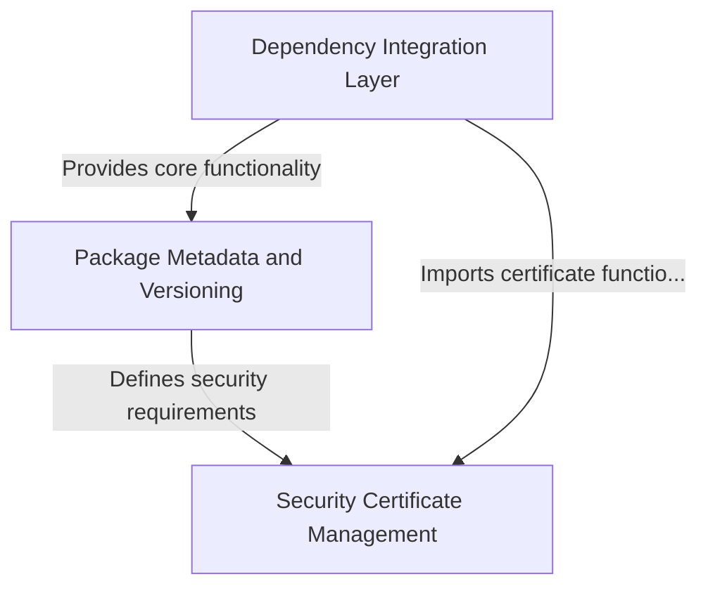

# Tutorial: requests

The **requests** library is a popular Python package that makes it easy to send *HTTP requests* to websites and APIs.
It acts as a **user-friendly wrapper** around lower-level networking libraries, providing a simple interface for tasks like
downloading web pages, sending data to servers, and interacting with web services. The library handles complex details like
*security certificates* and *dependency management* automatically, so developers can focus on their application logic
rather than the technical networking details.

**Source Repository:** [https://github.com/psf/requests](https://github.com/psf/requests)

## Chapters

1. [Dependency Integration Layer
](01_dependency_integration_layer_.md)
2. [Package Metadata and Versioning
](02_package_metadata_and_versioning_.md)
3. [Security Certificate Management
](03_security_certificate_management_.md)
